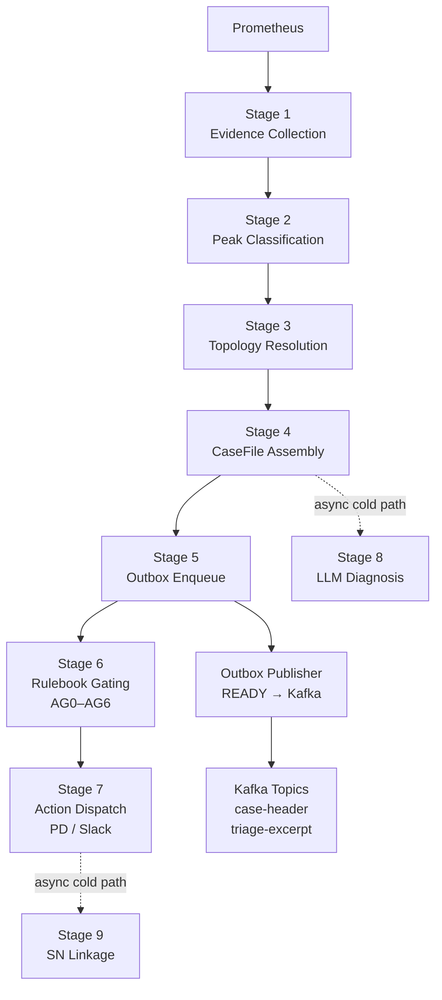

# aiops-triage-pipeline

A Python 3.13 event-driven AIOps triage pipeline for Kafka infrastructure signals. Processes telemetry-driven anomalies through deterministic pipeline stages, persists durable case artifacts, and routes downstream actions through a reliability-first outbox boundary.

## Table of Contents

- [What This Project Does](#what-this-project-does)
- [Current Status](#current-status)
- [Architecture at a Glance](#architecture-at-a-glance)
- [Pipeline Stages](#pipeline-stages)
- [Cold Path — LLM Diagnosis](#cold-path--llm-diagnosis)
- [Durable Persistence Layer](#durable-persistence-layer)
- [Integration Boundaries](#integration-boundaries)
- [Observability and Governance](#observability-and-governance)
- [Contracts](#contracts)
- [Quick Start (Local)](#quick-start-local)
- [Runtime Modes](#runtime-modes)
- [Configuration](#configuration)
- [Testing and Quality Gates](#testing-and-quality-gates)
- [Project Structure](#project-structure)
- [Documentation](#documentation)
- [Contributing](#contributing)

---

## What This Project Does

- Collects Prometheus telemetry and classifies anomaly signals (peak, near-peak, sustained, unknown).
- Resolves topology context per anomaly scope: stream identity, ownership hierarchy, blast radius.
- Assembles a durable CaseFile in object storage with write-once invariants.
- Publishes typed Kafka events (`CaseHeaderEventV1`, `TriageExcerptV1`) through a Postgres-backed durable outbox.
- Evaluates a deterministic Rulebook gate engine (AG0–AG6) to produce an `ActionDecisionV1`.
- Executes actions: PagerDuty page trigger, Slack notification, structured log fallback.
- Runs an asynchronous cold-path LLM diagnosis (LangGraph) that enriches case artifacts without blocking the hot path.
- Correlates cases with ServiceNow Incidents, Problems, and PIR tasks via a tiered linkage state machine.
- Exports OpenTelemetry metrics via OTLP and evaluates operational alert thresholds at runtime.
- Enforces exposure denylist, MI-1 posture, and policy version stamping for audit reproducibility.

---

## Feature Areas

All pipeline capabilities are fully implemented and production-ready.

| Area | Title | Status |
|------|-------|--------|
| 1 | Project Foundation & Developer Experience | Complete |
| 2 | Evidence Collection & Signal Validation | Complete |
| 3 | Topology Resolution & Case Routing | Complete |
| 4 | Durable Triage & Reliable Event Publishing | Complete |
| 5 | Deterministic Safety Gating & Action Execution | Complete |
| 6 | LLM-Enriched Diagnosis | Complete |
| 7 | Governance, Audit & Operational Observability | Complete |
| 8 | ServiceNow Postmortem Automation | Complete |

Test suite: **755+ unit tests, 4 end-to-end integration tests, zero skipped.**

---

## Architecture at a Glance



**Technology stack:**

| Layer | Technology |
|-------|-----------|
| Runtime | Python 3.13, asyncio |
| Modeling | Pydantic v2, pydantic-settings |
| SQL persistence | PostgreSQL (outbox state, SN linkage retry) |
| Cache | Redis (evidence window, peak, dedupe) |
| Object storage | S3-compatible (MinIO locally) |
| Messaging | Kafka via confluent-kafka |
| Observability | OpenTelemetry + OTLP, structlog |
| LLM cold path | LangGraph |
| Tooling | uv, pytest, testcontainers, ruff, Docker/Compose |

**Architecture principles:**

- **Durability first** — CaseFile written before any event is published (Invariant A). Outbox ensures at-least-once Kafka delivery (Invariant B2).
- **Hot-path determinism** — the LLM cold path fires and forgets; it never blocks or overrides gate decisions.
- **Explicit safety modes** — all external integrations operate in `OFF | LOG | MOCK | LIVE` mode.
- **UNKNOWN-not-zero** — missing or incomplete evidence propagates as UNKNOWN through all stages; it is never silently zeroed.

---

## Pipeline Stages

| Stage | Module | Responsibility |
|-------|--------|----------------|
| 1 — Evidence | `pipeline/stages/evidence.py` | Prometheus metric collection and evaluation cadence |
| 2 — Peak | `pipeline/stages/peak.py` | Anomaly pattern detection, peak/near-peak/sustained classification |
| 3 — Topology | `pipeline/stages/topology.py` | Registry resolution, blast radius, ownership routing |
| 4 — CaseFile | `pipeline/stages/casefile.py` | Write-once assembly to object storage |
| 5 — Outbox | `pipeline/stages/outbox.py` | Postgres outbox enqueue (`PENDING_OBJECT → READY`) |
| 6 — Gating | `pipeline/stages/gating.py` | Rulebook gate engine AG0–AG6 sequential evaluation |
| 7 — Dispatch | `pipeline/stages/dispatch.py` | PagerDuty, Slack, and structured log action execution |

Hot-path orchestration is in `pipeline/scheduler.py`.

**Gate engine (AG0–AG6):**

| Gate | Responsibility |
|------|----------------|
| AG0 | Environment and entry preconditions |
| AG1 | Environment and criticality tier caps |
| AG2 | Evidence sufficiency check |
| AG3 | Source topic validation |
| AG4 | Sustained threshold and confidence floor |
| AG5 | Action deduplication (Redis atomic SET NX EX) |
| AG6 | Postmortem predicate (MI-1 posture enforcement) |

---

## Cold Path — LLM Diagnosis

The cold path runs asynchronously after hot-path dispatch and does not block or influence gate decisions.

- **Stage 8 (Diagnosis):** LangGraph graph invokes the configured LLM, produces a `DiagnosisReportV1` with structured evidence citations, and writes `cases/<case_id>/diagnosis.json` to object storage.
- **Failure semantics:** Timeout, unavailability, schema validation failure, and internal errors each produce a deterministic fallback. The absence of `diagnosis.json` is explicit and observable — it means the LLM did not complete for this case.
- **Hash chain:** `diagnosis.json` includes the SHA-256 hash of `triage.json` to establish tamper-evident provenance.

**Stage 9 (SN Linkage):**

- Tiered ServiceNow correlation: Tier 1 (Incident correlation) → Tier 2 (Problem upsert) → Tier 3 (PIR task upsert).
- Idempotent upsert via stable external identifiers.
- Durable retry state machine persisted in `sn_linkage_retry` SQL table with terminal escalation handling.
- Fallback-rate metrics and alert thresholds integrated into the `aiops.*` telemetry layer.

---

## Durable Persistence Layer

### SQL tables (PostgreSQL)

| Table | State machine | Purpose |
|-------|--------------|---------|
| `outbox` | `PENDING_OBJECT → READY → SENT / RETRY / DEAD` | Durable Kafka event publication |
| `sn_linkage_retry` | Attempt state + retry windows | ServiceNow linkage lifecycle |

### Object storage (S3-compatible)

Each case has an isolated directory. Each enrichment stage writes one immutable file.

```
cases/<case_id>/
    triage.json      ← Stage 4 (hot path): evidence, topology, gate inputs, action decision
    diagnosis.json   ← Stage 8 (cold path): LLM DiagnosisReportV1
    linkage.json     ← Stage 9 (cold path): SN correlation result
    labels.json      ← Operator annotations (Phase 2+)
```

**Write-once invariants:** hash and idempotency checks prevent overwrite. A missing file means that stage did not complete — not that it failed silently.

---

## Integration Boundaries

All external integrations are adapter modules under `integrations/`. Each supports four safety modes controlled by environment variable:

| Variable | Integration |
|----------|------------|
| `INTEGRATION_MODE_PD` | PagerDuty Events V2 |
| `INTEGRATION_MODE_SLACK` | Slack incoming webhook |
| `INTEGRATION_MODE_SN` | ServiceNow table API (GET/POST/PATCH) |
| `INTEGRATION_MODE_LLM` | LLM provider (LangGraph) |

**Mode behaviour:**

| Mode | Behaviour |
|------|----------|
| `OFF` | Integration disabled entirely |
| `LOG` | Logs the payload; no external call |
| `MOCK` | Returns a deterministic canned response |
| `LIVE` | Makes the real external call |

The exposure denylist (`config/denylist.yaml`) is enforced at every outbound publish and notification boundary.

**Inbound:** Lightweight asyncio TCP health endpoint (`health/server.py`) returns the component status registry map.

---

## Observability and Governance

### Telemetry (`health/`)

- **OTLP export** (`health/otlp.py`): OpenTelemetry metrics exported via OTLP on startup.
- **Prometheus metrics** (`health/metrics.py`): `aiops.*`-namespaced counters and gauges for outbox health, linkage state, LLM fallback rates, and component degraded posture.
- **Operational alert evaluation** (`health/alerts.py`): `OperationalAlertEvaluator` loads `operational-alert-policy-v1.yaml` at startup and evaluates thresholds at runtime against live metric state.
- **Health registry** (`health/registry.py`): Component-level status map; drives degraded-mode capping and action posture.

### Audit and reproducibility

- `audit/replay.py` provides utilities to replay gate decisions against policy versions stamped in CaseFile artifacts.
- CaseFiles stamp `rulebook_version`, `peak_policy_version`, and active denylist version at decision time.
- See [Schema Evolution Strategy](docs/schema-evolution-strategy.md) for versioning procedures.

---

## Contracts

All contracts are frozen Pydantic v2 models in `src/aiops_triage_pipeline/contracts/`. Contract changes must be explicit and test-backed.

### Event and decision contracts

| Contract | Module |
|----------|--------|
| `GateInputV1` | `contracts/gate_input.py` |
| `ActionDecisionV1` | `contracts/action_decision.py` |
| `CaseHeaderEventV1` | `contracts/case_header_event.py` |
| `TriageExcerptV1` | `contracts/triage_excerpt.py` |
| `DiagnosisReportV1` | `contracts/diagnosis_report.py` |

### Policy and operational contracts

| Contract | Module |
|----------|--------|
| `RulebookV1` | `contracts/rulebook.py` |
| `PeakPolicyV1` | `contracts/peak_policy.py` |
| `PrometheusMetricsContractV1` | `contracts/prometheus_metrics.py` |
| `RedisTtlPolicyV1` | `contracts/redis_ttl_policy.py` |
| `OutboxPolicyV1` | `contracts/outbox_policy.py` |
| `TopologyRegistryLoaderRulesV1` | `contracts/topology_registry.py` |
| `ServiceNowLinkageContractV1` | `contracts/sn_linkage.py` |
| `OperationalAlertPolicyV1` | `contracts/operational_alert_policy.py` |
| `CasefileRetentionPolicyV1` | `contracts/casefile_retention_policy.py` |
| `LocalDevContractV1` | `contracts/local_dev.py` |

See [Contracts](docs/contracts.md) for the full contract reference.

---

## Quick Start (Local)

### Prerequisites

- Python 3.13+
- `uv`
- Docker + Docker Compose

### 1. Install dependencies

```bash
uv sync --dev
```

### 2. Start local infrastructure

```bash
docker compose up -d --build
```

This starts: ZooKeeper, Kafka, Postgres, Redis, MinIO, Prometheus, Harness, and App containers.

### 3. Validate the stack

```bash
bash scripts/smoke-test.sh
```

Verifies Kafka topics, Postgres, Redis, MinIO bucket, Prometheus health, and harness metrics endpoint.

### 4. Run a pipeline mode

```bash
# Outbox publisher (fully wired)
APP_ENV=local uv run python -m aiops_triage_pipeline --mode outbox-publisher

# Casefile lifecycle worker (fully wired)
APP_ENV=local uv run python -m aiops_triage_pipeline --mode casefile-lifecycle

# Single-iteration variants
APP_ENV=local uv run python -m aiops_triage_pipeline --mode outbox-publisher --once
APP_ENV=local uv run python -m aiops_triage_pipeline --mode casefile-lifecycle --once
```

---

## Runtime Modes

The entry point (`__main__.py`) dispatches to one of four modes via `--mode`.

| Mode | Status | Description |
|------|--------|-------------|
| `hot-path` | Bootstrap only | Loads settings, OTLP, and alert policy; runtime scheduler wiring uses a dedicated orchestration entrypoint |
| `cold-path` | Bootstrap only | Same bootstrap; cold-path invocation wired through dedicated entrypoint |
| `outbox-publisher` | Fully wired | Polls the `outbox` table for `READY` records and publishes to Kafka |
| `casefile-lifecycle` | Fully wired | Runs the retention policy against object storage; purges expired CaseFiles |

---

## Configuration

Configuration is loaded by `src/aiops_triage_pipeline/config/settings.py` using `pydantic-settings`.

**Supported `APP_ENV` values:** `local`, `dev`, `uat`, `prod`

**Env files:**

```
config/.env.local
config/.env.dev
config/.env.uat.template
config/.env.prod.template
config/.env.docker
```

**Policy files** (loaded at startup from `config/policies/`):

| File | Contract |
|------|----------|
| `outbox-policy-v1.yaml` | `OutboxPolicyV1` |
| `casefile-retention-policy-v1.yaml` | `CasefileRetentionPolicyV1` |
| `operational-alert-policy-v1.yaml` | `OperationalAlertPolicyV1` |
| `rulebook-v1.yaml` | `RulebookV1` |
| `peak-policy-v1.yaml` | `PeakPolicyV1` |

**Denylist:** `config/denylist.yaml` — enforced at every outbound publish and notification boundary.

---

## Testing and Quality Gates

Run focused suites:

```bash
uv run pytest -q tests/unit
uv run pytest -q tests/integration -m integration
```

Run the full suite:

```bash
uv run pytest -q
```

Run the full suite with Docker-backed integration execution (recommended):

```bash
TESTCONTAINERS_RYUK_DISABLED=true DOCKER_HOST=unix://$HOME/.docker/desktop/docker.sock uv run pytest -q -rs
```

Lint:

```bash
uv run ruff check
```

**Notes:**

- `tests/integration/conftest.py` auto-configures `DOCKER_HOST` for common local socket paths when unset.
- Integration tests require a running Docker daemon. If Docker is unavailable, run `uv run pytest -q tests/unit` to execute pure unit tests only.
- The zero-skip regression posture is mandatory: every change must pass a full-suite run with no skipped tests.

---

## Project Structure

```text
src/aiops_triage_pipeline/
├── __main__.py              # Runtime mode dispatch
├── pipeline/
│   ├── scheduler.py         # Hot-path stage orchestration
│   └── stages/              # evidence, peak, topology, casefile,
│                            # outbox, gating, dispatch, linkage
├── outbox/                  # Durable outbox: state machine, repository, worker, metrics
├── linkage/                 # SN retry state machine, repository, schema
├── storage/                 # Write-once CaseFile IO, S3 client, lifecycle runner
├── registry/                # Topology loader (v0/v1), resolver
├── diagnosis/               # LangGraph graph, prompt builder, deterministic fallback
├── audit/                   # Decision replay utilities
├── contracts/               # Frozen v1 contract and policy models
├── models/                  # Domain payload models (anomaly, evidence, peak, casefile)
├── integrations/            # PagerDuty, Slack, ServiceNow, Kafka, Prometheus, LLM
├── health/                  # Status registry, OTLP export, alert evaluation, HTTP server
├── cache/                   # Evidence window, peak cache, dedupe (Redis)
├── denylist/                # Enforcement and loader
├── config/                  # Settings singleton (pydantic-settings)
├── logging/                 # structlog processor pipeline
└── errors/                  # Typed exceptions
```

Additional source:

```text
harness/                     # Traffic generation (separated from src/)
tests/
├── unit/                    # Contract, stage, repository, adapter tests
└── integration/             # Docker-backed end-to-end and dependency tests
config/
├── policies/                # Runtime policy YAML files
└── .env.*                   # Environment-specific settings files
scripts/
└── smoke-test.sh            # Stack health validation script
```

---

## Documentation

Project docs live in `docs/` and are updated with each material change to architecture, contracts, or developer workflows.

| Document | Description |
|----------|-------------|
| [Architecture](docs/architecture.md) | Technology stack, data architecture, component overview, deployment topology |
| [Contracts](docs/contracts.md) | Full contract reference and compatibility rules |
| [Local Development](docs/local-development.md) | Setup, run commands, Docker troubleshooting |
| [Schema Evolution Strategy](docs/schema-evolution-strategy.md) | Versioning procedures for Kafka events, CaseFile schemas, and policies |

---

## Contributing

1. Keep contract changes explicit and test-backed.
2. Add or update tests in the same change for all behavioral changes.
3. Enforce the zero-skip regression posture: full suite must pass with no skipped tests before merging.
4. Update docs when runtime behavior, architecture, or developer workflows change.
5. All external integration code paths require a LIVE mode test asserting the Pydantic model is instantiated in the production serialization path.
