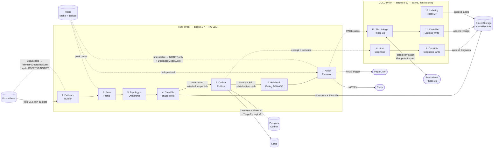

# Event-Driven AIOps Platform — Specific Requirements

## Project-Type Overview

This is an event-driven triage pipeline, not a request/response API. The primary data flow is: telemetry ingestion → evidence assembly → durable CaseFile → deterministic gating → action execution → async enrichment (LLM diagnosis, SN linkage, labels). Interactions with external systems (Prometheus, PD, SN, Slack) are integration points, not API endpoints exposed to consumers.

## Pipeline Architecture

**Hot path (synchronous, latency-critical — no LLM dependency):**

| Stage | Input | Output | Latency |
|---|---|---|---|
| 1. Evidence Builder | Prometheus metrics (5-min buckets) | Evidence primitives + evidence_status_map | Batch per evaluation interval |
| 2. Peak Profile | Evidence + historical baseline | Peak/near-peak classification per (env, cluster_id, topic) | Computed, cacheable (Redis) |
| 3. Topology + Ownership Enrichment | Evidence + topology registry | stream_id, topic_role, blast_radius, ownership routing, criticality_tier | Registry lookup (in-memory/cached) |
| 4. CaseFile Triage Write | All above | Durable `triage.json` (evidence snapshot + gating inputs) → object storage | Write-once, hash-stamped |
| 5. Outbox Publish | CaseFile triage write confirmed (Invariant A) | `CaseHeaderEvent.v1` + `TriageExcerpt.v1` → Kafka | Outbox SLO: p95 ≤ 1 min |
| 6. Rulebook Gating | GateInput.v1 envelope | ActionDecision.v1 (final action + gate reason codes) | Deterministic, sub-second |
| 7. Action Executor | ActionDecision.v1 | PD trigger / Slack notification / log emit / dedupe record | Integration-dependent |

**Cold path (asynchronous, non-blocking — pipeline does not wait):**

| Stage | Input | Output | Latency |
|---|---|---|---|
| 8. LLM Diagnosis | TriageExcerpt + structured evidence summary | DiagnosisReport.v1 (verdict, fault domain, confidence, evidence pack, next checks) | LLM-dependent; seconds to minutes |
| 9. CaseFile Diagnosis Write | DiagnosisReport.v1 | `diagnosis.json` written to case directory (diagnosis + policy versions) | Write-once after LLM completes |
| 10. SN Linkage (Phase 1B) | ActionDecision (PAGE cases) + pd_incident_id | sn_linkage_status, sn_incident_sys_id, sn_problem_sys_id | Async, 2-hour retry window |
| 11. CaseFile Linkage Write | SN linkage result | `linkage.json` written to case directory (linkage fields + status) | Write-once after linkage resolves |
| 12. Labeling (Phase 2+) | Human operator input | owner_confirmed, resolution_category, false_positive | Human-initiated |

**Critical constraint:** No LLM calls in the routing/paging path. The hot path (stages 1–7) completes without LLM. If LLM is unavailable or times out, the pipeline still produces a schema-valid CaseFile `triage.json` + header/excerpt and safe gated actions (typically capped to OBSERVE/NOTIFY by AG4 due to absent diagnosis confidence).

**Evaluation cadence:**
- 5-minute buckets aligned to wall-clock boundaries (00, 05, 10, ...)
- Sustained = 5 consecutive anomalous buckets (25 minutes)
- Peak profile recomputed weekly (cacheable; ≥ 7 days history preferred for confidence)

**Pipeline Data Flow:**

## CaseFile Lifecycle (Append-Only Staged Artifacts)

Each case is stored as a directory of independently immutable stage files. Each pipeline component writes its own file exactly once. The "complete CaseFile" is the logical aggregate of all stage files for a given case.

| Stage File | Content | Trigger | Invariant |
|---|---|---|---|
| `triage.json` | Evidence snapshot, gating inputs (GateInput.v1 fields), ActionDecision.v1, policy version stamps, SHA-256 hash | Hot-path stage 4 | Written BEFORE Kafka header publish (Invariant A) |
| `diagnosis.json` | DiagnosisReport.v1 (verdict, evidence pack, matched rules, gaps) | Cold-path stage 9 (after LLM) | Write-once; references hash of triage.json |
| `linkage.json` | sn_linkage_status, sn_incident_sys_id, sn_problem_sys_id, sn_linkage_reason_codes | Cold-path stage 11 (Phase 1B) | Write-once; idempotent (same result on retry) |
| `labels.json` | owner_confirmed, resolution_category, false_positive, missing_evidence_reason | Human-initiated (Phase 2+) | Write-once per label set; audit-logged |

**Storage path:** `cases/{case_id}/triage.json`, `cases/{case_id}/diagnosis.json`, etc.

**Key properties:**
- Each stage file is independently immutable — no read-modify-write across stages
- Hash chain: each stage file includes SHA-256 hashes of prior stage files it depends on
- Missing file = stage did not complete (e.g., no `diagnosis.json` if LLM timed out)
- Schema version is tracked per file via a standard SchemaEnvelope (see `docs/schema-evolution-strategy.md`), separate from the enrichment stage concept
- "v1", "v2" refer to **schema versions** (data structure changes), not enrichment stages

## Event Contracts (Frozen)

| Contract | Version | Purpose | Status |
|---|---|---|---|
| `CaseHeaderEvent.v1` | v1 | Minimal Kafka header for routing/paging decisions | Frozen — hot-path only |
| `TriageExcerpt.v1` | v1 | Executive-safe case summary (exposure-capped) | Frozen — hot-path only |
| `GateInput.v1` | v1 | Deterministic envelope for Rulebook evaluation | Frozen |
| `ActionDecision.v1` | v1 | Gating output: final_action, env_cap_applied, gate_rule_ids, gate_reason_codes, action_fingerprint, postmortem_required, postmortem_mode, postmortem_reason_codes | Frozen |
| `DiagnosisReport.v1` | v1 | LLM diagnosis output (verdict, evidence pack, next checks) | Schema locked; content evolves |
| CaseFile (staged) | v1+ per stage | Full durable record (object storage, per-stage files, hash-chained). See `docs/schema-evolution-strategy.md` for schema versioning. | Schema evolves via envelope; stage immutability locked |

## Storage Architecture

| Store | Role | Durability | Retention |
|---|---|---|---|
| Object storage (MinIO local / prod S3-compatible) | CaseFile system-of-record | Per-stage immutable files per case, SHA-256 hash chain across stages | 25 months prod |
| Postgres | Durable outbox (Invariant B2) | ACID, WAL-backed | SENT: 14d prod; DEAD: 90d prod |
| Redis | Evidence cache + peak profiles + dedupe keys | Cache-only, NOT system-of-record | Per redis-ttl-policy-v1 |
| Kafka | Hot-path event transport | Configured retention (topic-level) | Standard Kafka retention |

## Hot-Path vs Cold-Path Separation

- **Hot path (stages 1–7, latency-critical):** Evidence → Peak → Topology → CaseFile triage stage write → Outbox publish → Rulebook gating → Action Executor. No LLM calls. No object-store reads by downstream consumers. Kafka header/excerpt is sufficient for routing/paging decisions.
- **Cold path (stages 8–12, enrichment):** LLM diagnosis (non-blocking), SN linkage (async, 2-hour retry), labeling (human-initiated). Each writes a separate stage file to the case directory.
- **Bridging invariant:** CaseFile `triage.json` must exist in object storage BEFORE header appears on Kafka (Invariant A). Outbox ensures this even after crashes (Invariant B2).

## Integration Patterns

| Integration | Direction | Pattern | Mode Support |
|---|---|---|---|
| Prometheus | Inbound | Pull/query (PromQL) | LIVE (local or remote) / MOCK (replay file) |
| Kafka | Outbound | Produce header/excerpt to topic | LIVE (required for pipeline) |
| Object storage | Outbound | PUT CaseFile (write-once initial, append versions) | LIVE (MinIO local / prod) |
| Postgres | Internal | Outbox state machine | LIVE (required for durability) |
| Redis | Internal | Cache read/write + dedupe | LIVE / degraded-mode fallback |
| PagerDuty | Outbound | PAGE trigger with pd_incident_id | OFF / LOG / MOCK / LIVE |
| Slack | Outbound | Notification + DegradedModeEvent | OFF / LOG / MOCK / LIVE |
| ServiceNow | Outbound (Phase 1B) | Search incident + upsert Problem/PIR | OFF / LOG / MOCK / LIVE |
| Dynatrace | Inbound (Phase 3) | Smartscape topology query | OFF / MOCK / LIVE |

## Deployment Topology

| Environment | Kafka | Postgres | Redis | Object Store | Prometheus | External Integrations |
|---|---|---|---|---|---|---|
| Local (docker-compose) | docker-compose | docker-compose | docker-compose | MinIO (docker-compose) | docker-compose | OFF/LOG (default) |
| DEV | dedicated | dedicated | dedicated | dedicated | dedicated | MOCK (default), LIVE (opt-in) |
| UAT | dedicated | dedicated | dedicated | dedicated | dedicated | LIVE (default) |
| PROD | dedicated | dedicated | dedicated | dedicated | dedicated | LIVE |

## Implementation Considerations

- **Harness (Phase 0):** Generates real Kafka traffic + real Prometheus signals locally. Stream naming is separate from prod naming. Must prove 3 signal patterns + validate Redis/outbox/peak/ownership behaviors.
- **Schema evolution:** Event contracts are versioned (v1). Schema changes require version bumps + backward-compatible consumers. CaseFile schema can evolve but append-only immutability and hash integrity must be preserved across versions.
- **Observability of the observer:** The AIOps system itself needs monitoring — outbox SLOs, DEAD counts, Redis health, LLM latency/availability, dedupe effectiveness. This is meta-operability.
- **LLM stub/failure-injection mode (local/test only):** Pipeline must run end-to-end with LLM in stub mode for local and test environments. Hot path (stages 1–7) produces schema-valid CaseFile `triage.json` + header/excerpt + ActionDecision.v1. Cold-path LLM stub emits DiagnosisReport with `verdict=UNKNOWN`, `confidence=LOW`, `reason_codes=[LLM_STUB]`. LLM must run LIVE in prod — stub mode is not permitted in prod.
