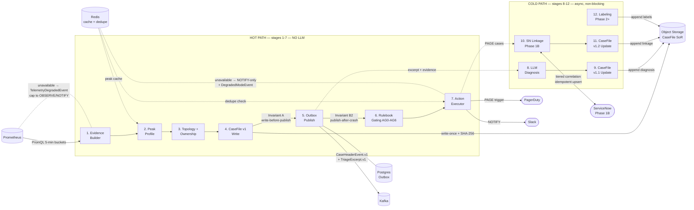

---
stepsCompleted:
  - step-01-init
  - step-02-discovery
  - step-02b-vision
  - step-02c-executive-summary
  - step-03-success
  - step-04-journeys
  - step-05-domain
  - step-06-innovation
  - step-07-project-type
  - step-08-scoping
  - step-09-functional
  - step-10-nonfunctional
  - step-11-polish
classification:
  projectType: Event-driven AIOps triage platform (internal operations tooling)
  domain: Fintech / Banking Operations (AIOps for Kafka)
  complexity: high
  projectContext: Greenfield AIOps layer on brownfield Kafka infrastructure
inputDocuments:
  - _bmad/input/BMAD-READY-INPUT-v1.0.md
  - _bmad/input/feed-pack/bmad-feed-pack-v1.7.md
  - _bmad/input/feed-pack/rulebook-v1.yaml
  - _bmad/input/feed-pack/gateinput-v1.contract.yaml
  - _bmad/input/feed-pack/redis-ttl-policy-v1.md
  - _bmad/input/feed-pack/outbox-policy-v1.md
  - _bmad/input/feed-pack/peak-policy-v1.md
  - _bmad/input/feed-pack/prometheus-metrics-contract-v1.yaml
  - _bmad/input/feed-pack/topology-registry.instances-v2.ownership-v1.clusters.yaml
  - _bmad/input/feed-pack/topology-registry.yaml
  - _bmad/input/feed-pack/topology-registry-loader-rules-v1.md
  - _bmad/input/feed-pack/servicenow-linkage-contract-v1.md
  - _bmad/input/feed-pack/local-dev-no-external-integrations-contract-v1.md
  - _bmad/input/feed-pack/phase-2-dod-v1.md
  - _bmad/input/feed-pack/phase-3-dod-v1.md
  - _bmad/input/feed-pack/diagnosis-policy.yaml
  - _bmad/input/feed-pack/claude_aiops_mvp_architecture_v6.md
workflowType: prd
documentCounts:
  briefs: 1
  research: 0
  projectDocs: 15
  brainstorming: 0
frozenContracts:
  - rulebook-v1.yaml
  - gateinput-v1.contract.yaml
  - redis-ttl-policy-v1.md
  - outbox-policy-v1.md
  - peak-policy-v1.md
  - prometheus-metrics-contract-v1.yaml
  - topology-registry.instances-v2.ownership-v1.clusters.yaml
  - topology-registry-loader-rules-v1.md
  - servicenow-linkage-contract-v1.md
  - local-dev-no-external-integrations-contract-v1.md
  - phase-2-dod-v1.md
  - phase-3-dod-v1.md
draftDocuments:
  - diagnosis-policy.yaml
optionalCues:
  - claude_aiops_mvp_architecture_v6.md
lastEdited: '2026-02-24'
editHistory:
  - date: '2026-02-24'
    changes: 'Post-validation improvements: fixed FR38/FR66 format, tightened FR16/FR42/FR50/FR62 measurability, added FR67 (MI-1 negative FR), added cross-border data N/A, data classification ref, Journey 6 Prometheus sub-scenario, Phase acceptance criteria, pipeline Mermaid diagram, Open Items section, Glossary'
---

# Product Requirements Document - bmad-demo

**Author:** Sas
**Date:** 2026-02-22

## Executive Summary

This platform delivers bank-grade AIOps triage for a shared Kafka streaming infrastructure. The immediate goal (Phase 0 → Phase 1B) is a triage-first pipeline: collect evidence from Prometheus, build durable CaseFiles, route incidents to the correct owning team with full provenance, and gate all actions through deterministic safety guardrails (Rulebook AG0–AG6). The system never simulates telemetry for MVP — Prometheus is the sole source of truth, and missing data is explicitly UNKNOWN, never treated as zero.

**Phase 0** is NOT MVP — it is a local harness that must prove three real-signal patterns (lag buildup, throughput-constrained proxy, volume drop) using real Prometheus metrics, plus validate Redis TTL behavior, peak profile confidence, ownership mapping, and outbox state-machine transitions locally. Harness stream naming is separate from prod naming.

**Phase 1A** delivers the MVP triage pipeline: Evidence Builder → Peak Profile → Topology+Ownership Enrichment → CaseFile to object storage → Postgres durable outbox publishes `CaseHeaderEvent.v1` + `TriageExcerpt.v1` to Kafka → deterministic Rulebook gating → Action Executor (env caps + dedupe) → SOFT postmortem enforcement via Slack/log. The Kafka hot path forwards only the minimal header and excerpt — no object-store reads in the routing/paging path. CaseFile is the system-of-record but is not fetched by hot-path consumers.

**Phase 1B** adds HARD ServiceNow postmortem automation: link to PD-created Incident, create/update Problem + PIR tasks via idempotent linkage contract with tiered correlation and 2-hour retry window.

**Phase 2** expands evidence coverage (client-level telemetry, runbook assistant, advisory ML boosters) and adds a labeling feedback loop, while keeping Rulebook guardrails authoritative. ML may propose top-N hypotheses and adjust diagnosis confidence weights using learned patterns, but never directly triggers actions in PROD/TIER_0.

**Phase 3** adds coverage-weighted hybrid topology (YAML as governed logical truth + Dynatrace Smartscape as best-effort observed graph + platform edge facts that emit even without app instrumentation) and a Sink Health Evidence Track with standardized primitives (`SINK_CONNECTIVITY`, `SINK_ERROR_RATE`, etc.).

**Exposure controls** are enforced throughout: TriageExcerpt and Slack outputs must be executive-safe, applying a denylist that excludes sensitive sink identifiers/endpoints, restricted access paths, credentials, and internal hostnames. CaseFile may contain richer operational detail, but excerpts are always capped.

**Postmortem policy** is selective (predicate `PM_PEAK_SUSTAINED` := peak && sustained && TIER_0 in PROD, per AG6). Phase 1A enforces via Slack/log (SOFT); Phase 1B via SN Problem + PIR tasks (HARD). MI posture: the system does NOT create Major Incident objects (MI-1 policy).

**Outbox operability** is a first-class requirement: delivery SLO (p95 ≤ 1 min, p99 ≤ 5 min), alerting on PENDING_OBJECT/READY/RETRY age thresholds, and a prod posture of DEAD=0 (any DEAD row in prod is critical).

Target users are Kafka platform operations engineers, data stewards, and incident responders at a bank. The system must be explainable to auditors, safe enough that a wrong-page-at-2-AM scenario is structurally prevented, and evolvable without breaking frozen contracts.

### What Makes This Special

- **Truthful telemetry as a structural guarantee.** Missing Prometheus series maps to `EvidenceStatus=UNKNOWN` — never faked as zero. Every evidence primitive carries provenance and confidence. Enforced by contract (prometheus-metrics-contract-v1, peak-policy-v1), not convention.
- **Deterministic safety guardrails decoupled from diagnosis.** The Rulebook (AG0–AG6) is a frozen contract that caps actions by environment, tier, evidence sufficiency, confidence, sustained state, and dedupe — independent of how diagnosis evolves. PAGE is structurally impossible outside PROD+TIER_0.
- **Minimal hot-path contract.** Kafka forwards only `CaseHeaderEvent.v1` + `TriageExcerpt.v1`. No object-store reads in the routing/paging path. CaseFile is system-of-record, written before publish (Invariant A), but hot-path consumers never fetch it.
- **Durable, reproducible CaseFiles.** Every triage case is written to object storage before any Kafka publish (Invariant A). A Postgres durable outbox (Invariant B2) guarantees publish-after-crash. Outbox SLOs and DEAD=0 prod posture are operability requirements, not aspirations. Cases are reproducible and auditable for 25 months in prod.
- **Executive-safe exposure controls.** TriageExcerpt and Slack outputs enforce a denylist — no sensitive sink endpoints, credentials, restricted hostnames. CaseFile stores richer detail; excerpts are always capped.
- **Ownership-aware routing from day one.** The topology registry encodes ownership at consumer-group, topic, stream, and platform-default levels. Routing is deterministic, not ad-hoc.
- **Safe degraded modes.** Redis unavailable → deny PAGE/TICKET, allow NOTIFY only. Dedupe store error → same. The system never generates paging storms when infrastructure degrades.
- **Selective postmortem enforcement (`PM_PEAK_SUSTAINED`).** Triggered by AG6 predicate (peak && sustained && TIER_0 in PROD). SOFT (Slack/log) in Phase 1A, HARD (SN Problem + PIR) in Phase 1B. No automated MI creation (MI-1).
- **Zero-external-integration local development.** The full pipeline runs locally via docker-compose (Kafka + Postgres + Redis + MinIO + Prometheus). All external integrations are pluggable via `OFF | LOG | MOCK | LIVE` modes with LOG/OFF as local defaults.
- **Instance-scoped multi-cluster topology.** Streams declare `instances[]` keyed by `(env, cluster_id)`, with `topic_index` scoped per instance. Prevents cross-cluster collisions and supports DR/multi-cluster natively. Backward-compatible loader migrates legacy v0 registries.
- **Coverage-weighted hybrid topology (Phase 3).** YAML is governed logical truth; Smartscape provides best-effort observed graph; platform edge facts emit even without app-level instrumentation. Instance-scoped, exposure-safe.

## Project Classification

- **Project Type:** Event-driven AIOps triage platform (internal operations tooling)
- **Domain:** Fintech / Banking Operations (AIOps for Kafka streaming infrastructure)
- **Complexity:** High — regulated industry, 12 frozen contracts as constraints, multi-phase delivery (Phase 0–3), deterministic auditability requirements
- **Project Context:** Greenfield AIOps layer on brownfield Kafka infrastructure

## Success Criteria

### User Success

**Kafka Platform Ops (primary responders):**
- Cases arrive with correct owning team pre-routed — responder does not manually triage ownership
- CaseFile provides enough context to START investigation and measurably reduces Prometheus re-queries and time-to-first-action
- False-positive PAGE rate is measurably low — responders trust that a page means "real, sustained, high-confidence, PROD TIER_0"
- Responders can trace any action decision back to specific gate IDs + reason codes (AG0–AG6) without reading code
- When degraded mode engages (Redis unavailable), responders receive an explicit `DegradedModeEvent` in logs/Slack explaining why PAGE/TICKET is capped — no silent behavioral changes

**Data Stewards (secondary):**
- Notified only for anomalies in their stewardship domain (SOURCE_TOPIC routing) — not paged for platform issues
- CaseFile references relevant topology (stream, topic role, source system) without requiring steward to know pipeline internals

**Incident Responders / Auditors:**
- Any case can be reproduced from object storage (CaseFile is system-of-record, 25-month prod retention)
- Postmortem obligations are traceable: `PM_PEAK_SUSTAINED` predicate (AG6) fires selectively, not blanket
- No sensitive sink endpoints/credentials appear in TriageExcerpt or Slack outputs (exposure denylist enforced)

### Business Success

- **Incident response quality:** Correct-team routing rate ≥ 95% for top critical streams (measured via owner-confirmed labels or manual sampling in Phase 2+)
- **Noise reduction:** No paging storms — repeat PAGE for same fingerprint within dedupe TTL is near-zero; repeat TICKET/NOTIFY within respective dedupe TTLs also near-zero; degraded Redis → NOTIFY-only with explicit `DegradedModeEvent` (no silent caps)
- **Audit readiness:** Every action decision is deterministically explainable via Rulebook gate IDs + reason codes; CaseFile provenance chain is complete
- **MI-1 posture:** System does NOT create Major Incident objects — this is a human decision boundary
- **Outbox reliability (prod):** DEAD=0 as standing posture; any DEAD row is critical alert
- **SN linkage (Phase 1B):** ≥ 90% of PAGE cases LINKED to PD-created SN Incident within 2-hour retry window; Tier 1 vs Tier 2/3 correlation fallback rates tracked — Tier 2/3 usage should trend down over time as PD→SN integration matures

### Technical Success

**Invariants (must hold at all times):**
- Invariant A: CaseFile written to object storage BEFORE Kafka header publish
- Invariant B2: Postgres durable outbox guarantees publish-after-crash
- Hot-path contract: Kafka forwards only `CaseHeaderEvent.v1` + `TriageExcerpt.v1` — no object-store reads in routing/paging path
- Missing Prometheus series → `EvidenceStatus=UNKNOWN` (never treated as zero)
- PAGE structurally impossible outside PROD+TIER_0 (AG1 env+tier caps)
- Exposure denylist enforced on all excerpt/notification outputs

**Outbox SLO (prod):**
- p95 CaseFile-write → Kafka-publish ≤ 1 minute
- p99 ≤ 5 minutes
- Critical breach: p99 > 10 minutes
- Alert thresholds: PENDING_OBJECT >5m warn / >15m crit; READY >2m warn / >10m crit; RETRY >30m crit; DEAD >0 crit (prod)

**Storm control + degraded-mode transparency:**
- Dedupe suppresses repeat PAGE/TICKET/NOTIFY within respective TTLs (PAGE 120m, TICKET 240m, NOTIFY 60m) — near-zero repeats
- Redis unavailable → deny PAGE/TICKET, allow NOTIFY only (AG5 `DEGRADE_AND_ALLOW_NOTIFY`)
- Degraded-mode engagement MUST emit explicit `DegradedModeEvent` to logs and Slack (if configured) with: affected scope, reason, capped action level, and estimated impact window

**Local-dev independence (dual-mode):**
- **Mode A (default): Local containers.** docker-compose with Kafka + Postgres + Redis + MinIO + Prometheus. No external integration calls. Full pipeline runs end-to-end locally.
- **Mode B (opt-in): Shared dev/uat infrastructure.** When endpoints and credentials are explicitly configured, integrations may use existing shared dev/uat services. LIVE mode is allowed only when explicitly configured and restricted to approved dev/uat endpoints — no accidental prod calls.
- All integrations support `OFF | LOG | MOCK | LIVE` modes. Default is `LOG` (safe, visible). LIVE requires explicit endpoint+credential configuration.
- CaseFile durability invariants testable in both modes (MinIO locally or real object store in dev/uat).

### Measurable Outcomes

| Metric | Phase 0 | Phase 1A | Phase 1B | Phase 2 | Phase 3 |
|--------|---------|----------|----------|---------|---------|
| Real-signal patterns proven | 3 (lag, constrained proxy, volume drop) | — | — | — | — |
| Outbox DEAD=0 (prod) | local validated | maintained | maintained | maintained | maintained |
| Outbox SLO p95 ≤ 1 min | local validated | measured | measured | measured | measured |
| Correct-team routing | local validated | baseline established | baseline | ≥ 95% | improved |
| SN linkage rate (PAGE cases) | — | — | ≥ 90% within 2h | maintained | maintained |
| SN Tier 2/3 fallback rate | — | — | baseline tracked | trending down | trending down |
| Dedupe effectiveness (repeat PAGE/TICKET/NOTIFY) | — | near-zero | near-zero | near-zero | near-zero |
| DegradedModeEvent emitted on Redis failure | — | validated | validated | validated | validated |
| TelemetryDegradedEvent emitted on Prometheus failure | local validated | validated | validated | validated | validated |
| UNKNOWN evidence rate (top 3 families) | — | baseline | — | ≥ 50% reduction | further reduction |
| Triage usefulness rating | — | — | — | ≥ 80% "useful" | maintained |
| Label completion rate (eligible cases) | — | — | — | ≥ 70% | maintained |
| Label consistency (owner_confirmed, resolution_category) | — | — | — | validation passing | maintained |
| Topology edge coverage (top N streams) | — | — | — | — | ≥ 70% |
| Sink evidence AVAILABLE rate | — | — | — | — | ≥ 60% |
| Exposure safety violations | 0 | 0 | 0 | 0 | 0 |

## Product Scope

### MVP — Phase 0 + Phase 1A + Phase 1B (Delivery Critical Path)

**Phase 0 (Local Harness — NOT MVP):**
- Prove lag buildup, throughput-constrained proxy, and volume drop patterns using real Prometheus metrics
- Validate Redis TTL behavior (evidence cache + dedupe) and peak profile confidence
- Validate outbox state-machine transitions (PENDING_OBJECT → READY → SENT + RETRY/DEAD)
- Validate ownership mapping against topology registry
- Validate `DegradedModeEvent` emission when Redis is unavailable
- Validate `TelemetryDegradedEvent` emission when Prometheus is unavailable (no all-UNKNOWN cases emitted; actions capped)
- Harness stream naming separate from prod naming

**Phase 1A (MVP Triage Pipeline):**
- Evidence Builder → Peak Profile → Topology+Ownership Enrichment → CaseFile (object storage) → Outbox → Kafka header/excerpt → Rulebook gating (AG0–AG6) → Action Executor (env caps + dedupe) → SOFT postmortem enforcement (Slack/log)
- All frozen contracts implemented: Rulebook, GateInput, Redis TTL, Outbox, Peak, Prometheus metrics, Registry loader, local-dev
- Clusters: Business_Essential, Business_Critical (prod)
- Exposure denylist enforced on TriageExcerpt + Slack
- Storm control: dedupe across PAGE/TICKET/NOTIFY with explicit `DegradedModeEvent` on Redis failure

**Phase 1B (SN Postmortem Automation):**
- Link to PD-created Incident via tiered correlation (Tier 1: PD field → Tier 2: keyword → Tier 3: heuristic)
- Idempotent Problem + PIR task upsert (external_id keyed)
- 2-hour retry window with exponential backoff + jitter
- FAILED_FINAL → Slack escalation (exposure-safe)
- Least-privilege SN integration user (read incident, CRUD problem/task)
- Track Tier 1 vs Tier 2/3 fallback rates from day one

### Growth Features — Phase 2 (Better Evidence + Better Triage Quality)

- Expanded evidence sources (client/app-level telemetry) mapped to Evidence primitives with provenance/confidence/UNKNOWN
- Runbook assistant (read-only, advisory — Rulebook still gates)
- Advisory ML boosters: top-N hypothesis ranking, confidence adjustment from learned patterns — ML never directly triggers actions in PROD/TIER_0
- Labeling feedback loop: `resolution_category`, `owner_confirmed`, `false_positive`, `missing_evidence_reason`
- ML-readiness data-quality gates: label completion rate ≥ 70% for eligible cases; validation/consistency checks for key labels (`owner_confirmed`, `resolution_category`) must pass before ML models consume them
- Success: UNKNOWN reduction ≥ 50%, misroute rate < 5%, triage usefulness ≥ 80% — measured 4 consecutive weeks

### Vision — Phase 3 (Hybrid Topology + Sink Health)

- Coverage-weighted hybrid topology: YAML (governed logical truth) + Smartscape (best-effort observed) + platform edge facts (emit without app instrumentation)
- Sink Health Evidence Track: `SINK_CONNECTIVITY`, `SINK_ERROR_RATE`, `SINK_LATENCY`, `SINK_BACKLOG`, `SINK_THROTTLE`, `SINK_AUTH_FAILURE`
- Improved diagnosis attribution: "Kafka symptoms vs downstream sink symptoms" with evidence references and uncertainty
- Instance-scoped enriched topology views keyed by `(env, cluster_id)`
- YAML governance never overridden by observed topology
- Success: edge coverage ≥ 70%, "wrong layer" misdiagnosis reduced ≥ 30%, sink evidence AVAILABLE ≥ 60%, exposure violations = 0 — measured 8 consecutive weeks

## User Journeys

### Journey 1: Kafka Platform Ops Engineer — Sustained Lag During Peak (PAGE Path)

**Persona:** Priya, Kafka Platform Ops on-call engineer. 3 AM, phone buzzes.

**Opening Scene:** Priya's pager fires. The page summary shows: `CaseHeaderEvent.v1` — sustained consumer lag on `e2-p-sourcestream` (KAFKA_SOURCE_STREAM role), Business_Essential cluster, TIER_0, peak window active. The TriageExcerpt (executive-safe, no sensitive endpoints) gives her: stream_id, anomaly family, confidence score, sustained=true, matched gates (AG1 passed, AG4 passed), final action=PAGE, `PM_PEAK_SUSTAINED` postmortem required.

**Rising Action:** Priya opens the full CaseFile from object storage. She sees: Evidence Builder findings with specific Prometheus metric values (messages-in rate vs p95 baseline), peak profile confirmation, topology context (stream → instances → topic_index → downstream components AT_RISK), ownership routing chain (how it reached her team), and all gate reason codes. She doesn't need to manually correlate Prometheus dashboards — the CaseFile has the evidence window, the baseline comparison, and the sustained-interval history. Time-to-first-action is minutes, not the usual 20+ minutes of manual Prometheus spelunking.

**Climax:** Priya identifies the issue as a downstream processing bottleneck causing backpressure on the shared source-stream. Sink visibility is UNKNOWN in Phase 1A — she cannot yet attribute to a specific downstream component (e.g., NiFi, HDFS landing) without Phase 3 Sink Health Evidence. She escalates using the blast_radius (downstream components marked AT_RISK) and topology_exposure from the CaseFile. The postmortem obligation (`PM_PEAK_SUSTAINED`) is tracked — Phase 1A logs the obligation to Slack; Phase 1B will auto-create a Problem + PIR tasks in ServiceNow linked to the PD-created Incident.

**Resolution:** Incident resolved. The CaseFile is the permanent record. Auditors can trace: evidence → diagnosis → gate decisions → action → postmortem obligation. No ambiguity about why she was paged or what the system decided.

**Capabilities revealed:** CaseFile assembly, peak profile, ownership routing, Rulebook gating (AG1/AG4), exposure-safe excerpt, `PM_PEAK_SUSTAINED` postmortem tracking, object-storage durability.

---

### Journey 2: Service Owner / Application Team On-call — Consumer Lag Routed to App Team

**Persona:** Marcus, payments application team on-call. His team owns consumer groups reading from `payment-p-events`.

**Opening Scene:** Marcus receives a TICKET (not a PAGE — his consumer group is TIER_1, capped by AG1). The TriageExcerpt tells him: sustained consumer lag on his consumer group against `payment-p-events` (SOURCE_TOPIC role), Business_Critical cluster. Anomaly family: CONSUMER_LAG. The excerpt includes the routing chain showing why it reached his team (consumer_group_owner match in topology registry).

**Rising Action:** Marcus opens the CaseFile. He sees: lag metric values over the 5-minute sustained window, the specific consumer group identity `(env, cluster_id, group, topic)`, peak context (not peak — so `PM_PEAK_SUSTAINED` did NOT fire), and the topology view showing his app's position in the pipeline. The findings declare their evidence requirements (`finding.evidence_required[]`), and AG2 confirms evidence is sufficient — any missing series remains UNKNOWN and is reflected in confidence (never treated as zero, never assumed PRESENT). He also sees: topic_role=SOURCE_TOPIC, so AG3 would have denied PAGE even if tier allowed it — the system prevented a 3 AM page for a source-topic anomaly.

**Climax:** Marcus identifies his consumer is falling behind due to a recent deployment that increased per-record processing time. The CaseFile's evidence pack and topology context gave him the starting point without manually correlating Prometheus dashboards across clusters.

**Resolution:** Marcus rolls back the deployment. The dedupe window (TICKET: 240 minutes) prevents a storm of duplicate tickets while he works. The CaseFile is retained for his team's postmortem review.

**Alternative path — misroute:** Marcus reviews the CaseFile and determines the lag is not caused by his application — it's a platform-side issue. He labels the case: `owner_confirmed: false`, `resolution_category: misrouted`, and reroutes to the platform ops team. This feeds the routing accuracy metric (target: ≥ 95% correct-team routing) and the labeling loop. Over time, misroute patterns drive topology registry corrections.

**Capabilities revealed:** Consumer-group ownership routing, TIER_1 action capping (AG1), SOURCE_TOPIC PAGE denial (AG3), evidence sufficiency with UNKNOWN-aware confidence (AG2), dedupe storm control (AG5), instance-scoped topology lookup, reroute/labeling feedback for routing accuracy.

---

### Journey 3: Data Steward — Volume Drop on Source Topic

**Persona:** Anika, payments data steward. Responsible for data quality from the Payments source system.

**Opening Scene:** Anika receives a NOTIFY (not TICKET — confidence is moderate, sustained but below threshold for higher urgency per AG4). The notification tells her: volume drop detected on `payment-p-events` (SOURCE_TOPIC), Business_Essential cluster. The TriageExcerpt is clean — no sink endpoints, no internal hostnames, just the anomaly summary and her team's routing key.

**Rising Action:** Anika checks the CaseFile. She sees the messages-in rate has dropped significantly against the p90 baseline, the source_system is identified as "Payments," and the blast radius is LOCAL_SOURCE_INGESTION (not shared pipeline). She doesn't need to understand the shared pipeline topology — the CaseFile scopes the issue to her domain. The gap list notes no client-level telemetry available yet (Phase 2 will add this).

**Climax:** Anika contacts the upstream Payments application team. The volume drop correlates with a scheduled maintenance window they forgot to communicate. She confirms it's expected.

**Resolution:** The case resolves as a false positive from the steward's perspective. In Phase 2, Anika's feedback (label: `false_positive`, `missing_evidence_reason: scheduled_maintenance_not_communicated`) feeds the labeling loop, improving future diagnosis quality.

**Capabilities revealed:** Data steward routing (topic_owner match), SOURCE_TOPIC scoping, blast radius classification, exposure-safe notifications, gap reporting, Phase 2 labeling feedback.

---

### Journey 4: Incident Manager / Auditor — Postmortem Compliance Review

**Persona:** David, incident management lead. Quarterly audit of postmortem compliance.

**Opening Scene:** David queries CaseFiles from object storage for the past quarter. He filters for cases where `PM_PEAK_SUSTAINED` fired (AG6: peak && sustained && TIER_0 in PROD). He needs to verify: did every obligated case get a postmortem?

**Rising Action:** For each flagged case, David traces the decision chain: Evidence Builder findings → peak profile confirmation → Rulebook gate outputs (AG6 `on_pass: set_postmortem_required: true`, reason code `PM_PEAK_SUSTAINED`) → action decision → postmortem enforcement record. In Phase 1A, he checks Slack logs for SOFT enforcement notifications. In Phase 1B, he checks ServiceNow for linked Problem + PIR tasks.

**Climax:** David finds one case where SN linkage was `FAILED_FINAL` (2-hour retry window exhausted). The CaseFile records the `sn_linkage_status`, `sn_linkage_reason_codes`, and the Slack escalation that was sent. He can see exactly what happened: Tier 1 correlation failed (PD field not populated), Tier 2 keyword search found no match, Tier 3 heuristic timed out. The system failed safe — no duplicate Problems were created, and humans were notified.

**Resolution:** David flags the linkage gap for process improvement (PD→SN integration needs the correlation field populated). The audit trail is complete — every decision is deterministic and traceable. He confirms: the system never created a Major Incident object (MI-1 posture held).

**Capabilities revealed:** CaseFile as audit record, `PM_PEAK_SUSTAINED` traceability, SN linkage state machine (PENDING → SEARCHING → FAILED_FINAL), idempotency guarantees, MI-1 posture, 25-month retention.

---

### Journey 5: AIOps Platform Developer — Local Development & Diagnosis Evolution

**Persona:** Chen, platform engineer building the AIOps system.

**Opening Scene:** Chen is developing a new diagnosis rule for a throughput-constrained proxy pattern. He needs to run the full pipeline locally without any external integrations.

**Rising Action (Mode A — Local Containers):** Chen runs `docker-compose up` — Kafka, Postgres, Redis, MinIO, Prometheus all start locally. All integrations default to `LOG` mode. He configures the harness to generate traffic patterns that produce the constrained-proxy signal (lag + near-peak ingress + not a volume drop). Harness stream naming is separate from prod naming. He watches: Evidence Builder collects from local Prometheus → peak profile computes against local baseline → CaseFile writes to MinIO → outbox transitions through PENDING_OBJECT → READY → SENT → Kafka header published to local broker. Slack/SN actions appear as structured `NotificationEvent` JSON in logs. He validates the full invariant chain locally.

**Rising Action (Mode B — Shared dev/uat):** Later, Chen needs to test against realistic data volumes. He configures integration endpoints to point at shared dev/uat Kafka and Prometheus. LIVE mode is explicitly enabled with approved dev/uat endpoints — the config prevents accidental prod calls. He runs the same pipeline against real dev/uat telemetry.

**Climax:** Chen's new diagnosis rule correctly identifies the constrained-proxy pattern. He validates the rule produces the expected GateInput fields, passes AG0 (schema valid), and AG2 (evidence requirements declared in `finding.evidence_required[]` are all PRESENT). The rule is ready for review.

**Resolution:** Chen submits the diagnosis policy change. The frozen contracts (Rulebook, GateInput, Peak, Prometheus metrics) didn't need to change — diagnosis evolved independently. Local-dev independence means no shared environment was blocked during development.

**Capabilities revealed:** Mode A/B local dev, LOG-mode integration fallbacks, harness traffic generation, diagnosis policy evolution independent of frozen contracts, outbox state-machine validation, MinIO as local object store.

---

### Journey 6: Ops Lead / SRE Manager — System Health & Degraded Mode

**Persona:** Fatima, SRE manager overseeing the AIOps platform in production.

**Opening Scene:** Fatima's monitoring dashboard shows a Redis connectivity issue in the prod cluster. She needs to understand the impact on AIOps behavior.

**Rising Action:** The AIOps system detects Redis unavailability and immediately emits a `DegradedModeEvent` to logs and Slack (her platform ops channel). The event contains: affected scope (evidence cache + dedupe store), reason (Redis connection timeout), capped action level (NOTIFY-only — PAGE and TICKET denied per AG5 `DEGRADE_AND_ALLOW_NOTIFY`), and estimated impact window. Cases continue to process — evidence is still collected from Prometheus, CaseFiles still written to object storage, outbox still publishes — but no pages or tickets fire. Responders see the `DegradedModeEvent` and understand why.

**Climax:** Fatima also monitors the outbox dashboard. She checks: DEAD count = 0 (holding), READY oldest age < 2 min (healthy), PENDING_OBJECT backlog normal. The outbox is unaffected by the Redis issue (Postgres is fine). She confirms the system is degrading safely — no paging storms, no silent failures.

**Resolution:** Redis recovers. Dedupe state is rebuilt (cache-only, recomputable). Fatima reviews the degraded-mode window: no false pages were sent, NOTIFY-only behavior held throughout. She logs the incident duration for capacity planning.

**Sub-scenario — Prometheus Unavailability:**

**Opening Scene:** A week later, Fatima sees a different degradation: Prometheus scrape failures across the prod cluster. The AIOps system detects total Prometheus unavailability (not individual missing series — those map to per-metric `EvidenceStatus=UNKNOWN` as normal) and emits a `TelemetryDegradedEvent` to logs and Slack. The event contains: affected scope (all evidence collection), reason (Prometheus connection timeout), and recovery status.

**Rising Action:** Unlike the Redis scenario, this affects evidence collection at the source. The pipeline does NOT emit normal cases with all-UNKNOWN evidence — it recognizes that total source unavailability is different from individual metric gaps. Actions are capped to OBSERVE/NOTIFY. No pages, no tickets. The outbox continues operating (Postgres is fine), but no new CaseFiles are produced because there is no evidence to collect.

**Climax:** Fatima confirms on the meta-monitoring dashboard: Prometheus connectivity shows scrape failure, `TelemetryDegradedEvent` is active, no new cases are being generated. She verifies the system is NOT generating noise — no all-UNKNOWN cases flooding the pipeline.

**Resolution:** Prometheus recovers. `TelemetryDegradedEvent` clears. Normal evaluation resumes on the next 5-minute interval. No backfill of missed intervals — the system acknowledges the gap rather than fabricating evidence. Fatima logs the outage window.

**Capabilities revealed:** `DegradedModeEvent` transparency, Redis degraded-mode behavior (AG5), `TelemetryDegradedEvent` transparency, Prometheus degraded-mode behavior (no all-UNKNOWN cases, action capping to OBSERVE/NOTIFY), outbox health monitoring (SLO, DEAD=0, age thresholds), safe degradation without paging storms, no-backfill recovery.

---

### Journey 7: Kafka Platform Ops — Sink Unreachable (Phase 3)

**Persona:** Priya again, on-call. This time the system has Phase 3 capabilities.

**Opening Scene:** Priya receives a TICKET. The TriageExcerpt shows: consumer lag sustained on the shared source-stream, but the CaseFile now includes Sink Health Evidence — a new evidence track unavailable in Phase 1A.

**Rising Action:** Priya opens the CaseFile. Unlike Phase 1A where downstream attribution was UNKNOWN, she now sees sink evidence primitives: `SINK_CONNECTIVITY: ABSENT` for the HDFS landing path, `SINK_ERROR_RATE: PRESENT (elevated)`, `SINK_LATENCY: PRESENT (normal)`. The coverage-weighted hybrid topology view (YAML governance + Smartscape observed + platform edge facts) shows the full path from Kafka consumer through NiFi to HDFS sink — with the edge fact confirming the consumer-to-sink relationship even though the application team hasn't instrumented.

**Climax:** The CaseFile's diagnosis attribution now distinguishes: "Kafka symptoms are secondary (lag is a consequence); primary evidence points to sink unreachability." The system presents this as "Kafka OK, downstream sink unreachable" with evidence references and explicit uncertainty markers. Priya routes directly to the storage/infrastructure team — no wasted triage cycle on the Kafka layer. The TriageExcerpt remains exposure-safe: it references the sink evidence status (`SINK_CONNECTIVITY: ABSENT`) but does NOT include the actual HDFS path, endpoint, or Ranger access groups.

**Resolution:** Storage team confirms HDFS maintenance caused the sink outage. The CaseFile records the full evidence chain including sink primitives with provenance and confidence. The "wrong layer" misdiagnosis that would have occurred in Phase 1A is avoided.

**Note:** In Phase 1A, this same scenario would show `SINK_CONNECTIVITY: UNKNOWN`, `SINK_ERROR_RATE: UNKNOWN` — the system would not misattribute, but would surface the UNKNOWN status and route based on Kafka-layer evidence only.

**Capabilities revealed:** Sink Health Evidence Track (`SINK_CONNECTIVITY`, `SINK_ERROR_RATE`), coverage-weighted hybrid topology (YAML + Smartscape + edge facts), improved diagnosis attribution ("Kafka vs sink"), exposure-safe sink evidence in excerpts, Phase 3 edge-fact coverage without app instrumentation.

---

### System Actor: PagerDuty (External)

**Scope:** PagerDuty creates ServiceNow Incidents externally. AIOps sends PAGE trigger payloads to PD containing `pd_incident_id` (or `pd_dedupe_key`) as a stable identifier for downstream SN correlation. AIOps does NOT create Incidents. PD→SN integration is an external dependency; AIOps relies on it populating a correlation field for Tier 1 linkage.

### System Actor: ServiceNow (Phase 1B)

**Scope:** AIOps interacts with SN via least-privilege integration user (read incident, CRUD problem/task). Interactions:
- **Search:** Find PD-created Incident using tiered correlation (Tier 1: PD field → Tier 2: keyword in description/work_notes → Tier 3: time-window + routing heuristic)
- **Create/Update:** Idempotent Problem upsert (`external_id = aiops_case_id`), PIR task upsert (`external_id = aiops_case_id:task_type`)
- **Retry:** Exponential backoff with jitter over 2-hour window (1m, 2m, 5m, 10m, 20m, 30m cap)
- **Fail-safe:** `FAILED_FINAL` after 2 hours → Slack escalation (exposure-safe: case_id + pd_incident_id + search fields used, no sensitive identifiers)
- **Linkage state:** Persisted as `PENDING → SEARCHING → LINKED` or `SEARCHING → FAILED_TEMP → SEARCHING` or `SEARCHING → FAILED_FINAL`
- **All API calls logged** with request_id, case_id, SN sys_ids touched, outcome, latency

### Journey Requirements Summary

| Capability Area | Journeys |
|---|---|
| Evidence Builder + Peak Profile | 1, 2, 3, 5 |
| Ownership routing (multi-level) | 1, 2, 3 |
| Rulebook gating (AG0–AG6) | 1, 2, 3, 4, 6 |
| CaseFile durability + audit trail | 1, 2, 3, 4, 5 |
| Exposure denylist (excerpt/Slack) | 1, 2, 3, 4, 7 |
| Hot-path minimal contract | 1, 2 |
| `PM_PEAK_SUSTAINED` postmortem | 1, 4 |
| Storm control (dedupe) | 2, 6 |
| Degraded-mode transparency (`DegradedModeEvent`, `TelemetryDegradedEvent`) | 6 |
| Outbox SLO + health monitoring | 5, 6 |
| SN linkage (Phase 1B) | 1, 4, SN actor |
| Local-dev Mode A/B | 5 |
| Labeling + reroute feedback loop | 2, 3 |
| Instance-scoped topology | 1, 2, 3, 5 |
| Sink Health Evidence Track (Phase 3) | 7 |
| Hybrid topology (Phase 3) | 7 |

## Domain-Specific Requirements

### Compliance & Regulatory

- **Audit trail completeness:** Every action decision must be deterministically traceable from evidence → diagnosis → Rulebook gate outputs → final action. CaseFile is the system-of-record (25-month prod retention). This satisfies internal audit and regulatory examination requirements for operational systems in a bank.
- **No automated Major Incident creation (MI-1):** The system does not create MI objects — this is a human decision boundary. AIOps supports postmortem automation (Problem + PIR tasks) but does not escalate into the bank's MI process autonomously.
- **Postmortem selectivity:** Postmortem obligations are predicate-driven (`PM_PEAK_SUSTAINED` via AG6), not blanket. This prevents audit noise from non-critical cases while ensuring every high-impact case is tracked.
- **Data retention:** CaseFile retention (25 months prod) aligns with banking regulatory examination windows. Outbox SENT/DEAD retention policies are defined per environment.
- **Cross-border data handling:** Not applicable for current scope. This platform processes operational telemetry (Kafka metrics, infrastructure health signals) from the bank's internal Kafka infrastructure. CaseFiles contain no customer PII, no transaction data, and no cross-border personal data — all data subjects are internal systems, not natural persons. If the deployment topology spans geographic regions (e.g., multi-region DR), data residency requirements for CaseFile storage should be evaluated during deployment planning as an infrastructure concern.

### Evidence Integrity & Immutability

- **Write-once / append-only CaseFiles:** CaseFile objects in storage must be write-once or append-only with versioning. Once evidence and decisions are recorded, they cannot be silently mutated. Any amendments (e.g., postmortem annotations, SN linkage updates) must be appended as new versions, preserving the original decision record.
- **Hash / checksum for audit integrity:** Each CaseFile version must include a content hash (e.g., SHA-256) recorded at write time. Auditors must be able to verify that the CaseFile retrieved matches the hash recorded at decision time — tamper-evidence for regulatory examination.
- **Policy version stamping:** Every CaseFile must record the exact versions of policies used to make its decisions: `rulebook_version`, `peak_policy_version`, `prometheus_metrics_contract_version`, `exposure_denylist_version`, `diagnosis_policy_version` (if applicable). This ensures reproducibility: given the same evidence + the same policy versions, the same gating decision must result.

### Data Minimization & Privacy

- **No PII/secrets in CaseFiles:** CaseFiles must not contain personally identifiable information, credentials, API keys, or secrets. Evidence fields must be limited to operational telemetry identifiers (cluster_id, topic, group, stream_id, metric values) — not user data payloads.
- **Sensitive field redaction:** Any field that could transitively reference sensitive data (e.g., sink endpoints with embedded credentials, Ranger group names that reveal org structure) must be redacted or excluded from CaseFile content. The exposure denylist applies to CaseFile content, not just excerpts.
- **Store only necessary evidence:** CaseFiles store evidence summaries (metric values, findings, status maps), not raw telemetry dumps. The principle is: enough to reproduce the decision, not enough to reconstruct the data pipeline's content.
- **Purge/retention governance:** Retention periods (25 months prod CaseFile, 14 days SENT outbox, 90 days DEAD outbox) must be enforced by automated lifecycle policies. Purge operations must be auditable (logged with timestamp, scope, policy reference). No manual ad-hoc deletion without governance approval.
- **Data classification alignment:** CaseFile content, TriageExcerpt, and all pipeline outputs contain operational telemetry identifiers (no PII, no secrets) and are expected to fall within the bank's Internal/Operational classification tier. The exposure denylist and data minimization controls must be validated against the bank's formal data classification taxonomy during deployment readiness review — the bank's Information Security team owns the taxonomy.

### Policy Governance & Change Management

- **Controlled policy changes:** Rulebook, exposure denylist, postmortem predicates (`PM_PEAK_SUSTAINED`), and Prometheus metrics contract must follow controlled change management: versioned artifacts, approval gates, and audit trail of who changed what and when.
- **Policy versioning:** All policy artifacts must carry explicit version identifiers (e.g., `rulebook.v1`, `gateinput.v1`). Version bumps require review. CaseFiles record which policy versions were active at decision time (see Evidence Integrity above).
- **Diagnosis policy separation:** Diagnosis policy (currently draft, not frozen) can evolve independently of Rulebook guardrails. This is by design — but changes must still be versioned and traceable. The Rulebook remains authoritative regardless of diagnosis policy changes.
- **Denylist governance:** The exposure denylist (controlling what appears in TriageExcerpt/Slack/SN outputs) must be a versioned, reviewable artifact — not hardcoded logic. Changes to the denylist are security-sensitive and require explicit approval.

### LLM Role & Boundaries

- **Bounded role:** The LLM is a "diagnosis synthesis + hypothesis ranking + explanation" component. It produces structured DiagnosisReport output (verdict, fault domain, confidence, evidence pack, next checks). It is NOT the action authority — deterministic Rulebook gates (AG0–AG6) are final.
- **Provenance-aware outputs:** LLM outputs must cite evidence IDs/references from the structured evidence pack. LLM must explicitly propagate UNKNOWN when evidence is missing — never invent metric values, never fabricate findings, never assert PRESENT when the evidence_status_map says UNKNOWN/ABSENT/STALE.
- **Exposure-capped inputs:** LLM primarily consumes the executive-safe TriageExcerpt + structured evidence summaries (GateInput-shaped). Sensitive sink identifiers/endpoints remain excluded from LLM context. CaseFile richer detail is available for evidence references but the exposure denylist still applies to any LLM-generated narrative that surfaces in outputs.
- **Non-blocking degradation:** If LLM is unavailable or times out, the pipeline must still produce a valid CaseFile + header/excerpt using deterministic findings and UNKNOWN semantics. DiagnosisReport falls back to `verdict: NEEDS_MORE_EVIDENCE` with a gap recorded. Actions remain safely gated — typically capped to OBSERVE/NOTIFY by AG4 (low confidence) when LLM is absent.
- **Cost controls:** LLM invocation is conditional — triggered only when case meets criteria (e.g., PROD+TIER_0, or sustained anomaly, or confidence above threshold). Token usage is bounded: input is excerpt + structured evidence summary, not full raw Prometheus series or log dumps. Phase 2 advisory ML (top-N hypothesis ranking) is similarly bounded.
- **Schema safety:** LLM output must be validated against DiagnosisReport schema. Invalid/unparseable LLM output → deterministic fallback (NEEDS_MORE_EVIDENCE + gap), never a crash or silent malformation. The system is resilient to bad model outputs.

### Technical Constraints

- **Exposure controls (executive-safe posture):** All outputs visible to humans outside the platform team (TriageExcerpt, Slack notifications, SN Problem descriptions) must enforce the versioned denylist: no sensitive sink endpoints/identifiers, no credentials, no restricted internal hostnames, no Ranger access group names. CaseFile stores richer detail but is access-controlled.
- **Least-privilege integrations:** SN integration user has READ on incident, CRUD on problem/task — no broad admin roles. All API calls logged with request_id, case_id, sys_ids touched, outcome, latency.
- **No accidental prod calls:** Local-dev LIVE mode is restricted to approved dev/uat endpoints. Config must prevent accidental connection to production integrations. Default integration mode is LOG (safe, visible).
- **Deterministic safety gates:** Rulebook guardrails (AG0–AG6) are deterministic policy, not probabilistic. ML (Phase 2+) is advisory only and never directly triggers actions in PROD/TIER_0. This is a regulatory posture: automated decisions that can page humans at 3 AM must be explainable and auditable.

### Integration Requirements

- **Prometheus:** Sole source of truth for telemetry. Label normalization (`cluster_id := cluster_name` exact string). Canonical metric names locked in prometheus-metrics-contract-v1. Missing series → UNKNOWN.
- **Object storage:** CaseFile system-of-record. Write-once/append-only with hash verification. Invariant A (write before publish) is non-negotiable. MinIO locally, production object store in higher environments.
- **Postgres:** Durable outbox (Invariant B2). State machine: PENDING_OBJECT → READY → SENT (+ RETRY, DEAD). SLO and alert thresholds defined in outbox-policy-v1.
- **Redis:** Cache-only (evidence windows, peak profiles, dedupe keys). NOT system-of-record. Degraded mode must be safe (NOTIFY-only). TTLs defined per environment in redis-ttl-policy-v1.
- **Kafka:** Hot-path transport for `CaseHeaderEvent.v1` + `TriageExcerpt.v1`. No object-store reads in hot path. Consumers route/page based on header/excerpt only.
- **PagerDuty:** External — creates SN Incidents. AIOps sends PAGE triggers with stable `pd_incident_id` for correlation. AIOps does NOT create Incidents.
- **ServiceNow (Phase 1B):** Tiered correlation to find PD-created Incident → idempotent Problem + PIR task upsert. 2-hour retry window. FAILED_FINAL escalation via Slack.
- **Slack:** Notification sink for SOFT postmortem enforcement (Phase 1A), degraded-mode events, and SN linkage escalations. Exposure denylist enforced. Falls back to structured log events when not configured.

### Risk Mitigations

| Risk | Mitigation | Contract Reference |
|---|---|---|
| Paging storm during infrastructure degradation | Redis down → NOTIFY-only (AG5); `DegradedModeEvent` emitted | rulebook-v1.yaml, redis-ttl-policy-v1.md |
| Wrong-team routing causing alert fatigue | Multi-level ownership lookup (group → topic → stream → platform default); reroute/labeling feedback loop | topology-registry-loader-rules-v1.md |
| Sensitive data leaking in notifications | Versioned exposure denylist enforced on TriageExcerpt + Slack; CaseFile access-controlled | BMAD-READY-INPUT §4.5 |
| CaseFile loss before publish | Invariant A (write to object storage before Kafka publish); outbox ensures publish-after-crash | outbox-policy-v1.md |
| CaseFile tampering post-decision | Write-once/append-only with SHA-256 hash; policy version stamping | (new requirement) |
| PII/secrets in operational artifacts | Data minimization policy; sensitive field redaction; exposure denylist on CaseFile content | (new requirement) |
| Uncontrolled policy drift | Versioned policy artifacts; approval gates; CaseFile records active policy versions | (new requirement) |
| Duplicate SN Problems/tasks on retry | Idempotent upsert via external_id keying | servicenow-linkage-contract-v1.md |
| Accidental prod integration calls from local dev | LIVE mode requires explicit endpoint+cred config; restricted to approved dev/uat endpoints | local-dev-no-external-integrations-contract-v1.md |
| ML overriding safety gates | ML is advisory only (Phase 2+); Rulebook guardrails remain authoritative; ML never triggers actions in PROD/TIER_0 | rulebook-v1.yaml, phase-2-dod-v1.md |
| Missing telemetry treated as "OK" | Individual missing series → `EvidenceStatus=UNKNOWN` (never zero); total Prometheus unavailability → `TelemetryDegradedEvent` + cap to OBSERVE/NOTIFY (no all-UNKNOWN cases) | prometheus-metrics-contract-v1.yaml, peak-policy-v1.md |
| LLM hallucinates evidence or metric values | Provenance requirement: must cite evidence IDs; schema validation rejects fabricated fields; UNKNOWN propagation enforced | (new requirement) |
| LLM unavailability blocks triage pipeline | Non-blocking: deterministic fallback to NEEDS_MORE_EVIDENCE + gap; actions safely capped to OBSERVE/NOTIFY | (new requirement) |
| LLM cost scales with case volume | Conditional invocation (PROD+TIER_0 or sustained only); bounded token input (excerpt, not raw logs) | (new requirement) |
| LLM consumes sensitive data | Exposure-capped inputs: LLM receives TriageExcerpt + structured evidence, not raw CaseFile with sink details | (new requirement) |

## Innovation & Novel Patterns

### Detected Innovation Areas

**1. Guardrails-as-frozen-contract decoupled from evolving diagnosis.**
Most AIOps platforms are either "all ML" or "all rules." This architecture explicitly separates deterministic safety gates (Rulebook AG0–AG6, frozen) from diagnosis intelligence (can evolve, can add ML) — with the structural guarantee that ML never overrides guardrails in PROD/TIER_0. The Rulebook is a safety engineering artifact, not a configuration option.

**2. LLM as bounded synthesis component, not action authority.**
The LLM synthesizes diagnosis hypotheses, ranks them, and explains evidence — but deterministic gates make the final action decision. LLM outputs must cite evidence IDs, propagate UNKNOWN explicitly, and never invent metric values. If LLM is unavailable, the pipeline degrades to deterministic findings with UNKNOWN semantics and safely-capped actions. This is a novel pattern: LLM-assisted observability with structural safety guarantees.

**3. Evidence truthfulness as an architectural invariant (UNKNOWN-not-zero).**
Missing Prometheus series → `EvidenceStatus=UNKNOWN`, propagated through every layer: evidence collection, peak detection, sustained computation, confidence scoring, gating. Most observability tools silently treat missing data as zero or drop it. Here, UNKNOWN is a first-class signal with explicit downstream consequences (confidence downgrade, action capping).

**4. Evidence-contract abstraction (contract-driven observability ingestion).**
`GateInput.v1` + `prometheus-metrics-contract-v1` + `peak-policy-v1` form a layered contract stack: canonical metric names → evidence primitives → gating envelope. New evidence sources (Phase 2 client telemetry, Phase 3 sink health) plug into the same abstraction. Evidence requirements are declared per Finding (`finding.evidence_required[]`), not in a central list — new anomaly families bring their own evidence contracts.

**5. Hot-path minimal contract + durability invariants as audit-first eventing.**
Kafka forwards only `CaseHeaderEvent.v1` + `TriageExcerpt.v1` — no object-store reads in the routing/paging path. CaseFile written to object storage before publish (Invariant A); outbox ensures publish-after-crash (Invariant B2). This is latency-safe (hot-path consumers never block on object-store reads) AND audit-safe (CaseFile always exists before any downstream action).

**6. Storm-control as safety engineering.**
Dedupe (AG5) + degraded-mode caps (Redis down → NOTIFY-only) prevent operational harm. `DegradedModeEvent` provides transparency. This treats alert storms as a safety hazard, not just a UX annoyance — the system structurally cannot generate paging storms even when its own infrastructure degrades.

**7. Replayability guarantee (reproducible decisions).**
CaseFiles record policy versions (rulebook_version, peak_policy_version, prometheus_metrics_contract_version, exposure_denylist_version, diagnosis_policy_version). Given the same evidence + same policy versions → same gating result. Auditors can replay any historical decision and verify it produces the same outcome. This is tamper-evident (write-once + SHA-256 hash) and version-stamped.

**8. Instance-scoped multi-cluster topology + backward-compatible migration.**
`streams[].instances[]` keyed by `(env, cluster_id)` with `topic_index` scoped per instance prevents cross-cluster collisions. Loader rules handle v0→v1 migration with deterministic canonicalization, compat views for legacy consumers, and fail-fast validation. This is correctness-by-construction for multi-cluster/DR environments.

**9. Hybrid topology governance hierarchy + coverage weighting (Phase 3).**
Three topology sources with explicit governance hierarchy: YAML governs (canonical stream grouping, exposure caps, ownership), Smartscape enriches (observed runtime dependencies, best-effort), platform edge facts supplement (producer→topic, consumer→topic edges emitted without app instrumentation). Observed topology never overrides governed topology. Coverage weighting makes gaps explicit rather than silent.

**10. Two-mode local dev with standardized integration modes.**
Mode A (docker-compose local infra) and Mode B (opt-in shared dev/uat) with `OFF | LOG | MOCK | LIVE` integration modes. Default is LOG (safe, visible). LIVE restricted to approved dev/uat endpoints. This is rare — most enterprise platforms require VPN + shared environments from day one. Full pipeline testable locally with zero external calls.

**11. Postmortem enforcement + SN linkage + labeling loop as data flywheel.**
Selective postmortem enforcement (`PM_PEAK_SUSTAINED`) → SN Problem + PIR tasks (Phase 1B) → labeling loop (`owner_confirmed`, `resolution_category`, `false_positive`, `missing_evidence_reason`) → ML-readiness data quality gates → Phase 2 advisory ML. Each phase generates the data the next phase consumes. The labeling loop is not an afterthought — it's the structural enabler for advisory ML.

### Validation Approach

- **Invariant testing:** Invariant A (write-before-publish), Invariant B2 (publish-after-crash), UNKNOWN propagation, and exposure denylist enforcement are testable locally in Phase 0
- **Replayability verification:** Regression suite that replays historical evidence against specific policy versions and asserts identical gating outcomes
- **LLM degradation testing:** Pipeline must produce valid CaseFile + header/excerpt with LLM in stub/failure-injection mode (local/test only); actions must be safely gated
- **Storm-control simulation:** Inject Redis failures during active cases; verify NOTIFY-only behavior and `DegradedModeEvent` emission
- **Migration correctness:** Loader tests with v0 + v1 mixed registries; verify no cross-cluster collisions and compat views work

### Innovation Risk Mitigation

| Innovation Risk | Mitigation |
|---|---|
| LLM generates hallucinated evidence | Provenance requirement: must cite evidence IDs; schema validation rejects fabricated fields; UNKNOWN propagation enforced |
| LLM unavailability blocks pipeline | Non-blocking: deterministic fallback to NEEDS_MORE_EVIDENCE + gap; actions safely capped |
| LLM cost scales with case volume | Conditional invocation (PROD+TIER_0 or sustained only); bounded token input (excerpt, not raw logs) |
| Hybrid topology observed data overrides governance | Governance hierarchy: YAML > Smartscape > edge facts; observed never overrides governed |
| Labeling loop produces low-quality ML training data | Data quality gates: ≥ 70% label completion, consistency validation before ML consumption |
| Migration breaks legacy consumers | Compat views + deprecation plan (v0 supported Phase 1A, warnings Phase 1B/2, removed Phase 2+) |

## Event-Driven AIOps Platform — Specific Requirements

### Project-Type Overview

This is an event-driven triage pipeline, not a request/response API. The primary data flow is: telemetry ingestion → evidence assembly → durable CaseFile → deterministic gating → action execution → async enrichment (LLM diagnosis, SN linkage, labels). Interactions with external systems (Prometheus, PD, SN, Slack) are integration points, not API endpoints exposed to consumers.

### Pipeline Architecture

**Hot path (synchronous, latency-critical — no LLM dependency):**

| Stage | Input | Output | Latency |
|---|---|---|---|
| 1. Evidence Builder | Prometheus metrics (5-min buckets) | Evidence primitives + evidence_status_map | Batch per evaluation interval |
| 2. Peak Profile | Evidence + historical baseline | Peak/near-peak classification per (env, cluster_id, topic) | Computed, cacheable (Redis) |
| 3. Topology + Ownership Enrichment | Evidence + topology registry | stream_id, topic_role, blast_radius, ownership routing, criticality_tier | Registry lookup (in-memory/cached) |
| 4. CaseFile v1 Write | All above | Durable CaseFile v1 (evidence snapshot + gating inputs) → object storage | Write-once, hash-stamped |
| 5. Outbox Publish | CaseFile v1 write confirmed (Invariant A) | `CaseHeaderEvent.v1` + `TriageExcerpt.v1` → Kafka | Outbox SLO: p95 ≤ 1 min |
| 6. Rulebook Gating | GateInput.v1 envelope | ActionDecision.v1 (final action + gate reason codes) | Deterministic, sub-second |
| 7. Action Executor | ActionDecision.v1 | PD trigger / Slack notification / log emit / dedupe record | Integration-dependent |

**Cold path (asynchronous, non-blocking — pipeline does not wait):**

| Stage | Input | Output | Latency |
|---|---|---|---|
| 8. LLM Diagnosis | TriageExcerpt + structured evidence summary | DiagnosisReport.v1 (verdict, fault domain, confidence, evidence pack, next checks) | LLM-dependent; seconds to minutes |
| 9. CaseFile v1.1 Update | DiagnosisReport.v1 | Appended to CaseFile (diagnosis + policy versions) | Append after LLM completes |
| 10. SN Linkage (Phase 1B) | ActionDecision (PAGE cases) + pd_incident_id | sn_linkage_status, sn_incident_sys_id, sn_problem_sys_id | Async, 2-hour retry window |
| 11. CaseFile v1.2 Update | SN linkage result | Appended to CaseFile (linkage fields + status) | Append after linkage resolves |
| 12. Labeling (Phase 2+) | Human operator input | owner_confirmed, resolution_category, false_positive | Human-initiated |

**Critical constraint:** No LLM calls in the routing/paging path. The hot path (stages 1–7) completes without LLM. If LLM is unavailable or times out, the pipeline still produces a schema-valid CaseFile v1 + header/excerpt and safe gated actions (typically capped to OBSERVE/NOTIFY by AG4 due to absent diagnosis confidence).

**Evaluation cadence:**
- 5-minute buckets aligned to wall-clock boundaries (00, 05, 10, ...)
- Sustained = 5 consecutive anomalous buckets (25 minutes)
- Peak profile recomputed weekly (cacheable; ≥ 7 days history preferred for confidence)

**Pipeline Data Flow:**



### CaseFile Lifecycle (Append-Only Versioned Artifact)

| Version | Content | Trigger | Invariant |
|---|---|---|---|
| v1 (initial) | Evidence snapshot, gating inputs (GateInput.v1 fields), ActionDecision.v1, policy version stamps, SHA-256 hash | Hot-path stage 4 | Written BEFORE Kafka header publish (Invariant A) |
| v1.1 (diagnosis) | DiagnosisReport.v1 appended (verdict, evidence pack, matched rules, gaps) | Cold-path stage 9 (after LLM) | Append-only; original v1 content preserved |
| v1.2 (SN linkage) | sn_linkage_status, sn_incident_sys_id, sn_problem_sys_id, sn_linkage_reason_codes | Cold-path stage 11 (Phase 1B) | Append-only; idempotent updates |
| v1.3+ (labels) | owner_confirmed, resolution_category, false_positive, missing_evidence_reason | Human-initiated (Phase 2+) | Append-only; audit-logged |

Each version preserves: original evidence, all prior appended content, policy version stamps from the decision that produced it, and hash integrity chain. No version silently overwrites prior content.

### Event Contracts (Frozen)

| Contract | Version | Purpose | Status |
|---|---|---|---|
| `CaseHeaderEvent.v1` | v1 | Minimal Kafka header for routing/paging decisions | Frozen — hot-path only |
| `TriageExcerpt.v1` | v1 | Executive-safe case summary (exposure-capped) | Frozen — hot-path only |
| `GateInput.v1` | v1 | Deterministic envelope for Rulebook evaluation | Frozen |
| `ActionDecision.v1` | v1 | Gating output: final_action, env_cap_applied, gate_rule_ids, gate_reason_codes, action_fingerprint, postmortem_required, postmortem_mode, postmortem_reason_codes | Frozen |
| `DiagnosisReport.v1` | v1 | LLM diagnosis output (verdict, evidence pack, next checks) | Schema locked; content evolves |
| CaseFile | v1+ | Full durable record (object storage, append-only, hash-stamped) | Schema evolves; immutability locked |

### Storage Architecture

| Store | Role | Durability | Retention |
|---|---|---|---|
| Object storage (MinIO local / prod S3-compatible) | CaseFile system-of-record | Write-once initial, append-only versions, SHA-256 hash chain | 25 months prod |
| Postgres | Durable outbox (Invariant B2) | ACID, WAL-backed | SENT: 14d prod; DEAD: 90d prod |
| Redis | Evidence cache + peak profiles + dedupe keys | Cache-only, NOT system-of-record | Per redis-ttl-policy-v1 |
| Kafka | Hot-path event transport | Configured retention (topic-level) | Standard Kafka retention |

### Hot-Path vs Cold-Path Separation

- **Hot path (stages 1–7, latency-critical):** Evidence → Peak → Topology → CaseFile v1 write → Outbox publish → Rulebook gating → Action Executor. No LLM calls. No object-store reads by downstream consumers. Kafka header/excerpt is sufficient for routing/paging decisions.
- **Cold path (stages 8–12, enrichment):** LLM diagnosis (non-blocking), SN linkage (async, 2-hour retry), labeling (human-initiated). Each appends to CaseFile as a new version.
- **Bridging invariant:** CaseFile v1 must exist in object storage BEFORE header appears on Kafka (Invariant A). Outbox ensures this even after crashes (Invariant B2).

### Integration Patterns

| Integration | Direction | Pattern | Mode Support |
|---|---|---|---|
| Prometheus | Inbound | Pull/query (PromQL) | LIVE (local or remote) / MOCK (replay file) |
| Kafka | Outbound | Produce header/excerpt to topic | LIVE (required for pipeline) |
| Object storage | Outbound | PUT CaseFile (write-once initial, append versions) | LIVE (MinIO local / prod) |
| Postgres | Internal | Outbox state machine | LIVE (required for durability) |
| Redis | Internal | Cache read/write + dedupe | LIVE / degraded-mode fallback |
| PagerDuty | Outbound | PAGE trigger with pd_incident_id | OFF / LOG / MOCK / LIVE |
| Slack | Outbound | Notification + DegradedModeEvent | OFF / LOG / MOCK / LIVE |
| ServiceNow | Outbound (Phase 1B) | Search incident + upsert Problem/PIR | OFF / LOG / MOCK / LIVE |
| Dynatrace | Inbound (Phase 3) | Smartscape topology query | OFF / MOCK / LIVE |

### Deployment Topology

| Environment | Kafka | Postgres | Redis | Object Store | Prometheus | External Integrations |
|---|---|---|---|---|---|---|
| Local (Mode A) | docker-compose | docker-compose | docker-compose | MinIO (docker-compose) | docker-compose | OFF/LOG (default) |
| Local (Mode B) | shared dev/uat | shared dev/uat | shared dev/uat | shared dev/uat | shared dev/uat | LOG/MOCK/LIVE (explicit config) |
| dev / uat | shared | shared | shared | shared | shared | MOCK/LIVE |
| prod | dedicated | dedicated | dedicated | dedicated | dedicated | LIVE |

### Implementation Considerations

- **Harness (Phase 0):** Generates real Kafka traffic + real Prometheus signals locally. Stream naming is separate from prod naming. Must prove 3 signal patterns + validate Redis/outbox/peak/ownership behaviors.
- **Schema evolution:** Event contracts are versioned (v1). Schema changes require version bumps + backward-compatible consumers. CaseFile schema can evolve but append-only immutability and hash integrity must be preserved across versions.
- **Observability of the observer:** The AIOps system itself needs monitoring — outbox SLOs, DEAD counts, Redis health, LLM latency/availability, dedupe effectiveness. This is meta-operability.
- **LLM stub/failure-injection mode (local/test only):** Pipeline must run end-to-end with LLM in stub mode for local and test environments. Hot path (stages 1–7) produces schema-valid CaseFile v1 + header/excerpt + ActionDecision.v1. Cold-path LLM stub emits DiagnosisReport with `verdict=UNKNOWN`, `confidence=LOW`, `reason_codes=[LLM_STUB]`. LLM must run LIVE in prod — stub mode is not permitted in prod.

## Project Scoping & Phased Development

### MVP Strategy & Philosophy

**MVP Approach:** Problem-solving MVP — prove that deterministic, evidence-based triage with safety guardrails is operationally useful before adding intelligence layers. The MVP must demonstrate: "a real incident → correct evidence → correct routing → safe action → auditable record → LLM-enriched diagnosis" end-to-end.

**Why this order:** Phase 0 proves the signals are real (no simulated telemetry). Phase 1A proves the pipeline is operationally safe (guardrails, durability, degraded modes) with LLM-enriched diagnosis on the cold path. Phase 1B proves the system integrates into existing incident management. Only after this foundation exists does it make sense to add advisory ML (Phase 2) or broader topology coverage (Phase 3). Each phase generates the data and trust the next phase requires.

### MVP Feature Set — Phase 0 + Phase 1A + Phase 1B (Delivery Critical Path)

**Core User Journeys Supported:**
- Journey 1: Platform Ops — PAGE path (sustained lag, peak, TIER_0) ✓
- Journey 2: Service Owner — TICKET path (consumer lag, app-team routing, reroute/label) ✓
- Journey 3: Data Steward — NOTIFY path (volume drop, SOURCE_TOPIC) ✓
- Journey 4: Auditor — postmortem compliance review ✓
- Journey 5: Developer — local dev Mode A/B ✓
- Journey 6: SRE Manager — degraded mode + outbox health ✓
- Journey 7: Sink Health (Phase 3) — NOT in MVP; sink evidence is UNKNOWN

**Must-Have Capabilities (MVP cut-line):**

| Capability | Phase | Cut-line Rationale |
|---|---|---|
| Evidence Builder (3 signal patterns: lag, constrained proxy, volume drop) | 0 | Proves Prometheus truth; no simulated telemetry |
| Peak Profile (5-min buckets, sustained detection) | 0+1A | Required for `PM_PEAK_SUSTAINED` and AG4/AG6 |
| Topology Registry loader (v0+v1, instance-scoped) | 1A | Required for ownership routing and topic_role |
| CaseFile v1 write-once + hash (Invariant A) | 1A | Non-negotiable durability invariant |
| Outbox (Invariant B2) + SLO + alerting | 1A | Non-negotiable publish-after-crash |
| Rulebook gating AG0–AG6 | 1A | Non-negotiable safety gates |
| ActionDecision.v1 | 1A | Required for action execution + audit |
| LLM Diagnosis (cold-path, non-blocking) | 1A | Mandatory for DiagnosisReport.v1; hot path does not wait; fallback: verdict=UNKNOWN, confidence=LOW, reason_codes=[LLM_TIMEOUT/UNAVAILABLE/ERROR] |
| Exposure denylist (versioned) | 1A | Non-negotiable for bank context |
| Dedupe + DegradedModeEvent | 1A | Storm control is safety-critical |
| Hot-path header/excerpt (no object-store reads) | 1A | Latency contract |
| SOFT postmortem (Slack/log) | 1A | `PM_PEAK_SUSTAINED` enforcement |
| SN linkage (tiered correlation, idempotent upsert) | 1B | HARD postmortem automation |
| Local-dev Mode A (docker-compose, zero external) | 0+1A | Developer independence |

**LLM Decision (locked):** LLM diagnosis is mandatory in Phase 1A. It is cold-path and non-blocking:
- Hot path (CaseFile v1 write → outbox publish → Rulebook gating → action execution) must NOT wait on LLM.
- LLM consumes TriageExcerpt + structured evidence summary (exposure-capped). Must cite evidence refs/IDs. Missing evidence stays UNKNOWN.
- If LLM is unavailable/timeout/error: emit schema-valid DiagnosisReport with `verdict=UNKNOWN`, `confidence=LOW`, `reason_codes=[LLM_TIMEOUT | LLM_UNAVAILABLE | LLM_ERROR]`. Pipeline continues with deterministic findings + Rulebook gating.
- LLM never overrides Rulebook — it informs diagnosis narrative and hypothesis ranking only.
- CaseFile v1.1 appends DiagnosisReport when available; CaseFile v1 is complete and actionable without it.

**Explicitly NOT in MVP:**
- Client/app-level telemetry (Phase 2)
- Runbook assistant (Phase 2)
- Advisory ML boosters / top-N hypothesis ranking from learned patterns (Phase 2)
- Labeling feedback loop capture workflow (Phase 2 — CaseFile schema supports it, but operator workflow deferred)
- Sink Health Evidence Track (Phase 3)
- Hybrid topology / Smartscape / edge facts (Phase 3)
- Local-dev Mode B (opt-in shared dev/uat — useful but not blocking)

### Phase Acceptance Criteria

Consolidated pass/fail checklists per phase. Each item is traceable to PRD sections (Success Criteria, Measurable Outcomes, Functional Requirements, NFRs, Domain-Specific Requirements) and/or external DoD documents. A phase is complete when all items pass.

#### Phase 0 — Validation Harness

- [ ] Three real-signal patterns proven against real Prometheus metrics: consumer lag buildup, throughput-constrained proxy, volume drop (FR2, FR58)
- [ ] Missing Prometheus series maps to `EvidenceStatus=UNKNOWN` — never treated as zero — and UNKNOWN propagates through peak, sustained, and confidence computations (FR5; NFR-T2)
- [ ] Redis TTL behavior validated: evidence cache and dedupe keys honor environment-specific TTLs per redis-ttl-policy-v1 (FR7)
- [ ] Peak profile confidence validated: peak/near-peak classification computed per (env, cluster_id, topic) against historical baselines (FR3)
- [ ] Outbox state-machine transitions validated locally: PENDING_OBJECT → READY → SENT, plus RETRY and DEAD paths (FR23)
- [ ] Ownership mapping validated against topology registry: multi-level lookup returns correct owning team for test cases (FR13)
- [ ] `DegradedModeEvent` emitted when Redis is unavailable, containing affected scope, reason, capped action level, and estimated impact window (FR51; NFR-T4)
- [ ] `TelemetryDegradedEvent` emitted when Prometheus is totally unavailable; pipeline does NOT emit normal cases with all-UNKNOWN evidence; actions capped to OBSERVE/NOTIFY (FR67; NFR-R2)
- [ ] Harness stream naming is separate from prod naming — no collision with production stream identifiers
- [ ] Exposure safety violations = 0 across all harness outputs

#### Phase 1A — MVP Triage Pipeline

- [ ] Full hot-path executes end-to-end: Evidence Builder → Peak Profile → Topology+Ownership → CaseFile v1 write → Outbox publish → Rulebook gating (AG0–AG6) → Action Executor (FR17–FR35, FR66; NFR-T5)
- [ ] Invariant A holds: CaseFile v1 written to object storage BEFORE Kafka header publish, verified by automated test (FR18; NFR-T2)
- [ ] Invariant B2 holds: Postgres durable outbox guarantees publish-after-crash, verified by crash-simulation test (FR22–FR23; NFR-T2)
- [ ] Hot-path contract enforced: Kafka forwards only CaseHeaderEvent.v1 + TriageExcerpt.v1 — no object-store reads in routing/paging path (FR24)
- [ ] Exposure denylist enforced on TriageExcerpt, Slack, and all notification outputs; zero violations (FR25, FR65; NFR-S5)
- [ ] Storm control operational: dedupe suppresses repeat PAGE/TICKET/NOTIFY within TTLs (120m/240m/60m); Redis unavailable → NOTIFY-only with `DegradedModeEvent` (FR33–FR34, FR51; NFR-T4)
- [ ] LLM diagnosis runs on cold path, non-blocking; hot path completes without LLM; LLM unavailability produces schema-valid DiagnosisReport fallback (FR36–FR41, FR66; NFR-T3)
- [ ] Outbox delivery SLO baselined: p95 ≤ 1 min, p99 ≤ 5 min; DEAD=0 prod posture validated (FR52–FR54; NFR-P1b)
- [ ] SOFT postmortem enforcement: `PM_PEAK_SUSTAINED` predicate triggers Slack/log notification (FR35, FR44)
- [ ] Local-dev Mode A runs full pipeline via docker-compose with zero external integration calls (FR55; NFR-T5)

#### Phase 1B — ServiceNow Integration

- [ ] Tiered SN Incident correlation functional: Tier 1 (PD field) → Tier 2 (keyword) → Tier 3 (time-window + routing heuristic) (FR46)
- [ ] Idempotent Problem + PIR task upsert via `external_id` keying — no duplicates on retry (FR47)
- [ ] 2-hour retry window with exponential backoff + jitter; FAILED_FINAL → Slack escalation (exposure-safe) (FR48)
- [ ] SN linkage state machine persisted: PENDING → SEARCHING → LINKED or SEARCHING → FAILED_TEMP → SEARCHING or SEARCHING → FAILED_FINAL (FR49)
- [ ] Tier 1 vs Tier 2/3 fallback rates tracked as Prometheus metrics (FR50)
- [ ] SN linkage rate: ≥ 90% of PAGE cases LINKED within 2-hour retry window
- [ ] Least-privilege SN integration user enforced: READ on incident, CRUD on problem/task only (NFR-S6)
- [ ] MI-1 posture holds: system does NOT create Major Incident objects — verified by automated test (FR67)
- [ ] Outbox SLO and DEAD=0 posture maintained under SN linkage load
- [ ] Exposure denylist enforced on SN Problem/PIR descriptions and FAILED_FINAL Slack escalation; zero violations (NFR-S5)

#### Phase 2 — Better Evidence + Triage Quality

> Full DoD: `phase-2-dod-v1.md`. Key PRD exit criteria below.

- [ ] Expanded evidence sources mapped to Evidence primitives with explicit provenance, confidence, and UNKNOWN handling
- [ ] UNKNOWN evidence rate reduced ≥ 50% vs Phase 1 baseline for top 3 anomaly families, measured 4 consecutive weeks
- [ ] Routing accuracy: misroute rate < 5%; correct-team routing ≥ 95% for top critical streams, measured via owner-confirmed labels
- [ ] Triage usefulness rating ≥ 80% "useful" from sampled responder feedback, sustained 4 consecutive weeks
- [ ] Labeling loop operational: label completion ≥ 70% for eligible cases; consistency checks pass before ML consumption (FR63–FR64)
- [ ] Rulebook guardrails remain authoritative: ML/advisory boosters never directly trigger actions in PROD/TIER_0
- [ ] Outbox SLO and DEAD=0 posture maintained under expanded evidence load
- [ ] Phase 2 features run locally with integrations in LOG/OFF modes
- [ ] Phase 3 backlog is evidence-driven from labels + UNKNOWN reasons

#### Phase 3 — Hybrid Topology + Sink Health

> Full DoD: `phase-3-dod-v1.md`. Key PRD exit criteria below.

- [ ] Hybrid topology operational: YAML (governed) + Smartscape (observed) + edge facts, instance-scoped by (env, cluster_id)
- [ ] YAML governance never overridden by observed topology
- [ ] Sink Health Evidence Track operational with 6 standardized primitives (SINK_CONNECTIVITY, SINK_ERROR_RATE, SINK_LATENCY, SINK_BACKLOG, SINK_THROTTLE, SINK_AUTH_FAILURE)
- [ ] Topology edge coverage ≥ 70% for top N critical streams, measured 8 consecutive weeks
- [ ] Sink evidence AVAILABLE rate ≥ 60% for streams with defined sinks
- [ ] "Wrong layer" misdiagnosis reduced ≥ 30% vs Phase 1 baseline, measured via labels
- [ ] Diagnosis attribution distinguishes Kafka symptoms vs downstream sink symptoms with evidence references
- [ ] Exposure safety: zero incidents of sensitive sink identifiers in outputs
- [ ] Phase 3 components default to OFF/LOG locally; mock inputs supported via local files
- [ ] All success metrics sustained 8 consecutive weeks; runbooks exist for hybrid topology signal interpretation

### Phase Dependencies

```
Phase 0 ──→ Phase 1A ──→ Phase 1B ──→ Phase 2 ──→ Phase 3
  │              │             │            │            │
  │              │             │            │            └─ Hybrid topology + sink health
  │              │             │            └─ Advisory ML + labeling + expanded evidence
  │              │             └─ SN linkage (requires Phase 1A PAGE working)
  │              └─ MVP pipeline + LLM diagnosis (requires Phase 0 signal validation)
  └─ Local harness (proves signals are real)
```

**Cross-phase data dependencies:**
- Phase 1A → Phase 1B: PAGE cases + pd_incident_id needed for SN linkage
- Phase 1A/1B → Phase 2: CaseFiles + DiagnosisReports + postmortem records needed for labeling loop
- Phase 2 labeling → Phase 2 ML: Label completion ≥ 70% + consistency validation needed before ML consumption
- Phase 2 evidence expansion → Phase 3: UNKNOWN reduction informs where topology/sink gaps matter most

### Risk Mitigation Strategy

**Technical Risks:**

| Risk | Severity | Mitigation | Cut-line Impact |
|---|---|---|---|
| Prometheus metric availability/quality in prod | High | Phase 0 validates real signals; canonical metric contract locks names/aliases | Blocks Phase 1A if signals don't exist |
| Outbox complexity (state machine + alerting) | Medium | Phase 0 validates locally; outbox-policy-v1 locks SLO/thresholds | Must be solid for Phase 1A — no shortcuts |
| Registry migration (v0→v1 legacy consumers) | Medium | Loader rules locked; compat views + deprecation plan | Phase 1A supports both; remove v0 in Phase 2+ |
| LLM integration (mandatory cold-path) | Medium | Non-blocking; fallback emits DiagnosisReport with verdict=UNKNOWN, confidence=LOW, reason_codes=[LLM_TIMEOUT/UNAVAILABLE/ERROR]; hot path unaffected; LLM stub/failure-injection mode for local/test | Cannot cut — but cannot block hot path either |
| Redis failure during active incidents | Medium | AG5 degraded mode + DegradedModeEvent; validated in Phase 0 | Safety-critical — must work from Phase 1A |

**Operational Risks:**

| Risk | Severity | Mitigation |
|---|---|---|
| PD→SN integration doesn't populate correlation field | High | Tiered correlation fallback (Tier 2/3); track fallback rates; escalate to integration team |
| Responders don't trust AIOps routing | Medium | Reroute/labeling loop; routing accuracy metric; Phase 2 improvements driven by feedback |
| Outbox DEAD accumulation | High | DEAD=0 prod posture; >0 = critical alert; 90-day retention for forensics |
| Policy drift without governance | Medium | Versioned artifacts; approval gates; CaseFile stamps policy versions |

**Resource Risks:**
- **Minimum viable team:** 1-2 engineers can deliver Phase 0 + Phase 1A given frozen contracts (most design decisions are made). Phase 1B SN integration may require SN admin access coordination.
- **If resources constrained:** Phase 0 + Phase 1A (including cold-path LLM) is the minimum. SN linkage (Phase 1B) and labeling (Phase 2) can be deferred without breaking core safety guarantees. LLM cannot be cut but its fallback mode means it doesn't block delivery.
- **If timeline constrained:** Phase 0 can be compressed if Prometheus signals are already known to exist in the target environment. Phase 1B can follow Phase 1A with a gap if SN access is not yet available.

## Functional Requirements

**Environment enum (frozen):** `local | dev | uat | prod`

### Evidence Collection & Processing

- **FR1:** The system can collect Prometheus metrics at 5-minute evaluation intervals using canonical metric names from prometheus-metrics-contract-v1
- **FR2:** The system can detect three anomaly patterns: consumer lag buildup, throughput-constrained proxy, and volume drop
- **FR3:** The system can compute peak/near-peak classification per (env, cluster_id, topic) against historical baselines (p90/p95 of messages-in rate)
- **FR4:** The system can compute sustained status (5 consecutive anomalous buckets) for each anomaly
- **FR5:** The system can map missing Prometheus series to `EvidenceStatus=UNKNOWN` (never treated as zero) and propagate UNKNOWN through peak, sustained, and confidence computations
- **FR6:** The system can produce an evidence_status_map for each case mapping evidence primitives to PRESENT/UNKNOWN/ABSENT/STALE
- **FR7:** The system can cache evidence windows, peak profiles, and per-interval findings in Redis with environment-specific TTLs per redis-ttl-policy-v1
- **FR8:** Each Finding can declare its own `evidence_required[]` list (no central required-evidence registry)

### Topology & Ownership

- **FR9:** The system can load topology registry in both v0 (legacy) and v1 (instances-based) formats and canonicalize to a single in-memory model
- **FR10:** The system can resolve `stream_id`, `topic_role`, `criticality_tier`, and `source_system` from topology registry given an anomaly key (env, cluster_id, topic/group)
- **FR11:** The system can compute blast radius classification (LOCAL_SOURCE_INGESTION vs SHARED_KAFKA_INGESTION) based on topic_role
- **FR12:** The system can identify downstream components as AT_RISK with exposure_type (DOWNSTREAM_DATA_FRESHNESS_RISK, DIRECT_COMPONENT_RISK, VISIBILITY_ONLY)
- **FR13:** The system can route cases to the correct owning team using multi-level ownership lookup: consumer_group_owner → topic_owner → stream_default_owner → platform_default
- **FR14:** The system can scope topic_index by (env, cluster_id) to prevent cross-cluster collisions
- **FR15:** The system can validate registry on load: fail-fast on duplicate topic_index keys, duplicate consumer-group ownership keys, or missing routing_key references
- **FR16:** The system can provide backward-compatible compat views for legacy consumers during v0→v1 migration — backward-compatible means existing consumers reading v0 schema fields receive identical values and types with no breaking changes to field names, types, or semantics

### CaseFile Management

- **FR17:** The system can assemble a CaseFile v1 containing: evidence snapshot, gating inputs (GateInput.v1 fields), ActionDecision.v1, policy version stamps (rulebook, peak, prometheus metrics, exposure denylist, diagnosis policy versions), and SHA-256 content hash
- **FR18:** The system can write CaseFile v1 to object storage as a write-once artifact before any Kafka header publish (Invariant A)
- **FR19:** The system can append CaseFile versions (v1.1 diagnosis, v1.2 SN linkage, v1.3+ labels) without mutating prior content, preserving hash integrity chain
- **FR20:** The system can enforce data minimization: no PII, credentials, or secrets in CaseFiles; sensitive fields redacted per exposure denylist
- **FR21:** The system can enforce CaseFile retention (25 months prod) via automated lifecycle policies with auditable purge operations

### Event Publishing & Durability

- **FR22:** The system can publish `CaseHeaderEvent.v1` + `TriageExcerpt.v1` to Kafka via Postgres durable outbox after CaseFile v1 write is confirmed
- **FR23:** The outbox can manage state transitions: PENDING_OBJECT → READY → SENT (+ RETRY, DEAD) with publish-after-crash guarantee (Invariant B2)
- **FR24:** The system can enforce that hot-path consumers receive only header/excerpt — no object-store reads required for routing/paging decisions
- **FR25:** The system can enforce exposure denylist on TriageExcerpt: no sensitive sink endpoints, credentials, restricted hostnames, or Ranger access groups
- **FR26:** The system can retain outbox records per outbox-policy-v1: SENT (14d prod), DEAD (90d prod), PENDING/READY/RETRY until resolved

### Action Gating & Safety

- **FR27:** The system can evaluate GateInput.v1 through Rulebook gates AG0–AG6 sequentially and produce an ActionDecision.v1 with: final_action, env_cap_applied, gate_rule_ids, gate_reason_codes, action_fingerprint, postmortem_required, postmortem_mode, postmortem_reason_codes
- **FR28:** The system can cap actions by environment per AG1: local=OBSERVE, dev=NOTIFY, uat=TICKET, prod=PAGE eligible (only when TIER_0 and all other gates pass; otherwise capped per tier/gates)
- **FR29:** The system can cap actions by criticality tier in prod per AG1: TIER_0=PAGE eligible (if all other gates pass), TIER_1=TICKET, TIER_2/UNKNOWN=NOTIFY
- **FR30:** The system can deny PAGE for SOURCE_TOPIC anomalies per AG3; final_action caps to TICKET or lower depending on env/tier/remaining gates (not always TICKET)
- **FR31:** The system can evaluate finding-declared `evidence_required[]` per AG2; evidence with status UNKNOWN/ABSENT/STALE is treated as insufficient unless a finding explicitly allows it; insufficient evidence downgrades action (never assumes PRESENT)
- **FR32:** The system can require sustained=true and confidence≥0.6 for PAGE/TICKET actions per AG4
- **FR33:** The system can deduplicate actions by action_fingerprint with TTLs per action type (PAGE 120m, TICKET 240m, NOTIFY 60m) per AG5
- **FR34:** The system can detect dedupe store (Redis) unavailability and cap to NOTIFY-only per AG5 degraded mode
- **FR35:** The system can evaluate `PM_PEAK_SUSTAINED` predicate (peak && sustained && TIER_0 in PROD) for selective postmortem obligation per AG6

### Diagnosis & Intelligence

- **FR36:** The system can invoke LLM diagnosis on the cold path (non-blocking) consuming TriageExcerpt + structured evidence summary to produce DiagnosisReport.v1
- **FR37:** The LLM can produce structured DiagnosisReport output: verdict, fault_domain, confidence, evidence_pack (facts, missing_evidence, matched_rules), next_checks, gaps
- **FR38:** The LLM can cite evidence IDs/references and explicitly propagate UNKNOWN for missing evidence — the system rejects any output that invents metric values or fabricates findings
- **FR39:** The system can fall back to a schema-valid DiagnosisReport when LLM is unavailable/timeout/error: verdict=UNKNOWN, confidence=LOW, reason_codes=[LLM_TIMEOUT | LLM_UNAVAILABLE | LLM_ERROR]
- **FR40:** The system can validate LLM output against DiagnosisReport schema; invalid/unparseable output triggers deterministic fallback with a gap recorded
- **FR41:** The system can run in LLM stub/failure-injection mode for local and test use, producing deterministic schema-valid DiagnosisReport fallback without external LLM API calls; LLM must run LIVE in prod — stub mode is not permitted in prod
- **FR42:** The system can conditionally invoke LLM based on case criteria (environment=PROD, tier=TIER_0, state=sustained) with bounded token input (TriageExcerpt only, not raw logs; max input token budget defined per deployment configuration)
- **FR66:** The system can execute CaseFile v1 write, outbox header/excerpt publish, Rulebook gating, and action execution without waiting on LLM diagnosis completion (LLM diagnosis is cold-path and non-blocking)

### Notification & Action Execution

- **FR43:** The system can send PAGE triggers to PagerDuty with stable `pd_incident_id` for downstream SN correlation
- **FR44:** The system can send SOFT postmortem enforcement notifications to Slack/log when `PM_PEAK_SUSTAINED` fires (Phase 1A)
- **FR45:** The system can emit structured `NotificationEvent` to logs (JSON) when Slack is not configured, containing case_id, final_action, routing_key, support_channel, postmortem_required, reason_codes
- **FR46:** The system can search for PD-created SN Incidents using tiered correlation: Tier 1 (PD field) → Tier 2 (keyword) → Tier 3 (time-window + routing heuristic) (Phase 1B)
- **FR47:** The system can create/update SN Problem + PIR tasks idempotently via external_id keying (Phase 1B)
- **FR48:** The system can retry SN linkage with exponential backoff + jitter over 2-hour window, transitioning to FAILED_FINAL with Slack escalation if unresolved (Phase 1B)
- **FR49:** The system can track SN linkage state: PENDING → SEARCHING → LINKED or SEARCHING → FAILED_TEMP → SEARCHING or SEARCHING → FAILED_FINAL (Phase 1B)
- **FR50:** The system can track Tier 1 vs Tier 2/3 SN correlation fallback rates as Prometheus metrics (gauge per tier), exposed on the /metrics endpoint with alerting threshold configurable per deployment (Phase 1B)

### Operability & Monitoring

- **FR51:** The system can emit `DegradedModeEvent` to logs and Slack (if configured) when Redis is unavailable, containing: affected scope, reason, capped action level, estimated impact window
- **FR67:** The system can emit `TelemetryDegradedEvent` when Prometheus is unavailable (total source failure, not individual missing series), containing: affected scope, reason, recovery status; pipeline caps actions to OBSERVE/NOTIFY and does NOT emit normal cases with all-UNKNOWN evidence until Prometheus recovers
- **FR52:** The system can monitor and alert on outbox health: PENDING_OBJECT age (>5m warn, >15m crit), READY age (>2m warn, >10m crit), RETRY age (>30m crit), DEAD count (>0 crit in prod)
- **FR53:** The system can measure outbox delivery SLO: p95 ≤ 1 min, p99 ≤ 5 min (CaseFile write → Kafka publish)
- **FR54:** The system can enforce DEAD=0 prod posture as a standing operational requirement

### Local Development & Testing

- **FR55:** The system can run end-to-end locally via docker-compose (Mode A) with Kafka, Postgres, Redis, MinIO, Prometheus — zero external integration calls
- **FR56:** The system can optionally connect to shared dev/uat infrastructure (Mode B) when endpoints and credentials are explicitly configured, restricted to approved dev/uat endpoints — no accidental prod calls
- **FR57:** Every outbound integration can be configured in OFF/LOG/MOCK/LIVE modes with LOG as default; LIVE requires explicit endpoint+credential configuration
- **FR58:** The system can generate harness traffic (Phase 0) producing real Prometheus signals for lag, constrained proxy, and volume drop patterns with harness-specific stream naming
- **FR59:** The system can validate all durability invariants (Invariant A, Invariant B2) locally using MinIO + Postgres

### Governance & Audit

- **FR60:** Every CaseFile can record the exact policy versions used to make its decisions (rulebook_version, peak_policy_version, prometheus_metrics_contract_version, exposure_denylist_version, diagnosis_policy_version)
- **FR61:** Auditors can reproduce any historical gating decision given the same evidence + same policy versions and verify identical outcomes
- **FR62:** The exposure denylist can be maintained as a versioned, reviewable artifact with controlled change management — changes require pull request review by at least one designated approver, with an audit log entry recording author, reviewer, timestamp, and diff summary
- **FR63:** Operators can label cases with: owner_confirmed, resolution_category, false_positive, missing_evidence_reason (Phase 2 capture workflow; CaseFile schema supports from Phase 1A)
- **FR64:** The system can validate label data quality: completion rate ≥ 70% for eligible cases, consistency checks for key labels before ML consumption (Phase 2)
- **FR65:** The system can enforce that LLM-generated narrative in any surfaced output (excerpt, Slack, SN) complies with the exposure denylist
- **FR67:** The system can guarantee that no automated process creates Major Incident (MI) objects in ServiceNow — MI creation is a human decision boundary; the system supports postmortem automation (Problem + PIR tasks) but never escalates into the bank's MI process autonomously (MI-1 posture)

## Non-Functional Requirements

### Performance

- **NFR-P1a: Compute latency.** Prometheus query start → CaseFile v1 written to object storage (stages 1–4): p95 ≤ 30 seconds, p99 ≤ 60 seconds. Excludes outbox publish and external integration calls. Measured per evaluation cycle per (env, cluster_id). Targets are tuneable per environment.
- **NFR-P1b: Delivery latency (Outbox SLO).** CaseFile v1 write confirmed → Kafka header published (stage 5): p95 ≤ 1 minute, p99 ≤ 5 minutes per outbox-policy-v1. Breach of p99 > 10 minutes is critical.
- **NFR-P1c: Action dispatch latency (informational).** Kafka header observed by consumer → PD trigger sent / Slack posted / log emitted (stages 6–7): tracked as a separate metric. Integration-dependent; no hard SLO initially — baseline established in Phase 1A.
- **NFR-P2: Evaluation interval adherence.** 5-minute evaluation intervals aligned to wall-clock boundaries (00, 05, 10, ...) must not drift by more than 30 seconds under normal load. Missed intervals must be logged as operational warnings with catch-up behavior documented.
- **NFR-P3: Rulebook gating latency.** GateInput.v1 → ActionDecision.v1: p99 ≤ 500ms. Gating is deterministic policy evaluation with no external dependencies — latency is bounded by computation, not I/O.
- **NFR-P4: LLM cold-path response bound.** LLM invocation timeout ≤ 60 seconds. If exceeded, emit DiagnosisReport fallback (verdict=UNKNOWN, confidence=LOW, reason_codes=[LLM_TIMEOUT]) and continue. No retry within the same evaluation cycle.
- **NFR-P5: Registry lookup latency.** Topology resolution (anomaly key → stream_id + ownership + tier): p99 ≤ 50ms. Registry is loaded into memory at startup; lookups are local. Reload on registry change ≤ 5 seconds.
- **NFR-P6: Concurrent case throughput.** The system must handle at least 100 concurrent active cases per evaluation interval without degrading hot-path compute latency (NFR-P1a) p95 target. This covers the top-N critical streams across Business_Essential + Business_Critical clusters.

### Security

- **NFR-S1: Encryption in transit.** All network communication between pipeline components, external integrations (PD, SN, Slack, Prometheus, object storage), and Kafka must use TLS 1.2+. Local-dev (Mode A) may use plaintext for docker-compose internal networks only.
- **NFR-S2: Encryption at rest.** CaseFiles in object storage must be encrypted at rest using server-side encryption (SSE). Outbox records in Postgres must use encrypted storage volumes. Redis cache data is ephemeral and does not require at-rest encryption, but transport must be TLS in prod.
- **NFR-S3: CaseFile access control.** Object storage access to CaseFiles must be restricted to: pipeline service accounts (read/write), authorized audit users (read-only), and lifecycle management (delete per retention policy only). No anonymous or broad-role access.
- **NFR-S4: Integration credential management.** Credentials for external integrations (PD, SN, Slack, Prometheus, object storage) must be stored in a secrets manager or injected via mounted secrets — never in config files, CaseFiles, or logs. Credential rotation must be supported via the secrets manager/mount mechanism; pipeline restart is allowed if required by the rotation mechanism but no code change is required to rotate.
- **NFR-S5: Exposure denylist enforcement coverage.** The exposure denylist must be applied at every output boundary: TriageExcerpt assembly, Slack notification formatting, SN Problem/PIR description composition, and LLM-generated narrative surfacing. Automated tests must verify denylist enforcement at each boundary. Zero violations is the target (per success criteria).
- **NFR-S6: Audit log completeness.** All SN API calls, PD triggers, Slack notifications, CaseFile writes, and outbox state transitions must be logged with: timestamp, request_id, case_id, action, outcome, latency. Logs must be retained for at least 90 days in prod (aligned with DEAD outbox retention for forensics).
- **NFR-S7: No privilege escalation via configuration.** Integration mode changes (e.g., LOG → LIVE) must be controlled by environment configuration — not runtime API or operator action. Changing from dev/uat endpoints to prod endpoints must require a deployment, not a config toggle.
- **NFR-S8: LLM data handling.** LLM prompts and responses must comply with exposure caps (denylist enforced on inputs and outputs). LLM calls must use approved, bank-sanctioned endpoints only. The LLM vendor contract must prohibit training on submitted data. LLM prompt/response logging must meet bank data retention and classification policies — logs must not persist longer than the approved retention window and must be stored in bank-controlled infrastructure. Prompt content must not include PII, credentials, or denylist-excluded fields.

### Reliability

- **NFR-R1: Pipeline continuity under component failures.** The system must continue processing cases when any single non-critical component fails. Specifically:
  - Redis unavailable → pipeline continues; actions capped to NOTIFY-only (AG5 degraded mode); `DegradedModeEvent` emitted
  - LLM unavailable → hot path unaffected; cold-path emits fallback DiagnosisReport; CaseFile v1 complete and actionable
  - Slack unavailable → notification degrades to structured log; no pipeline interruption
  - SN unavailable (Phase 1B) → linkage enters retry loop (2-hour window); FAILED_FINAL escalation via Slack/log
- **NFR-R2: Critical path failure = stop.** Failure of critical-path components must halt processing with explicit alerting (not silent degradation):
  - Object storage unavailable → cannot write CaseFile → pipeline halts (Invariant A non-negotiable)
  - Postgres unavailable → outbox cannot operate → pipeline halts (Invariant B2 non-negotiable)
  - Kafka unavailable → no publish possible → outbox accumulates READY; alerts on READY age thresholds
  - Prometheus unavailable → do NOT emit normal cases with all-UNKNOWN evidence; emit a `TelemetryDegradedEvent` (affected scope, reason, recovery status) and cap actions to OBSERVE/NOTIFY until Prometheus recovers. Individual missing series for specific metrics still map to `EvidenceStatus=UNKNOWN` per normal processing — this rule applies only to total Prometheus unavailability.
- **NFR-R3: Recovery behavior.** After component recovery:
  - Redis: dedupe state rebuilt from scratch (cache-only, no persistent state lost); no catch-up required
  - Outbox: RETRY records resume exponential backoff automatically; no manual intervention for RETRY
  - SN linkage: FAILED_TEMP cases resume retry on next cycle; FAILED_FINAL cases remain terminal (human review required)
  - LLM: next evaluation cycle includes LLM diagnosis normally; no backfill of missed diagnoses for prior cases
  - Prometheus: `TelemetryDegradedEvent` clears; normal evaluation resumes on next interval; no backfill of missed intervals
- **NFR-R4: DEAD=0 prod posture.** Any DEAD outbox row in prod is a critical operational event. Recovery from DEAD requires human investigation and explicit replay/resolution — no automatic retry of DEAD records.
- **NFR-R5: Data durability.** CaseFile in object storage must survive single-node failures (object store replication or equivalent). Outbox in Postgres must survive single-node failures (WAL + replication or equivalent). These are infrastructure-level requirements — the pipeline assumes durable storage and does not implement its own replication.

### Operability

- **NFR-O1: Meta-monitoring (observability of the observer).** The AIOps system must expose health metrics for its own components:
  - Outbox: queue depth by state (PENDING_OBJECT, READY, RETRY, DEAD, SENT), age of oldest per state, publish latency histogram
  - Redis: connection status, cache hit/miss rate, dedupe key count
  - LLM: invocation count, latency histogram, timeout/error rate, fallback rate
  - Evidence Builder: evaluation interval adherence, cases produced per interval, UNKNOWN rate by metric
  - Prometheus connectivity: scrape success/failure, `TelemetryDegradedEvent` active/cleared
  - Pipeline: end-to-end compute latency histogram (NFR-P1a), delivery latency histogram (NFR-P1b), case throughput
- **NFR-O2: Alerting thresholds defined.** Alerting rules must exist for: outbox age thresholds (per outbox-policy-v1), DEAD>0 (crit in prod), Redis connection loss, Prometheus unavailability (`TelemetryDegradedEvent`), LLM error rate spikes, evaluation interval drift, and pipeline latency breach. Alert definitions must be versioned and reviewed as operational artifacts.
- **NFR-O3: Structured logging.** All pipeline events must use structured logging (JSON) with consistent fields: timestamp, correlation_id (case_id), component, event_type, severity, and contextual fields. Log levels: ERROR for failures requiring attention, WARN for degraded behavior, INFO for normal processing, DEBUG for diagnostic detail.
- **NFR-O4: Configuration transparency.** Active configuration (integration modes, environment, LLM endpoint, feature flags) must be logged at startup and queryable at runtime. Configuration changes that affect behavior (e.g., integration mode switches via deployment) must be logged as operational events.
- **NFR-O5: Deployment independence.** Each phase must be independently deployable without requiring coordinated deployment of unrelated components. Phase 1B (SN linkage) must be deployable as an add-on to Phase 1A without redeploying the hot-path pipeline. Cold-path components (LLM, SN linkage) must be independently restartable.
- **NFR-O6: Graceful shutdown.** Pipeline shutdown must: complete in-flight evaluation cycles (or mark them interrupted), flush outbox READY records to Kafka before exit (best-effort), and log shutdown state. No silent data loss on controlled shutdown.

### Testability & Auditability

- **NFR-T1: Decision reproducibility.** Given a CaseFile (evidence snapshot + policy version stamps), any historical gating decision must be reproducible by loading the referenced policy versions and re-evaluating the Rulebook. A regression test suite must exercise this for representative cases.
- **NFR-T2: Invariant verification.** Automated tests must verify:
  - Invariant A: CaseFile exists in object storage before Kafka header appears (write-before-publish)
  - Invariant B2: Outbox publishes after crash recovery (simulate crash between CaseFile write and Kafka publish)
  - UNKNOWN propagation: missing Prometheus series → UNKNOWN through evidence → peak → confidence → gating
  - Exposure denylist: no denied fields in TriageExcerpt, Slack, SN outputs
  - `TelemetryDegradedEvent`: Prometheus unavailability → no normal all-UNKNOWN cases emitted; actions capped to OBSERVE/NOTIFY
- **NFR-T3: LLM degradation testing.** The pipeline must be testable with LLM in stub/failure-injection mode (local and test environments only — produces deterministic fallback DiagnosisReport without external API calls), LLM simulated timeout, and LLM returning malformed output. Each scenario must produce a valid CaseFile v1 + header/excerpt + safely-gated action. LLM must run LIVE in prod — stub mode is not permitted in prod.
- **NFR-T4: Storm-control simulation.** Tests must verify: Redis failure → NOTIFY-only cap + `DegradedModeEvent`; rapid duplicate cases → dedupe suppression; rapid recovery → normal behavior resumes.
- **NFR-T5: End-to-end pipeline test.** A single test must exercise the full hot-path: harness traffic → evidence collection → peak → topology → CaseFile write → outbox → Kafka publish → gating → action. Runnable locally (Mode A, docker-compose) with no external dependencies.
- **NFR-T6: Audit trail completeness verification.** Tests must verify that a CaseFile contains: all evidence used in the decision, all gate rule IDs + reason codes, policy version stamps, and SHA-256 hash. An auditor persona test must demonstrate: retrieve CaseFile → trace evidence → trace gating → verify action was correct given policy.

## Open Items & Deferred Design Decisions

This section tracks unresolved design decisions and acknowledged deferrals. Items are separated into those requiring resolution before their target phase can ship and those explicitly deferred without blocking MVP.

### Open — Requires Resolution Before Target Phase

| ID | Item | Context | Target Phase |
|---|---|---|---|
| OI-1 | Edge Fact schema definition | Platform edge facts (producer→topic, consumer_group→topic, service→sink) are referenced throughout Phase 3 scope but no formal schema, ingestion contract, or provenance model exists. Required before hybrid topology enrichment can consume them. | Phase 3 |
| OI-2 | Sink-to-stream mapping policy | Sink identifiers must map to topology registry streams for Sink Health Evidence Track attribution. Mapping must remain exposure-safe (denylist applies to sink endpoints). No mapping policy or schema is defined. | Phase 3 |
| OI-3 | Dynatrace Smartscape integration contract | Phase 3 lists Smartscape as an inbound integration (OFF/MOCK/LIVE) but no API contract, query patterns, authentication model, or data-mapping specification exists. Required before hybrid topology can merge observed edges with governed YAML. | Phase 3 |
| OI-4 | Coverage weighting formula for hybrid topology | Phase 3 success metric requires "runtime enrichment covers >= 70% of expected edges." No formula defines how coverage weight is computed across YAML, Smartscape, and edge-fact sources. | Phase 3 |
| OI-5 | Exposure denylist initial seed content | The denylist is mandated as a versioned artifact (FR62, NFR-S5) enforced at every output boundary, but no initial denylist content (pattern list, field names, regex rules) is defined. Required before Phase 1A TriageExcerpt assembly. | Phase 1A |
| OI-6 | DiagnosisReport.v1 formal field schema | DiagnosisReport.v1 is referenced as "schema locked; content evolves" with fields (verdict, fault_domain, confidence, evidence_pack, next_checks, gaps), but no frozen YAML/JSON schema artifact exists comparable to GateInput.v1. Required for LLM output validation (FR40). | Phase 1A |
| OI-7 | CaseFile v1 serialization schema | CaseFile contents are described semantically (evidence snapshot, gating inputs, policy stamps, SHA-256 hash, append-only versions) but no formal serialization schema (field names, types, nesting, versioning envelope) is defined. | Phase 1A |
| OI-8 | Diagnosis policy freeze criteria | Diagnosis policy is explicitly "draft, not frozen" and can evolve independently of the Rulebook. No criteria exist for when or whether it should be frozen, nor how draft-to-production promotion is governed. | Phase 1A |
| OI-9 | Data classification taxonomy validation | CaseFile content is expected to fall within the bank's Internal/Operational tier, but formal validation against the bank's data classification taxonomy is deferred to deployment readiness review. Must be resolved before prod deployment. | Phase 1A (prod) |

### Deferred — Acknowledged, Not Blocking MVP

| ID | Item | Context | Target Phase |
|---|---|---|---|
| DF-1 | v0 registry deprecation timeline | v0 compat views supported in Phase 1A with deprecation warnings in Phase 1B/2 and removal Phase 2+. No concrete deprecation date or consumer-readiness gate defined. | Phase 2+ |
| DF-2 | LLM vendor selection & data handling contract | NFR-S8 requires bank-sanctioned LLM endpoints and a vendor contract prohibiting training on submitted data. Vendor identity, contract terms, and endpoint provisioning are unresolved. | Phase 1A (pre-prod) |
| DF-3 | Labeling workflow UX | CaseFile schema supports label fields from Phase 1A, but the operator capture workflow (UI/API/CLI) is explicitly deferred to Phase 2. | Phase 2 |
| DF-4 | Local-dev Mode B (shared dev/uat) | Mode B is opt-in. Mode A (docker-compose) is the MVP requirement. Mode B endpoint approval, credential provisioning, and guardrails against accidental prod calls are deferred. | Phase 1A+ |
| DF-5 | LLM cost model & invocation budget | LLM invocation is conditional with bounded token input (FR42), but no per-case token budget, monthly cost ceiling, or cost-tracking metric is defined. | Phase 1A (prod) |
| DF-6 | Multi-region / DR topology for AIOps pipeline | Instance-scoped topology supports multi-cluster for monitored streams, but DR posture for the pipeline's own components (Postgres, object storage, Redis) has no defined RTO/RPO targets. | Phase 1A (prod) |
| DF-7 | Outbox DEAD manual recovery procedure | DEAD=0 is a standing prod posture and any DEAD row is critical. Recovery requires human investigation (NFR-R4), but no runbook or replay tooling is specified. | Phase 1A (prod) |
| DF-8 | Advisory ML booster architecture | Phase 2 adds top-N hypothesis ranking from learned patterns. No ML model type, training pipeline, or serving architecture is defined. Blocked by label data quality gates. | Phase 2 |
| DF-9 | Runbook assistant content & linking strategy | Phase 2 includes a read-only runbook assistant providing "next best checks." No content authoring workflow or linking mechanism to CaseFile evidence is defined. | Phase 2 |
| DF-10 | Client/app-level telemetry metric contract | Phase 2 expands evidence sources to client/app signals. No metric names, collection methods, or prometheus-metrics-contract-v2 extension is defined. | Phase 2 |
| DF-11 | CaseFile purge automation implementation | Retention governance and auditable purge are required (FR21), but the lifecycle policy engine and purge audit log format are not specified. | Phase 1A (prod) |
| DF-12 | Sink health evidence source identification | Phase 3 defines six sink evidence primitives but does not identify which telemetry sources (exporters, agents) provide the raw signals. | Phase 3 |

## Glossary & Terminology

Domain-specific terms, acronyms, and identifiers used in this PRD. Definitions reflect how each term is used within this system's architecture and contracts.

### Rulebook & Safety Gates

| Term | Definition |
|------|-----------|
| Rulebook | Frozen contract (`rulebook-v1.yaml`) containing deterministic safety gates AG0–AG6 that cap actions by environment, tier, evidence sufficiency, confidence, sustained state, and dedupe. Independent of diagnosis evolution; ML never overrides it in PROD/TIER_0. |
| AG0 | Gate 0: Schema validation. Ensures GateInput.v1 is structurally valid before downstream gates evaluate it. |
| AG1 | Gate 1: Environment + criticality tier caps. Caps maximum action by `(environment, criticality_tier)` — e.g., local=OBSERVE, dev=NOTIFY, uat=TICKET, prod TIER_0=PAGE eligible. Structurally prevents PAGE outside PROD+TIER_0. |
| AG2 | Gate 2: Evidence sufficiency. Evaluates each Finding's declared `evidence_required[]` against evidence_status_map. Insufficient evidence downgrades the action. |
| AG3 | Gate 3: SOURCE_TOPIC PAGE denial. Denies PAGE for anomalies on topics with `topic_role=SOURCE_TOPIC`; caps to TICKET or lower. |
| AG4 | Gate 4: Confidence + sustained threshold. Requires `sustained=true` and `confidence >= 0.6` for PAGE/TICKET. Cases below threshold are downgraded. |
| AG5 | Gate 5: Dedupe + degraded-mode storm control. Deduplicates actions by `action_fingerprint` with per-type TTLs (PAGE 120m, TICKET 240m, NOTIFY 60m). Redis unavailable → `DEGRADE_AND_ALLOW_NOTIFY` (deny PAGE/TICKET, allow NOTIFY only). |
| AG6 | Gate 6: Postmortem predicate evaluation. Evaluates `PM_PEAK_SUSTAINED` (peak && sustained && TIER_0 in PROD). On pass: sets `postmortem_required=true` with SOFT or HARD enforcement. |
| GateInput.v1 | Frozen event contract: deterministic envelope consumed by Rulebook evaluation. Contains all fields needed for AG0–AG6 decisions. |
| ActionDecision.v1 | Frozen event contract produced by Rulebook evaluation. Contains: `final_action`, `env_cap_applied`, `gate_rule_ids`, `gate_reason_codes`, `action_fingerprint`, `postmortem_required`, `postmortem_mode`. |

### Evidence & Telemetry

| Term | Definition |
|------|-----------|
| EvidenceStatus | Enum: `PRESENT`, `UNKNOWN`, `ABSENT`, `STALE`. Carried by every evidence primitive. Missing Prometheus series maps to UNKNOWN — never treated as zero. |
| evidence_status_map | Per-case mapping of evidence primitives to their EvidenceStatus values. Consumed by AG2 for sufficiency evaluation. |
| UNKNOWN-not-zero | Architectural invariant: missing Prometheus series produces `EvidenceStatus=UNKNOWN`, propagated through peak, sustained, confidence, and gating. Never silently treated as zero. |
| sustained | Boolean: anomaly has persisted for 5 consecutive anomalous 5-minute buckets (25 minutes). Required by AG4 for PAGE/TICKET and by AG6 for `PM_PEAK_SUSTAINED`. |
| peak / near-peak | Classification of current ingestion rate against historical baselines (p90/p95) per `(env, cluster_id, topic)`. Computed by Peak Profile stage; cached in Redis. Input to `PM_PEAK_SUSTAINED`. |
| anomaly family | Category of detected anomaly pattern. Phase 0/1A: consumer lag buildup, throughput-constrained proxy, volume drop. Each family defines its own `evidence_required[]` list. |
| evidence primitive | Atomic unit of collected evidence (e.g., a specific Prometheus metric value). Carries provenance, confidence, and EvidenceStatus. New evidence sources (Phase 2/3) plug into this abstraction. |
| Finding | Structured detection result from Evidence Builder. Declares its own `evidence_required[]` list evaluated by AG2. |
| evaluation interval | 5-minute time window aligned to wall-clock boundaries (00, 05, 10, ...). Sustained detection spans 5 consecutive intervals. |
| confidence | Numeric score (0.0–1.0) reflecting certainty. UNKNOWN evidence downgrades confidence. AG4 requires `>= 0.6` for PAGE/TICKET. |
| TelemetryDegradedEvent | Event emitted when Prometheus is totally unavailable. Pipeline caps actions to OBSERVE/NOTIFY and suppresses all-UNKNOWN cases until recovery. |
| DegradedModeEvent | Event emitted when Redis is unavailable. Contains affected scope, reason, capped action level. Provides transparency about why PAGE/TICKET is suppressed. |

### Event Contracts & Data

| Term | Definition |
|------|-----------|
| CaseHeaderEvent.v1 | Frozen: minimal Kafka header for routing/paging on the hot path. Published after CaseFile v1 write (Invariant A). No object-store reads required by consumers. |
| TriageExcerpt.v1 | Frozen: executive-safe case summary published alongside CaseHeaderEvent.v1. Enforces exposure denylist — no sensitive endpoints, credentials, or restricted hostnames. |
| DiagnosisReport.v1 | Schema-locked cold-path output from LLM. Contains: `verdict`, `fault_domain`, `confidence`, `evidence_pack`, `next_checks`, `gaps`. Schema locked; content evolves. |
| CaseFile | System-of-record for every triage case. Write-once initial (v1), append-only versions (v1.1 diagnosis, v1.2 SN linkage, v1.3+ labels). Object storage with SHA-256 hash chain. 25-month prod retention. |
| action_fingerprint | Stable dedupe key (anomaly key + action type). Used by AG5 to suppress repeat actions within TTL windows. |
| PM_PEAK_SUSTAINED | Postmortem predicate: `peak && sustained && TIER_0 in PROD`. SOFT (Slack/log) Phase 1A; HARD (SN Problem + PIR) Phase 1B. |
| NotificationEvent | Structured log fallback when Slack is not configured. Contains case_id, final_action, routing_key, reason_codes. |
| pd_incident_id | Stable PagerDuty identifier in PAGE payloads. Used for SN Tier 1 correlation. |
| external_id | Idempotency key for SN upserts. Format: `aiops_case_id` (Problem), `aiops_case_id:task_type` (PIR tasks). |
| policy version stamps | Set of version IDs in every CaseFile: `rulebook_version`, `peak_policy_version`, `prometheus_metrics_contract_version`, `exposure_denylist_version`, `diagnosis_policy_version`. Enables decision replay. |

### Topology & Routing

| Term | Definition |
|------|-----------|
| stream_id | Canonical identifier for a logical data stream. Groups related topics, consumer groups, and downstream components into a named, ownable unit. |
| topic_role | Topic classification: `SOURCE_TOPIC` (ingestion from external source) or other roles. AG3 uses topic_role to deny PAGE for SOURCE_TOPIC anomalies. |
| criticality_tier | `TIER_0` (PAGE eligible in prod), `TIER_1` (TICKET max), `TIER_2`/`UNKNOWN` (NOTIFY max). Enforced by AG1. |
| blast_radius | Downstream impact scope: `LOCAL_SOURCE_INGESTION` (scoped to source) or `SHARED_KAFKA_INGESTION` (shared pipeline). Derived from topic_role. |
| routing_key | Maps a case to the correct owning team's notification channel via multi-level ownership lookup. |
| topology registry | YAML-based configuration defining streams, instances, topics, consumer groups, ownership, tiers, and downstream components. Two schema versions: v0 (legacy), v1 (instance-scoped). |
| instance-scoped | Architecture pattern: streams declare `instances[]` keyed by `(env, cluster_id)` with `topic_index` per instance. Prevents cross-cluster collisions. |
| topic_index | Per-instance mapping of topic names to stream context. Scoped by `(env, cluster_id)`. |
| edge fact | Platform-level topology observation (producer→topic, consumer→topic). Phase 3 supplementary source below YAML and Smartscape in governance hierarchy. |
| multi-level ownership lookup | Resolution chain: `consumer_group_owner → topic_owner → stream_default_owner → platform_default`. First match wins. |
| hybrid topology | Phase 3: YAML (governed) + Smartscape (observed) + edge facts. Governance hierarchy ensures YAML is never overridden by observed data. |
| compat views | Backward-compatible views for v0 consumers during migration. Deprecated Phase 1B/2; removed Phase 2+. |

### Pipeline Infrastructure

| Term | Definition |
|------|-----------|
| Invariant A | Write-before-publish: CaseFile v1 written to object storage BEFORE CaseHeaderEvent.v1 appears on Kafka. Non-negotiable durability guarantee. |
| Invariant B2 | Publish-after-crash: Postgres outbox ensures that if CaseFile v1 is written but process crashes before Kafka publish, the outbox completes the publish on recovery. |
| hot path | Stages 1–7: latency-critical synchronous pipeline. No LLM calls; no object-store reads by downstream consumers. |
| cold path | Stages 8–12: asynchronous enrichment (LLM diagnosis, SN linkage, labeling). Non-blocking — hot path does not wait. |
| outbox | Postgres-backed durable publish queue. State machine: `PENDING_OBJECT → READY → SENT` (+ `RETRY`, `DEAD`). Guarantees Invariant B2. |
| DEAD=0 | Standing prod posture: any DEAD outbox row is a critical alert. DEAD records require human investigation — never automatically retried. 90-day retention. |
| SHA-256 hash chain | CaseFile integrity mechanism. Each version includes a SHA-256 hash for tamper-evidence during regulatory examination. |
| write-once / append-only | CaseFile immutability: v1 is write-once; subsequent versions append without mutating prior content. |

### Integration & Actions

| Term | Definition |
|------|-----------|
| PAGE | Highest-urgency action: PagerDuty alert. Structurally impossible outside PROD+TIER_0 (AG1). Dedupe TTL: 120m. |
| TICKET | Mid-urgency: investigation ticket. Max for TIER_1 in prod. Dedupe TTL: 240m. |
| NOTIFY | Low-urgency: Slack or structured log. Max for TIER_2/UNKNOWN in prod and degraded mode. Dedupe TTL: 60m. |
| OBSERVE | Lowest: internal logging only. Max for local environment. Also the cap during total Prometheus unavailability. |
| exposure denylist | Versioned security artifact excluding sensitive identifiers from all human-visible outputs. Enforced at every output boundary: TriageExcerpt, Slack, SN, LLM narratives. |
| SN linkage | Phase 1B: correlating PAGE cases to PD-created SN Incidents, then creating idempotent Problem + PIR tasks. Tiered correlation with 2-hour retry. |
| tiered correlation | Tier 1 (PD field lookup) → Tier 2 (keyword search) → Tier 3 (time-window + routing heuristic). Fallback rates tracked; Tier 2/3 usage should trend down. |
| MI-1 | Major Incident posture: system does NOT create MI objects. MI creation is a human decision boundary. |
| FAILED_FINAL | Terminal SN linkage state after 2-hour retry exhaustion. Triggers Slack escalation (exposure-safe). |
| integration mode | Per-integration: `OFF`, `LOG` (safe default), `MOCK` (simulated), `LIVE` (real calls). LIVE requires explicit endpoint+credential configuration. |
| SOFT / HARD postmortem | SOFT (Phase 1A): Slack/log obligation. HARD (Phase 1B): SN Problem + PIR tasks auto-created via idempotent linkage. |

### Environment & Classification

| Term | Definition |
|------|-----------|
| Business_Essential | Highest Kafka cluster classification. TIER_0 streams on these clusters are PAGE-eligible in prod. |
| Business_Critical | High-criticality cluster classification. Second tier. |
| environment enum | Frozen: `local`, `dev`, `uat`, `prod`. Each has distinct action caps (AG1), TTLs, retention policies, and integration mode defaults. |
| Mode A | Default local dev: docker-compose (Kafka + Postgres + Redis + MinIO + Prometheus). Zero external calls. All integrations LOG mode. |
| Mode B | Opt-in local dev: connects to shared dev/uat infrastructure. LIVE mode only for approved endpoints. |

### Sink Health Evidence (Phase 3)

| Term | Definition |
|------|-----------|
| Sink Health Evidence Track | Phase 3 evidence expansion: standardized primitives for downstream sink health. Enables Kafka vs sink symptom attribution. |
| SINK_CONNECTIVITY | Sink reachability. ABSENT suggests sink unreachability as root cause. |
| SINK_ERROR_RATE | Error rate at downstream sink. |
| SINK_LATENCY | Response time at downstream sink. |
| SINK_BACKLOG | Queued/pending work at downstream sink. |
| SINK_THROTTLE | Active throttling by downstream sink. |
| SINK_AUTH_FAILURE | Authentication/authorization failures at downstream sink. |

### Frozen Contracts & Policy Artifacts

| Term | Definition |
|------|-----------|
| frozen contract | Versioned specification that cannot change without formal version bump and review. 12 frozen contracts constrain this system. |
| prometheus-metrics-contract-v1 | Locks canonical metric names and label normalization rules. Missing series → UNKNOWN. |
| redis-ttl-policy-v1 | Per-environment TTLs for evidence cache, peak profiles, and dedupe keys. Redis is cache-only. |
| outbox-policy-v1 | Outbox state machine, SLO thresholds, alerting thresholds, and retention policies. |
| peak-policy-v1 | Peak/near-peak classification rules, baseline computation, recomputation cadence. |
| servicenow-linkage-contract-v1 | SN integration scope: tiered correlation, idempotent upsert, retry schedule, FAILED_FINAL behavior, least-privilege permissions. |
| local-dev-no-external-integrations-contract-v1 | Local dev (Mode A) requires zero external calls. Defines integration mode defaults and LIVE restrictions. |
| diagnosis-policy.yaml | Draft (not frozen) diagnosis rules. Can evolve independently of Rulebook. Changes must be versioned and traceable. |
| topology-registry-loader-rules-v1 | How topology YAML is loaded, validated, and canonicalized. Covers v0→v1 migration, fail-fast validation, compat view generation. |
