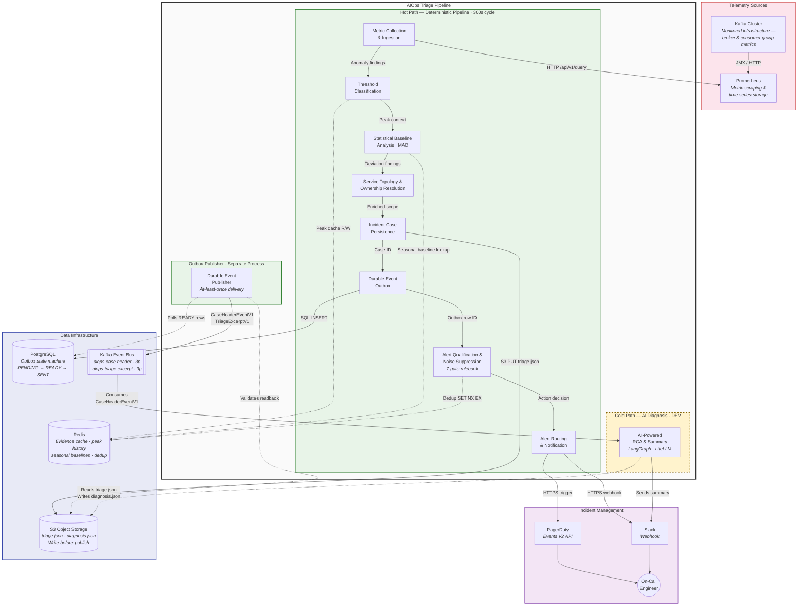

# AIOps Triage Pipeline — Architecture Diagrams (Prototype)

## Current State

## Future State

```mermaid
flowchart TB
    subgraph ext_sources ["Telemetry Sources"]
        infra_metrics["Infrastructure &<br/>Application Metrics<br/><i>Kafka · Kubernetes · Cloud<br/>APM · Custom Apps</i>"]
        prometheus["Prometheus<br/><i>Metric scraping &<br/>time-series storage</i>"]
    end

    subgraph ext_actions ["Incident Management"]
        pagerduty["PagerDuty<br/><i>Events V2 API</i>"]
        slack["Slack<br/><i>Webhook</i>"]
        servicenow["ServiceNow<br/><i>Incident · Problem · PIR</i>"]
        oncall(("On-Call<br/>Engineer"))
    end

    subgraph ext_ai ["AI Services"]
        llm_api["LLM API<br/><i>Claude · LLM Gateway</i>"]
    end

    subgraph aiops ["AIOps Triage Pipeline"]

        subgraph hotpath ["Hot Path — Deterministic Pipeline · 300s cycle"]
            ingestion["Metric Collection<br/>& Ingestion"]
            threshold["Threshold<br/>Classification"]
            baseline["Statistical Baseline<br/>Analysis · MAD"]
            topology["Service Topology &<br/>Ownership Resolution"]
            casefile["Incident Case<br/>Persistence"]
            outbox_stage["Durable Event<br/>Outbox"]
            gating["Alert Qualification &<br/>Noise Suppression<br/><i>7-gate rulebook</i>"]
            dispatch["Alert Routing<br/>& Notification"]
        end

        subgraph outbox_worker ["Outbox Publisher · Separate Process"]
            publisher["Durable Event<br/>Publisher<br/><i>At-least-once delivery</i>"]
        end

        subgraph coldpath ["Cold Path — Intelligent Diagnosis"]
            diagnosis["Anomaly Finding<br/>Summary<br/><i>Synthesizes triage evidence</i>"]
            confidence["Confidence<br/>Evaluation<br/><i>LOW · MEDIUM · HIGH</i>"]
            rca_enhance["Root Cause Hypothesis<br/>Enhancement<br/><i>LLM-powered domain analysis</i>"]
            tool_call["Action Execution<br/>· Tool Use ·<br/><i>Drafts & sends structured<br/>Slack message</i>"]
        end

        subgraph postmortem_boundary ["Automated Postmortem & Incident Correlation"]
            linkage["Incident Correlation<br/>Engine<br/><i>Tiered: PD ID → keyword<br/>→ heuristic fallback</i>"]
            sn_upsert["ServiceNow<br/>Upsert<br/><i>Idempotent Problem +<br/>PIR task creation</i>"]
        end

    end

    subgraph datastore ["Data Infrastructure"]
        s3[("S3 Object Storage<br/><i>triage.json · diagnosis.json<br/>· linkage.json<br/>Hash chain provenance</i>")]
        postgres[("PostgreSQL<br/><i>Outbox state machine<br/>Linkage retry table</i>")]
        redis[("Redis<br/><i>Evidence cache · peak history<br/>seasonal baselines · dedup</i>")]
        kafka_internal[["Kafka Event Bus<br/><i>aiops-case-header · 3p<br/>aiops-triage-excerpt · 3p</i>"]]
    end

    %% Telemetry flow
    infra_metrics -- "JMX / HTTP / OTLP" --> prometheus
    ingestion -- "HTTP /api/v1/query" --> prometheus

    %% Hot path flow
    ingestion -- "Anomaly findings" --> threshold
    threshold -- "Peak context" --> baseline
    baseline -- "Deviation findings" --> topology
    topology -- "Enriched scope" --> casefile
    casefile -- "Case ID" --> outbox_stage
    outbox_stage -- "Outbox row ID" --> gating
    gating -- "Action decision" --> dispatch

    %% Cache interactions
    threshold -. "Peak cache R/W" .-> redis
    baseline -. "Seasonal baseline lookup" .-> redis
    gating -. "Dedup SET NX EX" .-> redis

    %% Persistence
    casefile -- "S3 PUT triage.json" --> s3
    outbox_stage -- "SQL INSERT" --> postgres

    %% Dispatch
    dispatch -- "HTTPS trigger" --> pagerduty
    dispatch -- "HTTPS webhook" --> slack

    %% Outbox publisher
    publisher -. "Polls READY rows" .-> postgres
    publisher -. "Validates readback" .-> s3
    publisher -- "CaseHeaderEventV1<br/>TriageExcerptV1" --> kafka_internal

    %% Cold path — 4-step diagnosis flow
    kafka_internal -- "Consumes<br/>CaseHeaderEventV1" --> diagnosis
    diagnosis -. "Reads triage.json" .-> s3
    diagnosis -- "Anomaly summary" --> confidence
    confidence -- "High-confidence<br/>findings" --> rca_enhance
    rca_enhance -- "Enhanced RCA prompt" --> llm_api
    rca_enhance -- "Root cause hypothesis" --> tool_call
    tool_call -- "Drafts & sends<br/>diagnosis message" --> slack
    tool_call -. "Writes diagnosis.json" .-> s3

    %% Postmortem
    kafka_internal -- "Consumes<br/>case events" --> linkage
    linkage -. "Reads diagnosis.json" .-> s3
    linkage -. "Correlates incident ID" .-> pagerduty
    linkage -- "Correlation result" --> sn_upsert
    sn_upsert -- "Upsert Problem +<br/>PIR task" --> servicenow
    sn_upsert -. "Writes linkage.json" .-> s3
    sn_upsert -. "Linkage retry state" .-> postgres

    %% Alerting to engineer
    pagerduty --> oncall
    slack -- "AI-generated RCA" --> oncall
    servicenow -- "Postmortem task" --> oncall

    %% Styling
    style hotpath fill:#e8f4e8,stroke:#2d7d2d,stroke-width:2px
    style coldpath fill:#e3f2fd,stroke:#1565c0,stroke-width:2px
    style outbox_worker fill:#e8f4e8,stroke:#2d7d2d,stroke-width:2px
    style postmortem_boundary fill:#fce4ec,stroke:#c62828,stroke-width:2px
    style datastore fill:#e8eaf6,stroke:#3949ab,stroke-width:2px
    style ext_sources fill:#fce4ec,stroke:#c62828,stroke-width:1px
    style ext_actions fill:#f3e5f5,stroke:#6a1b9a,stroke-width:1px
    style ext_ai fill:#fff8e1,stroke:#f57f17,stroke-width:1px
    style aiops fill:#fafafa,stroke:#333,stroke-width:3px
```

## Key Design Decisions

### Visual Conventions
| Convention | Meaning |
|---|---|
| Green boundary (`hotpath`, `outbox_worker`) | Production deterministic processes |
| Yellow dashed boundary (`coldpath` current) | In-development component |
| Blue boundary (`coldpath` future) | Production AI-powered process |
| Red boundary (`postmortem`) | Future-state addition |
| Indigo boundary (`datastore`) | Stateful infrastructure |
| Solid arrows (`-->`) | Primary data flow |
| Dashed arrows (`-.->`) | Cache/storage read-write (side effects) |

### Current → Future Delta
| What Changes | Current State | Future State |
|---|---|---|
| Telemetry sources | Kafka Cluster (single source) | Infrastructure & Application Metrics (multi-source) |
| Cold path diagnosis | Single container, simple webhook | 4-step flow: Summarize → Evaluate → Enhance RCA → Tool Call |
| Cold path status | DEV (yellow dashed border) | Production (blue solid border) |
| Postmortem | Not present | Automated Postmortem & Incident Correlation (red border) |
| ServiceNow | Not present | External system with upsert integration |
| LLM API | Implicit in diagnosis | Explicit external system |
| Hash chain | triage.json → diagnosis.json | triage.json → diagnosis.json → linkage.json |
| PostgreSQL scope | Outbox only | Outbox + linkage retry |

### What to Test with Reviewers
1. Is the hot path / cold path boundary clear enough?
2. Does the 4-step diagnosis flow (Summarize → Confidence → RCA → Tool Call) read correctly?
3. Is the level of detail on arrows right — too much or too little?
4. Should data infrastructure be inside or outside the AIOps boundary?
5. Does the current → future delta jump out when comparing the two diagrams?
