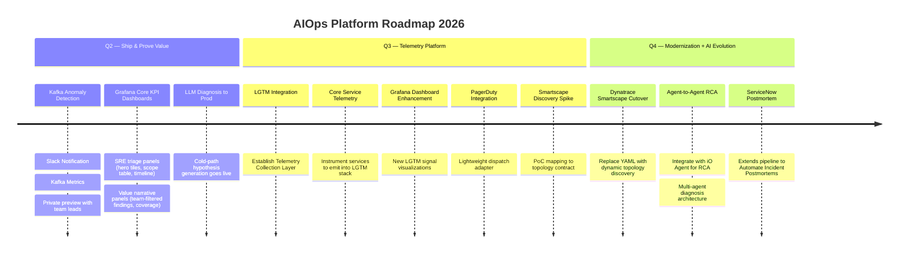
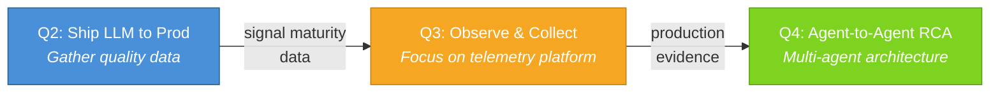
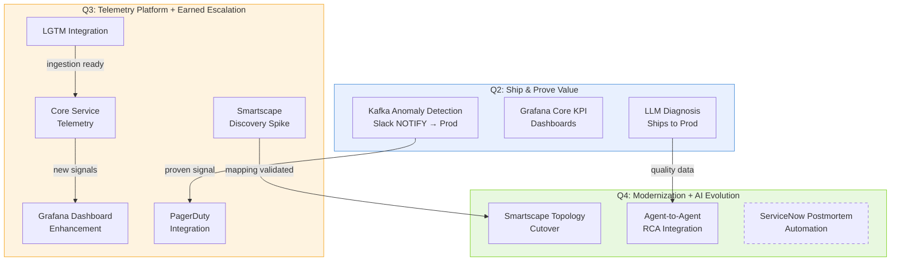

# AIOps Platform Roadmap — Q2-Q4 2026

## Presentation Roadmap Diagram

## AI Evolution Thread

## Quarterly Themes

## Key Decisions

- **PagerDuty:** Deferred from Q2 to Q3 — earned after signal maturity proof
- **Smartscape:** De-risked with Q3 discovery spike before Q4 cutover
- **ServiceNow:** Release valve if Q4 squeezed (dashed border) — can slip to Q1
- **AI Thread:** Ship → Observe → Agent-to-Agent (skip incremental improvements)
- **LGTM:** Leverages existing org infrastructure — integrate, not build
- **Dashboard:** Post-gating decisions only, hybrid time windows, team-filterable
