# UX Design Specification - aiOps Q1 MVP Stakeholder Dashboard

**Author:** Sas
**Date:** 2026-04-11

---

<!-- UX design content will be appended sequentially through collaborative workflow steps -->

## Executive Summary

### Project Vision

The aiOps Q1 MVP Stakeholder Dashboard is a Grafana-based visualization layer that makes an intelligent AIOps triage pipeline's decision-making visible to stakeholders. It serves a dual purpose: (1) a live demo artifact that proves in 60 seconds why a purpose-built pipeline with deterministic noise suppression, team-aware routing, and LLM-powered diagnosis is superior to any off-the-shelf alternative, and (2) a genuine operational triage workspace for SRE leads. The dashboard uses a "newspaper front page" architecture — everything above the fold is the stakeholder narrative, everything below is operational credibility, and the drill-down is real SRE value.

### Target Users

| Persona | Time Budget | Core Question | Emotional Intent | Dashboard Zone |
|---|---|---|---|---|
| **VP/Executive** | 3 seconds | "Is this platform alive and valuable?" | Pride in investment | Hero banner + P&L stat (above-the-fold) |
| **Platform Senior Director** | 30 seconds | "Is every pipeline capability operational?" | Confidence in coverage | Capability stack + topic heatmap (above/below fold) |
| **SRE Director** | 60 seconds | "Is this protecting my team from noise?" | Relief from alert fatigue | Gating funnel + action distribution (below-the-fold) |
| **SRE Lead** | 5+ minutes | "Can I triage an incident with this?" | Trust in operational readiness | Per-topic drill-down dashboard |
| **Presenter (implicit)** | Full walkthrough | "Can I narrate this without explaining?" | Confidence in visual clarity | All zones — needs self-evident panels and narrative anchors |

All personas consume the dashboard during a single top-to-bottom walkthrough. The VP peels off after 3 seconds, the directors after 60, and the SRE Lead stays for the drill-down. The presenter navigates the entire flow and needs every panel to be self-evident enough to support narration without pausing to decode. The UX must support this cascading attention model.

### Key Design Challenges

1. **Conversion design over information architecture** — The above-the-fold experience must generate a "yes, fund this" reaction in 3 seconds. This is fundamentally a persuasion design challenge: the dashboard must *sell* continued AIOps investment, not just *display* metrics. The visual hierarchy must be ruthlessly enforced so each persona finds their answer at the right scroll depth without cognitive overload.

2. **The 3-second rule as design constraint** — Every above-the-fold panel must be instantly legible to someone who has never seen the dashboard. In a live demo, audience attention will scatter — they won't follow the presenter's pointer obediently. If any panel requires verbal explanation to understand, it fails the design test. This is the PRD's highest-rated risk.

3. **Narrative flow as user experience** — The dashboard IS the demo script. The top-to-bottom scroll followed by a click-through to drill-down must mirror a story arc: "it works" (hero banner) -> "it's smart" (baseline overlay) -> "it's valuable" (gating funnel) -> "it's operationally real" (drill-down). The UX is the storytelling sequence, not just individual panel usability.

4. **Consistent color semantics** — Green/amber/red must carry the same meaning across all panels. Evidence status (PRESENT/STALE/UNKNOWN/ABSENT), topic health tiles, capability stack indicators, and the hero banner all use color as a primary signal. Inconsistency breaks trust instantly in a live demo.

### Design Opportunities

1. **Emotional design intent** — Panels designed to evoke specific reactions (pride, confidence, relief, trust) are more persuasive than panels that merely present data. The hero banner should make the VP feel proud, the gating funnel should make the SRE Director feel relieved, and the baseline overlay should create a moment of awe. Designing for emotion transforms a dashboard into a demo that lands.

2. **The baseline deviation overlay as visual quality bar** — A time-series line with a shaded expected-range band is visual storytelling gold. The audience instantly gets "the AI knows what's normal" without explanation. This panel sets the quality standard — if any other panel requires more explanation than the overlay, it needs redesign.

3. **Absence as strongest proof** — "0 false PAGEs this week" is more persuasive than "30 correct NOTIFYs." Zero-states should be *celebrated* as evidence of noise prevention, not merely handled gracefully. This reframes metrics like zero PAGE actions in dev from empty states into the core value proposition.

4. **The "newspaper front page" as progressive disclosure** — Above-the-fold panels act as a dashboard summary (conversion), below-the-fold panels reward scrolling with operational depth (credibility scaffolding), and the drill-down rewards clicking with triage-ready detail (operational proof). This maps cleanly to a proven UX pattern.

## Core User Experience

### Defining Experience

The aiOps dashboard has **two distinct usage modes** with fundamentally different UX requirements:

**Mode 1: The Live Demo Walkthrough (MVP Primary)**
The presenter opens the dashboard on a projector or laptop in a meeting room and performs an interactive walkthrough. This is not a passive scroll — the presenter actively engages with the dashboard: changing time windows to show trends, hovering panels for detail, adjusting filters to focus the narrative, and clicking heatmap tiles to drill down. The audience watches a live, interactive performance where the dashboard responds to the presenter's touch in real time. The core interaction loop is:

> **Glance → Understand → Feel → Interact → Narrate → Scroll → Repeat → Drill-down**

The dashboard must support both the audience (who sees from a distance and needs instant legibility) and the presenter (who needs confident, zero-fumble interaction targets).

**Mode 2: Daily SRE Triage (MVP Secondary)**
The SRE Lead uses the drill-down dashboard independently during incident response or daily triage. This is a self-service operational tool — no presenter, no audience. The user needs to quickly filter to a specific topic, assess evidence status, understand the action decision rationale, and check LLM diagnosis confidence. The interaction pattern is direct and task-driven: select topic, scan status, decide next action.

### Platform Strategy

| Requirement | Decision | Rationale |
|---|---|---|
| **Platform** | Grafana web dashboard (desktop browser) | Extends existing docker-compose infrastructure; no custom frontend build required |
| **Primary display** | Projector or laptop screen in meeting room | Demo context — panels must be legible at projector distance (6-10 feet) AND on a shared laptop screen |
| **Input method** | Mouse/keyboard (presenter-driven) | No touch considerations; presenter uses trackpad or mouse during walkthrough |
| **Offline capability** | Not required | Dashboard queries live Prometheus data source; meaningless without data |
| **Kiosk mode** | Required for demo | Grafana kiosk mode hides chrome for presentation-friendly display |
| **Responsive design** | Not required | Fixed desktop viewport; no mobile or tablet use case |

**Grafana-Specific Constraints:**
- Panel types limited to Grafana's built-in library (stat, gauge, heatmap, time-series, bar gauge, table, text)
- Dashboard layout uses Grafana's grid system — panels snap to grid positions
- Inter-dashboard navigation via Grafana data links (heatmap tile → drill-down)
- Time window control via Grafana's native time picker
- Topic filtering via Grafana template variables

### Effortless Interactions

| Interaction | Must Feel Effortless | Design Implication |
|---|---|---|
| **Reading any above-the-fold panel** | Instant comprehension at projector distance — zero squinting, zero decoding | Large fonts, high contrast, minimal label text, self-evident panel titles |
| **Scrolling the narrative arc** | Smooth, predictable progression from "it works" to "it's valuable" | Clear visual separation between above/below fold; no ambiguous panel boundaries |
| **Clicking a heatmap tile to drill-down** | One click, instant context switch, obvious "I can go deeper" affordance | Grafana data links with clear hover state; drill-down loads with topic pre-filtered |
| **Changing time windows** | Presenter can switch from 24h to 7d without breaking narrative flow | Grafana time picker positioned consistently; panels re-render within 5 seconds (NFR) |
| **Returning from drill-down to main** | Instant, no "where am I?" confusion | Breadcrumb or back link always visible; main dashboard state preserved |
| **Scanning evidence status (SRE Lead)** | Traffic-light clarity — PRESENT/UNKNOWN/ABSENT/STALE instantly distinguishable | Color-coded indicators with consistent green/amber/red/grey semantics |
| **Filtering by topic (SRE Lead)** | Select topic, everything updates — zero manual panel-by-panel filtering | Single Grafana variable selector drives all drill-down panels simultaneously |

### Critical Success Moments

1. **The 3-second nod** (VP) — The presenter opens the dashboard. The hero banner is green, the P&L stat reads a meaningful number. The VP understands the platform is alive and valuable without a single word spoken. *If this moment fails, the entire demo starts from a deficit.*

2. **The "it knows normal" moment** (Platform Director) — The presenter points to the baseline deviation overlay. A time-series line with a shaded expected-range band. The line breaks out, a detection marker appears. The audience sees that the AI understands seasonality. *If this panel isn't visually self-evident, the competitive differentiation argument collapses.*

3. **The lean-forward moment** (SRE Director) — The gating funnel shows 200 detected, 170 suppressed, 30 dispatched. The SRE Director realizes this platform prevents noise, not creates it. *If the funnel requires verbal explanation to read, the relief-from-alert-fatigue emotional response doesn't land.*

4. **The "this is real" moment** (SRE Lead) — The presenter clicks a heatmap tile, the drill-down opens with per-topic context. Evidence status, findings, action rationale, LLM diagnosis stats — all filtered and ready. The room sees genuine operational utility, not demo polish. *If the drill-down feels like a stub or afterthought, the "give us scope" argument fails.*

5. **The zero-fumble walkthrough** (Presenter) — The entire 5-minute walkthrough completes without the presenter needing to pause, explain a confusing panel, hunt for a click target, or wait for a slow-loading query. *If the presenter hesitates or apologizes for any panel, audience confidence drops immediately.*

### Experience Principles

1. **Legibility at distance over information density** — When in doubt, make the panel bigger and the text larger. A panel that's instantly readable from 8 feet away beats one that packs more data but requires leaning in. Projector readability is a hard constraint, not a nice-to-have.

2. **Self-evidence over completeness** — Every panel must answer its question without verbal explanation. If a panel needs the presenter to say "what this shows is..." before the audience understands it, the panel has failed. Cut secondary information before compromising primary clarity.

3. **Narrative sequence over dashboard flexibility** — The panel layout IS the demo script. Panels are ordered to tell a story, not organized for ad-hoc exploration. The top-to-bottom scroll path is deliberate and non-negotiable. Rearranging panels would break the narrative.

4. **Confident interaction over feature richness** — The presenter must interact with the dashboard confidently in front of an audience. Click targets must be large, transitions must be fast, and state changes must be predictable. One confident click-through beats five feature-rich but risky interactions.

5. **Operational authenticity over demo polish** — The drill-down dashboard must be genuinely useful for daily SRE triage, not a demo-only facade. Real operational utility is the strongest form of credibility.

## Desired Emotional Response

### Primary Emotional Goals

| Context | Primary Emotion | What It Sounds Like |
|---|---|---|
| **Demo audience (above-the-fold)** | Conviction | "This is worth funding." |
| **Demo audience (below-the-fold)** | Respect | "This is genuinely sophisticated." |
| **Demo audience (drill-down)** | Trust | "This is operationally real, not demo polish." |
| **Presenter (throughout)** | Command | "I own this narrative. The dashboard speaks for itself." |
| **SRE Lead (daily triage)** | Calm control | "I can see everything I need. No surprises. I can act." |

The overarching emotional arc for the demo is **skepticism → conviction**. Every panel must move the audience one step further along this arc. Any panel that creates confusion, doubt, or the need for verbal explanation interrupts the emotional momentum.

### Emotional Journey Mapping

**Demo Walkthrough — Audience Emotional Arc:**

```
OPEN DASHBOARD
  │  Curiosity ("what am I looking at?")
  ▼
HERO BANNER + P&L STAT
  │  Reassurance ("it's alive, it's producing value")
  ▼
TOPIC HEATMAP
  │  Impressed ("it covers all our critical topics")
  ▼
BASELINE DEVIATION OVERLAY
  │  Awe ("it understands what's normal — this is AI")
  ▼
GATING INTELLIGENCE FUNNEL
  │  Relief ("it prevents noise, not creates it")
  ▼
CAPABILITY STACK + DIAGNOSIS STATS
  │  Respect ("every layer is real and operational")
  ▼
DRILL-DOWN CLICK-THROUGH
  │  Conviction ("this is genuinely useful, fund it")
  ▼
WALKTHROUGH COMPLETE
     Trust ("I'd bet on this team")
```

**Demo Walkthrough — Presenter Emotional Arc:**

```
OPEN DASHBOARD
  │  Grounded ("the hero banner is green, we're good")
  ▼
NARRATE ABOVE-THE-FOLD
  │  Confident ("panels are self-evident, audience is tracking")
  ▼
INTERACT WITH PANELS
  │  Fluent ("time picker works, hover shows detail, no fumbles")
  ▼
SCROLL TO BELOW-THE-FOLD
  │  Proud ("the funnel tells the story better than I can")
  ▼
CLICK-THROUGH TO DRILL-DOWN
  │  Commanding ("one click, instant context, audience is impressed")
  ▼
WALKTHROUGH COMPLETE
     Triumphant ("that landed")
```

**Daily SRE Triage — SRE Lead Emotional Arc:**

```
OPEN DRILL-DOWN
  │  Oriented ("topic selector, time window — I know where I am")
  ▼
SELECT TOPIC + SCAN STATUS
  │  Calm control ("evidence status is clear, findings are filtered")
  ▼
READ ACTION RATIONALE
  │  Trust ("I understand why this decision was made")
  ▼
CHECK DIAGNOSIS STATS
  │  Speed ("got my answer, back to the incident")
  ▼
CLOSE OR SWITCH TOPIC
     Efficiency ("that took 30 seconds, not 5 minutes")
```

### Micro-Emotions

| Micro-Emotion | Where It Matters | Design Response |
|---|---|---|
| **Confidence vs. Confusion** | Every panel, every interaction | Self-evident titles, consistent color semantics, predictable layouts |
| **Trust vs. Skepticism** | Gating funnel, diagnosis stats, evidence status | Real data (never mocked), transparent gate rule IDs, explicit UNKNOWN states |
| **Awe vs. Indifference** | Baseline deviation overlay | Shaded expected-range band must be visually striking — this is the "money shot" |
| **Relief vs. Anxiety** | Gating funnel, action distribution | The suppression ratio must be immediately legible — "170 suppressed" is the relief trigger |
| **Command vs. Hesitation** | Presenter interactions (clicks, hovers, time changes) | Large click targets, fast transitions, predictable state changes |
| **Calm vs. Overwhelm** | Drill-down dashboard (SRE Lead) | Clean layout, single variable selector, no visual noise from adjacent panels |

**Emotions to actively prevent:**
- **Confusion** — "What does this panel mean?" (panel fails the 3-second rule)
- **Embarrassment** — Presenter fumbles a click or a panel shows "No data" during demo
- **Doubt** — Audience sees an empty panel and wonders if the system actually works
- **Overwhelm** — Too many panels visible at once, competing for attention

### Design Implications

| Emotional Goal | UX Design Approach |
|---|---|
| **Conviction (audience)** | Above-the-fold panels must deliver a complete narrative without scrolling — if the audience never scrolls, the hero banner + P&L stat + heatmap must still be persuasive on their own |
| **Command (presenter)** | Interactive elements must have generous click targets, hover states that preview what will happen, and transitions under 1 second. No interaction should surprise the presenter |
| **Awe (baseline overlay)** | The expected-range band must use a visually distinct fill (soft gradient or shaded area) that contrasts sharply with the actual-value line. Detection markers must be unmissable |
| **Relief (gating funnel)** | The suppression ratio must be the visual focal point — large numbers, clear funnel shape, color gradient from red (detected) to green (dispatched). The "waste reduction" must feel dramatic |
| **Calm control (SRE Lead)** | Drill-down layout must be spacious, not cramped. White space is a feature. Evidence status indicators must be scannable in a single horizontal sweep. No hidden information requiring extra clicks |
| **Trust (throughout)** | Never show mocked or simulated data. Never hide UNKNOWN states. Show gate rule IDs by name. Transparency builds trust — "we show you exactly how every decision was made" |

### Emotional Design Principles

1. **Momentum over completeness** — The emotional arc must never stall. If a panel interrupts the flow (confusion, loading delay, visual clutter), the audience's emotional momentum resets to skepticism. It is better to show fewer panels that maintain momentum than more panels that risk interruption.

2. **Absence builds trust** — Empty states (zero PAGEs, zero false alarms) should feel like proof of intelligence, not missing data. Design zero-states to be celebrated: "0 false PAGEs this week" is a badge of honor, displayed prominently with a positive color signal.

3. **The presenter's confidence IS the audience's confidence** — If the presenter hesitates, hovers uncertainly, or needs to explain what a panel means, the audience absorbs that uncertainty. Every interaction must be designed so the presenter can perform it with fluid confidence. The dashboard's UX is ultimately measured by the presenter's body language.

4. **Transparency converts skeptics** — The most persuasive panels are the ones that show *how* the system makes decisions (gate rule IDs, suppression counts, evidence status), not just *what* it decided. Skeptical stakeholders are converted by transparency, not by polish.

5. **Calm is a feature** — For the SRE Lead's daily triage, the drill-down should feel like a quiet, organized workspace — not a noisy monitoring wall. Restrained color use, generous spacing, and predictable layout create the calm control that operational users need under incident pressure.

## UX Pattern Analysis & Inspiration

### Inspiring Products Analysis

**1. Datadog — Observability Dashboard UX**

Datadog sets the bar for observability dashboards that serve both executives and operators. Key UX strengths:
- **Visual hierarchy through panel sizing** — Hero metrics get full-width panels with large stat numbers, supporting detail gets smaller panels below. The eye naturally reads importance from size.
- **Color as semantic signal, not decoration** — Green/yellow/red mean the same thing everywhere. No gratuitous color variation.
- **Hover-to-detail pattern** — Panels show summary at rest, rich detail on hover. The dashboard stays clean until the user asks for depth.
- **Template variables as global filters** — A single dropdown at the top changes every panel simultaneously. No per-panel filtering.

*Relevance to aiOps:* The panel-sizing hierarchy directly maps to our above/below fold architecture. The template variable pattern is exactly what our drill-down topic filter needs. The hover-to-detail pattern supports the presenter's interactive walkthrough without cluttering the projector view.

**2. Stripe Dashboard — Business Metrics Storytelling**

Stripe's dashboard communicates complex financial data to non-technical stakeholders with remarkable clarity:
- **Large stat panels with trend context** — A single big number with a small sparkline or delta indicator. The number answers "how much?" and the trend answers "getting better or worse?" in one glance.
- **Minimal label text** — Panel titles are 2-4 words. No paragraph descriptions. The data speaks.
- **White space as structure** — Generous padding between panels creates visual grouping without explicit borders or dividers.
- **Progressive disclosure through tabs/pages** — Summary first, detail on demand. Never everything at once.

*Relevance to aiOps:* The P&L stat panel ("47 anomalies detected & acted on this week") should follow Stripe's big-number-plus-trend pattern. The hero banner should use Stripe's minimal-label approach. The white space philosophy directly supports our "calm is a feature" principle for the drill-down.

**3. Grafana "Node Exporter Full" Dashboard — What Works and What Doesn't**

The most-downloaded Grafana community dashboard is a useful study in both good and bad patterns:
- **What works:** Logical panel grouping by subsystem (CPU, memory, disk, network). Consistent panel types within groups. Template variables for host selection.
- **What doesn't work:** Information overload — 40+ panels crammed into a single dashboard. Tiny text requiring zoom. No visual hierarchy — every panel is the same size and importance. No narrative flow — it's a reference sheet, not a story.

*Relevance to aiOps:* This is the anti-pattern we must avoid. Our dashboard tells a story; Node Exporter Full is a phone book. The lesson: fewer panels with strong sizing hierarchy beats more panels with uniform layout.

**4. Apple Keynote Presentation Design — The Demo Stage**

Since the dashboard IS a live presentation, keynote design principles apply:
- **One idea per slide (one idea per viewport)** — Above-the-fold should communicate exactly one message: "the platform is alive and valuable."
- **The audience reads ahead** — In any projected content, eyes scatter before the presenter speaks. Every visible element must be self-evident.
- **Transitions signal narrative beats** — Scrolling from above-fold to below-fold is a narrative transition. It should feel deliberate, not accidental.
- **Contrast directs attention** — The most important element should have the highest visual contrast. Everything else recedes.

*Relevance to aiOps:* The "one idea per viewport" principle maps directly to our fold architecture. The "audience reads ahead" principle reinforces the 3-second rule. The contrast principle should guide which panel gets the most visual weight in each zone.

### Transferable UX Patterns

| Pattern | Source | Application to aiOps |
|---|---|---|
| **Big stat + trend indicator** | Stripe | Hero banner health signal, P&L stat with weekly delta |
| **Panel size = importance** | Datadog | Above-the-fold panels are full-width or half-width; below-the-fold panels can be smaller |
| **Template variable as global filter** | Datadog, Grafana best practice | Drill-down topic selector drives all panels simultaneously |
| **Hover-to-detail** | Datadog | Presenter hovers a heatmap tile to preview before clicking through to drill-down |
| **Color as semantic constant** | Datadog | Green/amber/red mean the same thing on every panel — no exceptions |
| **White space as structure** | Stripe | Generous row spacing between panel groups creates fold boundaries without explicit dividers |
| **One idea per viewport** | Apple Keynote | Above-the-fold communicates one message; below-the-fold communicates a different one |
| **Funnel visualization** | SaaS conversion dashboards | Gating intelligence funnel uses a top-down funnel shape: wide (detected) → narrow (dispatched) |
| **Traffic light indicators** | Operations dashboards | Evidence status PRESENT/STALE/UNKNOWN/ABSENT as colored dots in a horizontal row |
| **Sparkline context** | Stripe, Datadog | Small inline time-series in stat panels to show trend without requiring a separate time-series panel |

### Anti-Patterns to Avoid

| Anti-Pattern | Why It Fails | How We Avoid It |
|---|---|---|
| **Wall of graphs** (Node Exporter Full) | No hierarchy, no narrative, overwhelming | Strict panel count limit per zone; size hierarchy enforces importance |
| **Uniform panel sizing** | Everything looks equally important, nothing stands out | Above-the-fold panels are deliberately larger than below-the-fold panels |
| **Tiny text / dense labels** | Illegible on projector, requires leaning in | Minimum font size constraint for projector readability; 2-4 word panel titles |
| **Abbreviation-heavy labels** | Insiders understand, stakeholders don't ("AG1", "AG2" without context) | Full human-readable names on above-the-fold panels; abbreviations only on drill-down where SRE Lead knows the vocabulary |
| **Rainbow color schemes** | Color loses semantic meaning, becomes decorative noise | Strict 3-color semantic palette (green/amber/red) plus neutral grey for inactive/unknown |
| **Auto-refresh jitter during demo** | Panels flicker or rearrange during live presentation, breaking presenter confidence | Set appropriate refresh interval or pause auto-refresh during demo; panels must never visually jump |
| **"No data" empty states** | Audience interprets as broken, not as "nothing to report" | Every panel has a meaningful zero-state design — "0" with positive framing, never blank |
| **Scroll-to-discover navigation** | Important panels hidden below the fold without indication they exist | Clear visual signal that content continues below the fold; deliberate scroll-pause points |

### Design Inspiration Strategy

**What to Adopt Directly:**
- Stripe's big-number-plus-trend stat panel pattern for hero banner and P&L stat
- Datadog's template variable as global filter for drill-down topic selection
- Datadog's color-as-semantic-constant principle for the entire dashboard
- Apple Keynote's one-idea-per-viewport for above/below fold separation

**What to Adapt:**
- Datadog's hover-to-detail — adapt for Grafana's native tooltip and data link capabilities (less customizable than Datadog's custom UI)
- SaaS funnel visualization — adapt to Grafana's bar gauge or bar chart panel type for the gating intelligence funnel (Grafana doesn't have a native funnel panel)
- Stripe's white space — adapt to Grafana's grid system, using empty row spacers and panel padding options

**What to Avoid:**
- Grafana community dashboard aesthetics (dense, uniform, reference-sheet layout)
- Rainbow or gradient color schemes that dilute semantic meaning
- Auto-refresh behavior that causes visual instability during live presentation
- Abbreviation-heavy labeling that excludes non-technical audience members

## Design System Foundation

### Design System Choice

**Grafana Native Theme — Governed Convention Model**

The aiOps dashboard uses Grafana's native dark theme as its design system foundation, governed by a documented set of color, typography, panel type, and layout conventions. No custom theme plugins or external CSS overrides are used — all visual design is achieved through Grafana's built-in panel configuration, theme settings, and dashboard JSON properties.

This approach treats Grafana as both the rendering engine and the design system. The "design system" is not a component library but a set of binding conventions that ensure visual consistency, semantic clarity, and projector readability across all dashboard panels.

### Rationale for Selection

| Decision Factor | Rationale |
|---|---|
| **Dark theme base** | Higher contrast on projectors; industry-standard for observability dashboards; signals operational credibility to SRE audience; reduces eye strain during extended triage sessions |
| **Convention over plugin** | Solo developer with MVP timeline — governing Grafana's native capabilities is faster and more maintainable than building custom theme plugins that break across Grafana upgrades |
| **No brand requirements** | Internal tool for competitive evaluation — clarity and legibility take absolute priority over brand differentiation |
| **JSON-as-source-of-truth** | Dashboard JSON files committed to the repository serve as both the deployment artifact and the design system enforcement mechanism — conventions are embedded in panel configurations, not documented separately |

### Implementation Approach

**Theme Configuration:**
- Base: Grafana dark theme (default)
- No custom theme plugin — all customization through panel-level overrides and dashboard settings
- Kiosk mode enabled for demo presentation (hides Grafana chrome)

**Color Semantic Token System:**

| Token | Hex (Grafana Dark) | Meaning | Usage |
|---|---|---|---|
| `semantic-green` | `#73BF69` (Grafana green) | Healthy / Present / Positive | Hero banner healthy state, evidence PRESENT, topic health good, zero-state celebrations |
| `semantic-amber` | `#FF9830` (Grafana orange) | Warning / Stale / Degraded | Topic health warning, evidence STALE, capability degraded |
| `semantic-red` | `#F2495C` (Grafana red) | Critical / Absent / Error | Topic health critical, evidence ABSENT, capability down |
| `semantic-grey` | `#8E8E8E` (Grafana grey) | Unknown / Inactive / Neutral | Evidence UNKNOWN, suppressed actions, inactive states |
| `accent-blue` | `#5794F2` (Grafana blue) | Informational / Trend / Selection | Time-series lines, selected states, informational stat panels |
| `band-fill` | `#5794F2` at 15% opacity | Expected range / Baseline band | Baseline deviation overlay shaded expected-range area |

**Rule:** These six tokens are the only colors permitted on dashboard panels. Any panel using a color outside this palette fails design review.

**Typography Conventions:**

| Context | Minimum Size | Grafana Setting |
|---|---|---|
| Stat panel value (above-the-fold) | 48px+ | Panel options → Text size: large/extra-large |
| Stat panel title | 16px+ | Panel title font (Grafana default) |
| Heatmap tile labels | 14px+ | Heatmap cell label size |
| Below-the-fold panel values | 32px+ | Panel options → Text size: medium/large |
| Table text (drill-down) | 14px+ | Table column width and font defaults |
| Panel titles (all) | 16px+ | Dashboard-level panel title defaults |

**Rule:** No text on any above-the-fold panel may be below 16px. The 3-second rule requires instant legibility at 6-10 feet projector distance.

**Panel Type Conventions:**

| Data Purpose | Grafana Panel Type | Rationale |
|---|---|---|
| Single aggregate number (hero stat, P&L) | Stat panel | Designed for large, at-a-glance numbers with optional sparkline |
| Health status signal | Stat panel with color thresholds | Maps directly to green/amber/red semantic tokens |
| Topic health grid | Heatmap or Stat panel grid | Heatmap for color-coded tiles; stat grid for labeled tiles |
| Time-series with baseline band | Time series panel | Native support for shaded range bands and annotation markers |
| Funnel / stage progression | Bar gauge (horizontal) | Closest Grafana native to a funnel visualization |
| Action distribution over time | Time series (stacked) | Standard stacked area/bar for categorical time-series |
| Category breakdown | Bar chart or Pie chart | Bar chart preferred for clear label readability |
| Capability status stack | Table or Stat panel row | Table for structured multi-column status; stat row for visual impact |
| Detailed per-topic data | Table panel | Standard for drill-down operational data with sorting and filtering |
| Diagnosis statistics | Stat panels (grouped) | Small stat panel cluster for invocation count, success rate, latency |

**Layout Grid Conventions:**

| Zone | Grid Rows | Panel Width Convention |
|---|---|---|
| Above-the-fold (hero) | Rows 0-2 | Full-width (24 cols) for hero banner; half-width (12 cols) for paired stats |
| Above-the-fold (narrative) | Rows 3-8 | Full-width for heatmap and baseline overlay |
| Fold separator | Row 9 | Visual spacer row (empty or text panel with section label) |
| Below-the-fold (credibility) | Rows 10-20 | Mixed widths — full-width for funnel, thirds (8 cols) for supporting panels |
| Below-the-fold (operational) | Rows 21-28 | Standard widths — capability stack, throughput, diagnosis stats |

**Rule:** Above-the-fold panels use larger grid heights (3-4 rows minimum) for projector readability. Below-the-fold panels may use standard heights (2-3 rows).

### Customization Strategy

**What Grafana Provides Natively (Use As-Is):**
- Dark theme color palette and background
- Panel border and hover styling
- Time picker and variable selector UI
- Data link navigation between dashboards
- Tooltip rendering on hover
- Auto-refresh and time window controls
- Kiosk mode for presentation

**What We Govern Through Convention (Configure Per-Panel):**
- Color overrides using the six semantic tokens — applied via panel threshold configuration
- Text size overrides for projector readability — applied via panel display options
- Panel sizing for visual hierarchy — enforced via grid position in dashboard JSON
- Panel ordering for narrative flow — enforced via panel placement in dashboard JSON
- Zero-state display — configured via panel "no data" message and value mapping options

**What We Explicitly Do Not Customize:**
- No custom Grafana plugins (maintenance burden, upgrade fragility)
- No custom CSS injection (unsupported, breaks on upgrade)
- No custom fonts (Grafana's default font stack is legible and neutral)
- No custom panel types (built-in library covers all requirements)

**Design System Enforcement:**
The dashboard JSON files in `grafana/dashboards/` are the canonical expression of the design system. Panel configurations in these files encode color thresholds, text sizes, grid positions, and data link references. Code review of dashboard JSON changes is the design system governance mechanism — any panel that violates the color token system, typography minimums, or layout conventions is caught during review.

## Defining Interaction

### The Defining Experience

**"Open, scroll, believe."**

The aiOps dashboard's defining experience is the **uninterrupted narrative scroll** — a single, fluid top-to-bottom walkthrough where every panel builds on the previous one, the audience never needs verbal explanation to understand what they're seeing, and by the time the presenter reaches the AI diagnosis stats, the room has already moved from curiosity to conviction.

The one-sentence description a presenter would use: *"I open one dashboard, scroll for 60 seconds, and the room understands why we built this instead of buying something off the shelf."*

This defining experience replaces the current demo format — a **terminal-based walkthrough** where the presenter runs pipeline commands, narrates raw output, and asks the audience to trust their interpretation of log lines and metrics. The dashboard eliminates the translation layer between system output and stakeholder understanding. The data speaks visually; the presenter narrates the story, not the technology.

### User Mental Model

**Audience Mental Model (Demo Context):**

The audience arrives with the mental model of a **slide deck presentation** or a **terminal demo**. They expect to be *told* what the system does, not *shown*. Their prior experience with internal tooling demos is: the presenter talks, the screen shows something technical, and they trust (or don't) based on the presenter's credibility.

The dashboard must subvert this expectation immediately. Within 3 seconds, the audience should realize: *"This isn't a presentation — this is a live system, and I can read it myself."* The shift from passive audience to active reader is the first mental model transition. The second transition happens at the AI diagnosis stats: *"This system doesn't just detect — it reasons."* That's the moment the audience's mental model upgrades from "monitoring dashboard" to "intelligent triage platform."

**Key mental model assumptions the audience brings:**
- Green means good, red means bad (traffic light convention — our color system matches)
- Bigger numbers are more impressive (our P&L stat leverages this)
- Graphs go up and to the right = good (baseline overlay subverts this — breaking *out* of the band is the event)
- If I can't understand it in 3 seconds, it's probably not working (our 3-second rule matches)
- Terminal output = early-stage; visual dashboard = production-ready (the format itself signals maturity)

**SRE Lead Mental Model (Triage Context):**

The SRE Lead currently operates without AIOps — they get paged, then manually triage across multiple platforms (Prometheus, logs, Kafka console, Slack threads). Their mental model is **multi-tool scramble**: receive alert → open 4 tabs → correlate manually → form hypothesis → escalate or resolve.

The drill-down dashboard must map to this existing mental model but collapse the multi-tool scramble into a single screen. The SRE Lead should feel: *"Everything I'd normally hunt for across 4 tools is already here, pre-correlated, for this specific topic."* The mental model shift is from "gather evidence" to "review evidence the system already gathered."

### Success Criteria

**The narrative scroll succeeds when:**

| Criterion | Observable Signal |
|---|---|
| **No verbal decoding required** | The presenter never says "what this shows is..." — every panel is self-evident to someone seeing it for the first time |
| **Emotional momentum sustained** | The audience's body language progresses from curiosity (leaning back) to engagement (leaning forward) without interruption — no confused glances, no sidebar whispers |
| **The diagnosis reveal lands** | When the presenter reaches the AI diagnosis stats and LLM confidence metrics, the audience reacts visibly — this is the "this system *thinks*" moment that distinguishes AIOps from every off-the-shelf alternative |
| **Zero fumbles** | The presenter completes the entire scroll + drill-down click-through without hesitating, apologizing, or waiting for a panel to load |
| **The ask is easy** | After the walkthrough, the statement "we should continue investing in this" feels obvious, not argued — the dashboard made the case |

**The drill-down succeeds when:**

| Criterion | Observable Signal |
|---|---|
| **Instant orientation** | The SRE Lead knows where they are and what they can do within 2 seconds of landing on the drill-down |
| **Single-screen triage** | The SRE Lead can assess topic health, evidence status, action rationale, and diagnosis confidence without navigating away from the drill-down page |
| **Faster than the alternative** | The drill-down provides triage context in 30 seconds that currently takes 5 minutes of multi-tool scramble |

### Novel vs. Established UX Patterns

**Pattern Classification:**

The aiOps dashboard uses **entirely established UX patterns** — but combines them in a way that is novel for the AIOps domain.

| Pattern | Classification | Notes |
|---|---|---|
| Stat panels with large numbers | Established (Datadog, Stripe) | Standard KPI dashboard pattern |
| Color-coded health heatmap | Established (operations dashboards) | Traffic-light convention universally understood |
| Time-series with range band | Established (financial charts, Bollinger bands) | Novel *application* to AIOps baseline deviation — the audience intuitively reads "inside band = normal" |
| Gating funnel visualization | Established (SaaS conversion funnels) | Novel *application* to alert suppression — reframes noise prevention as a conversion metric |
| Drill-down from summary tile | Established (Datadog, Grafana best practice) | Standard progressive disclosure pattern |
| Template variable filtering | Established (Grafana native) | Standard Grafana interaction pattern |

**Why no novel patterns are needed:**

The audience (VPs, directors, SRE leads) are experienced dashboard consumers. They know how to read stat panels, heatmaps, and time-series charts. Introducing a novel interaction pattern would require education — which means the presenter would need to *explain* the UI, breaking the "self-evident" principle. The novelty is in what the dashboard *shows* (AI-powered triage decisions), not how the user *interacts* with it.

**The unique twist on established patterns:**

The gating intelligence funnel repurposes a SaaS conversion funnel pattern to tell an alert suppression story. In SaaS, a funnel narrowing means lost customers (bad). In AIOps, a funnel narrowing means suppressed noise (good). This inversion of the funnel's emotional valence is the single most creative UX decision — the audience reads the funnel shape instinctively, but the *meaning* is inverted from loss to value.

### Experience Mechanics

**The Narrative Scroll — Step by Step:**

**1. Initiation:**
- The presenter opens the Grafana dashboard URL (bookmarked or typed)
- Kiosk mode activates — no Grafana chrome, full-screen dashboard
- The hero banner is the first thing visible — green status, large P&L number
- **Trigger to begin:** The dashboard's visual state *is* the invitation. If the hero banner is green, the presenter starts narrating. No setup, no "let me just..."

**2. Interaction — The Scroll Sequence:**

| Scroll Position | Presenter Action | Audience Sees | Audience Feels |
|---|---|---|---|
| **Top (no scroll)** | Points to hero banner and P&L stat | Green health status, "47 anomalies acted on this week" | Reassurance — "it's alive" |
| **Slight scroll** | Gestures to topic heatmap | 9 color-coded tiles, mostly green | Impressed — "it covers everything" |
| **Quarter scroll** | Points to baseline deviation overlay | Time-series with shaded expected-range band, detection markers | Awe — "it knows what's normal" |
| **Half scroll (fold)** | Pauses briefly — narrative transition | Visual spacer or section label | Anticipation — "there's more" |
| **Past fold** | Points to gating funnel | 200 detected → 170 suppressed → 30 dispatched | Relief — "it prevents noise" |
| **Three-quarter scroll** | Gestures to capability stack and diagnosis stats | Pipeline stages lit up, LLM invocation count, confidence distribution | Respect — "every layer is real, and it *thinks*" |
| **Bottom** | Clicks a heatmap tile (scrolls back up or uses data link) | Drill-down opens with per-topic context | Conviction — "this is operationally real" |

**3. Feedback:**
- **Visual feedback:** Every panel uses consistent color semantics — the audience always knows green = good, amber = watch, red = act. No decoding required.
- **Interaction feedback:** Hovering a panel shows a tooltip with additional detail. Hovering a heatmap tile previews the topic name and status before clicking. The time picker responds instantly to range changes.
- **Narrative feedback:** The presenter's confidence IS the feedback mechanism. Fluid, unhesitating interaction tells the audience "this person trusts this system."
- **Error prevention:** Panels never show "No data" during a live demo — zero-states display meaningful messages ("0 false PAGEs this week" with a green badge). If a panel has no data, the zero-state design communicates intelligence, not absence.

**4. Completion:**
- **Demo complete when:** The presenter has scrolled top-to-bottom and clicked through to the drill-down. The narrative arc is: "it works → it's smart → it's valuable → it's real." The walkthrough took under 5 minutes.
- **Successful outcome:** The audience's next question is "what's the roadmap?" not "does it actually work?" The dashboard has answered the credibility question — the conversation moves to investment and scope.
- **What's next:** The presenter can go deeper into the drill-down for technical audience members, return to the main dashboard to show different time windows, or end the demo. The dashboard supports all three exits gracefully.

**The Drill-Down Click — Step by Step:**

**1. Initiation:**
- SRE Lead clicks a heatmap tile on the main dashboard (or navigates directly via bookmark)
- Grafana data link opens the drill-down dashboard with the topic pre-selected in the template variable

**2. Interaction:**
- Topic variable selector at the top — change topic, everything updates
- Scan evidence status indicators (horizontal row of colored dots: PRESENT/STALE/UNKNOWN/ABSENT)
- Read findings table filtered by topic — action decision, gate rationale, anomaly family
- Check diagnosis stats — LLM confidence, fault domain, invocation latency

**3. Feedback:**
- Evidence status colors match the same semantic tokens as the main dashboard — no mental context switch
- Table sorting and filtering respond instantly
- Time window changes apply to all panels simultaneously

**4. Completion:**
- SRE Lead has assessed the topic's status and decided on next action (escalate, investigate, or dismiss)
- Total time: 30 seconds for a familiar topic, 2 minutes for a new incident
- Exit: close tab, switch topic via variable selector, or navigate back to main dashboard

## Visual Design Foundation

### Color System

**Palette Philosophy: Muted Professional**

The aiOps dashboard uses a muted, desaturated color palette that signals polish and credibility rather than monitoring urgency. Colors are deliberately softened from Grafana's default high-saturation palette to create a visual tone that feels like a professional report, not a war room. This muted approach serves the stakeholder audience — executives and directors associate desaturated, restrained color with quality and maturity.

**Semantic Color Palette — Muted Variants:**

| Token | Default Grafana | Muted Override | Application |
|---|---|---|---|
| `semantic-green` | `#73BF69` | `#6BAD64` | Healthy, PRESENT, positive states, zero-state celebrations |
| `semantic-amber` | `#FF9830` | `#E8913A` | Warning, STALE, degraded states |
| `semantic-red` | `#F2495C` | `#D94452` | Critical, ABSENT, error states |
| `semantic-grey` | `#8E8E8E` | `#7A7A7A` | UNKNOWN, inactive, suppressed, neutral |
| `accent-blue` | `#5794F2` | `#4F87DB` | Time-series lines, informational stats, selected states |
| `band-fill` | `#5794F2` at 15% | `#4F87DB` at 12% | Baseline expected-range band — subtler fill to avoid visual noise |

**Color Usage Rules:**
- Never use full-saturation colors — all panel overrides use the muted variants above
- Background elements (band fills, inactive states) use reduced opacity to recede visually
- Foreground elements (stat values, active status indicators) use full muted color for readability
- No gradients, no color transitions — flat color only, consistent with the professional tone
- White (`#FFFFFF`) text for primary values; light grey (`#CCCCCC`) for secondary labels and descriptions

**Contrast Ratios (Muted Palette on Dark Background `#181b1f`):**

| Element | Foreground | Background | Contrast Ratio | WCAG AA |
|---|---|---|---|---|
| Stat value (white text) | `#FFFFFF` | `#181b1f` | 16.2:1 | Pass |
| Green indicator | `#6BAD64` | `#181b1f` | 7.8:1 | Pass |
| Amber indicator | `#E8913A` | `#181b1f` | 6.9:1 | Pass |
| Red indicator | `#D94452` | `#181b1f` | 5.4:1 | Pass |
| Grey indicator | `#7A7A7A` | `#181b1f` | 4.6:1 | Pass |
| Secondary label | `#CCCCCC` | `#181b1f` | 11.4:1 | Pass |

All combinations pass WCAG AA minimum contrast (4.5:1 for normal text, 3:1 for large text). The muted palette maintains accessibility while achieving the softer professional aesthetic.

### Typography System

**Typographic Tone: Editorial**

The dashboard treats typography as a hierarchy tool, not a density tool. Inspired by editorial design (newspaper front pages, magazine layouts), text elements are sized for instant comprehension and generous breathing room. Every text element has a clear role in the visual hierarchy — hero values dominate, supporting labels recede, and nothing competes.

**Type Scale:**

| Role | Size | Weight | Color | Usage |
|---|---|---|---|---|
| Hero value | 56px+ | Bold | `#FFFFFF` | Hero banner health status, P&L stat primary number |
| Primary stat value | 40px+ | Semi-bold | `#FFFFFF` | Above-the-fold stat panel values |
| Secondary stat value | 28px+ | Regular | `#FFFFFF` | Below-the-fold stat panel values |
| Panel title | 16px | Medium | `#CCCCCC` | All panel titles — understated, never competing with values |
| Supporting label | 14px | Regular | `#999999` | Subtitles, units, trend indicators |
| Table body text | 14px | Regular | `#CCCCCC` | Drill-down table content |
| Table header text | 13px | Semi-bold | `#999999` | Drill-down table column headers |

**Typography Rules:**
- Panel titles are always lighter and smaller than panel values — the data speaks, not the label
- No ALL CAPS except for status badges (PRESENT, STALE, UNKNOWN, ABSENT) where the convention adds urgency
- Panel titles use sentence case, 2-5 words maximum — brevity is a typographic discipline
- Numbers use tabular (monospace) figures where available in Grafana's font stack for visual alignment in stat panels

**Font Stack:**
Grafana's default font stack (Inter, system sans-serif fallbacks). No custom fonts — Inter's clean geometric forms and excellent numeral design are ideal for a data-heavy editorial dashboard. Inter was designed specifically for computer screens and is highly legible at both large display sizes (hero stats) and smaller body text (tables).

### Spacing & Layout Foundation

**Spatial Philosophy: Editorial Spaciousness**

The dashboard uses generous whitespace as a structural element — space between panels defines visual groups, separates narrative sections, and creates the "breathing room" that makes each panel feel intentional rather than crammed. This editorial approach treats empty space as part of the design, not wasted real estate.

**Spacing Scale (Grafana Grid Units):**

| Spacing Role | Grid Height | Pixel Equivalent | Usage |
|---|---|---|---|
| Hero panel height | 5-6 rows | ~200-240px | Above-the-fold hero banner and primary stats |
| Narrative panel height | 7-8 rows | ~280-320px | Baseline overlay, topic heatmap — panels that tell a story |
| Fold separator | 1 row | ~40px | Empty row between above-fold and below-fold zones |
| Credibility panel height | 5-6 rows | ~200-240px | Below-the-fold panels — gating funnel, action distribution |
| Operational panel height | 4-5 rows | ~160-200px | Capability stack, diagnosis stats, throughput |
| Section separator | 1 row | ~40px | Empty row between below-fold panel groups |

**Panel Spacing Rules:**
- Minimum 1 empty grid row between logical panel groups (hero zone, narrative zone, credibility zone, operational zone)
- No panel-to-panel horizontal gaps narrower than Grafana's default grid gap (4px) — rely on transparent backgrounds to create visual separation through the dark background showing through
- Above-the-fold panels are taller (5-8 rows) to create the editorial "generous" feel
- Below-the-fold panels can be more compact (4-6 rows) — the audience that scrolls this far expects denser information

**Layout Principles:**

1. **Transparency creates structure** — With transparent panel backgrounds, the dark dashboard background (`#181b1f`) becomes the visual separator between panels. No borders, no cards, no shadows. Content floats on the dark surface, and the gaps between panels define the visual grouping. This is a magazine layout technique: the whitespace (here, dark space) does the work of borders.

2. **Vertical rhythm over horizontal packing** — Panels are arranged to create a predictable vertical scroll rhythm. Each "beat" of the scroll reveals a new narrative element at a consistent vertical interval. The presenter's scroll speed becomes natural because the panel heights create a tempo.

3. **Full-width panels anchor the narrative** — The hero banner, baseline overlay, and gating funnel each span the full 24-column width. These are the narrative's major beats — they deserve the full stage. Supporting panels (action distribution, anomaly breakdown, diagnosis stats) use half-width or third-width, signaling "supporting detail" through size alone.

4. **The fold is a deliberate pause** — The empty row at the fold is not wasted space. It's a visual breath that signals "the stakeholder story is complete above; operational proof continues below." The presenter uses this pause to transition their narrative from "why fund us" to "why trust us."

### Accessibility Considerations

**Projector Readability (Primary Accessibility Concern):**

The dashboard's primary accessibility challenge is projector readability in meeting rooms. Design decisions address this:

| Concern | Design Response |
|---|---|
| **Distance readability** | Hero stat values at 56px+, primary values at 40px+ — legible at 10 feet |
| **Ambient light washout** | Muted color palette maintains sufficient contrast even with projector light bleed; dark background provides stable base |
| **Low-resolution projectors** | No thin lines, no fine detail that depends on pixel precision; stat panels and heatmap tiles use solid color fills |
| **Color differentiation** | Green/amber/red are spectrally distinct (not just saturation variants of the same hue); grey is achromatic and never confused with semantic colors |

**Screen Sharing Readability:**
For remote stakeholders viewing via screen share (video call), the same principles apply with an additional constraint: screen sharing compression can blur fine text and thin lines. The editorial spacing and large type scale mitigate this — nothing critical depends on rendering precision below 14px.

**Grafana Kiosk Mode Accessibility:**
Kiosk mode removes Grafana's navigation chrome, which improves the demo experience but removes the time picker and variable selector UI. For the main dashboard demo, this is acceptable — the presenter sets the time window before entering kiosk mode. For the drill-down (SRE Lead daily triage), kiosk mode should not be used — the SRE Lead needs the variable selector to filter by topic.

## Design Direction Decision

### Design Directions Explored

Three layout directions were evaluated for the aiOps main dashboard, each applying the same visual foundation (muted professional palette, editorial spacing, transparent panels) but varying in information hierarchy and narrative pacing:

**Direction A: "The Headline" — Maximum Above-the-Fold Impact**

Layout: Hero banner (full-width, 6 rows) + P&L stat (half-width) paired with topic heatmap (half-width) on the same row + baseline overlay (full-width, 8 rows). Four panels visible without scrolling. Below-the-fold contains gating funnel, action distribution, capability stack, diagnosis stats, and pipeline throughput in a denser 2-column layout.

Strength: Maximum 3-second impact — the VP sees everything they need without scrolling. The baseline overlay is visible on the first screen, which means the "it knows normal" moment happens immediately.

Weakness: Pairing the P&L stat and heatmap on the same row creates visual competition. The heatmap needs space to breathe, and at half-width the tile labels may be tight for 9 topics.

**Direction B: "The Scroll Story" — Full-Width Narrative Sequence**

Layout: Hero banner (full-width, 5 rows) + P&L stat (full-width, 4 rows) + topic heatmap (full-width, 6 rows) + baseline overlay (full-width, 8 rows). Each panel occupies the full 24-column width. Scrolling reveals one panel at a time. Below-the-fold mirrors the above-fold approach with full-width panels in sequence.

Strength: Every panel gets maximum visual weight. The narrative unfolds like a magazine article — one idea per scroll beat. Panel titles and values have maximum space for projector readability. The "one idea per viewport" principle from Apple Keynote is fully realized.

Weakness: Requires more scrolling. The entire above-the-fold narrative spans 23+ grid rows — the VP may need to scroll even for the hero content depending on projector resolution.

**Direction C: "The Newspaper" — Hybrid Editorial Layout**

Layout: Hero banner (full-width, 5 rows) + P&L stat (full-width, 3 rows) + topic heatmap (full-width, 6 rows) on first viewport. Baseline overlay (full-width, 8 rows) starts at or just below the fold — visible enough to tease but requiring a deliberate scroll to fully reveal. Below-the-fold uses a mixed layout: gating funnel full-width, then 2-column pairs for supporting panels.

Strength: Balances impact and efficiency. The VP sees hero + P&L + heatmap without scrolling (the "it's alive and comprehensive" message). The baseline overlay is the reward for scrolling — the "it knows normal" moment is the first payoff after the fold. Mixed widths below the fold signal "supporting detail" through size hierarchy.

Weakness: The baseline overlay may be partially visible at the fold, which could be visually awkward if the fold cuts through the chart area.

### Chosen Direction

**Direction C: "The Newspaper" — Hybrid Editorial Layout**, with one modification from Direction B: the baseline overlay should be positioned so it either fully appears above the fold (if viewport height permits) or begins cleanly below the fold separator row — never partially visible at the fold boundary.

### Design Rationale

| Factor | Direction C Advantage |
|---|---|
| **3-second rule** | Hero banner + P&L stat + topic heatmap all visible without scrolling — delivers "it's alive, it's valuable, it covers everything" in one glance |
| **Narrative pacing** | The fold acts as a deliberate narrative beat — "above tells the stakeholder story, below proves it's real." The baseline overlay is the first below-fold reward, creating the "it knows normal" moment as a scroll payoff |
| **Mixed widths below fold** | Full-width gating funnel gets maximum visual weight (it's the noise prevention proof), while supporting panels in 2-column layout signal "operational detail" through smaller size |
| **Projector readability** | Full-width panels above the fold maximize text and chart size for distance readability. Below-fold panels can be smaller because the audience that scrolls this far is already engaged |
| **Editorial tone** | The layout feels like a designed publication, not a monitoring grid. The visual hierarchy is unmistakable — importance is encoded in panel size and position |

### Implementation Approach

**Main Dashboard Layout Map:**

```
Row 0-4:   [========== Hero Banner (24 cols, 5 rows) ==========]
Row 5-7:   [========== P&L Stat (24 cols, 3 rows) =============]
Row 8-13:  [========== Topic Heatmap (24 cols, 6 rows) =========]
Row 14:    [========== Fold Separator (24 cols, 1 row) =========]
Row 15-22: [========== Baseline Deviation Overlay (24 cols, 8 rows) ==]
Row 23:    [~~~~~~~~~ Section Separator (1 row) ~~~~~~~~~~~~~~~~~]
Row 24-29: [========== Gating Funnel (24 cols, 6 rows) =========]
Row 30-34: [== Action Dist (12 cols) ==][== Anomaly Breakdown (12 cols) ==]
Row 35:    [~~~~~~~~~ Section Separator (1 row) ~~~~~~~~~~~~~~~~~]
Row 36-40: [== Capability Stack (12 cols) ==][== Diagnosis Stats (12 cols) ==]
Row 41-44: [== Pipeline Throughput (12 cols) ==][== Outbox Health (12 cols) ==]
```

**Drill-Down Dashboard Layout Map:**

```
Row 0:     [== Topic Variable Selector (Grafana built-in) ==]
Row 1-4:   [== Topic Health Stat (8 cols) ==][== Evidence Status Row (16 cols) ==]
Row 5-12:  [========== Per-Topic Time Series (24 cols, 8 rows) =====]
Row 13-18: [========== Findings Table (24 cols, 6 rows) ============]
Row 19-23: [== Diagnosis Stats (12 cols) ==][== Action Rationale (12 cols) ==]
```

## User Journey Flows

### Journey 1: Live Demo Walkthrough

**Entry:** Presenter opens Grafana URL → kiosk mode activates
**Goal:** Walk stakeholders from "what is this?" to "fund it" in under 5 minutes

```mermaid
flowchart TD
    A[Open Dashboard URL] --> B[Kiosk Mode Activates]
    B --> C{Hero Banner Green?}
    C -->|Yes| D[Begin Narration]
    C -->|No| E[Acknowledge Status\nNarrate Recovery Story]
    E --> D
    D --> F[Point to P&L Stat\n'47 anomalies acted on']
    F --> G[Gesture to Topic Heatmap\n'9 critical topics monitored']
    G --> H[Scroll Past Fold]
    H --> I[Present Baseline Overlay\n'AI knows what is normal']
    I --> J[Scroll to Gating Funnel\n'200 detected → 30 dispatched']
    J --> K[Show Action Distribution\n+ Anomaly Breakdown]
    K --> L[Point to Capability Stack\n+ Diagnosis Stats]
    L --> M[Click Heatmap Tile]
    M --> N[Drill-Down Opens\nTopic Pre-Selected]
    N --> O[Walk Through Evidence Status]
    O --> P[Show Findings Table\nAction Rationale Visible]
    P --> Q[Highlight Diagnosis Stats\n'The system thinks']
    Q --> R[Demo Complete\nOpen for Questions]

    style A fill:#2d333b,stroke:#4F87DB
    style R fill:#2d333b,stroke:#6BAD64
    style M fill:#2d333b,stroke:#E8913A
```



**Critical Decision Points:**
- Hero banner NOT green: The presenter pivots to narrating the system's detection capability — "it caught something real, let me show you what it found." This is an opportunity, not a failure.
- Heatmap tile selection: The presenter should pre-decide which topic to drill into based on which has the most interesting data (most findings, or an amber tile for dramatic effect).
- Time window: Set to 7d before entering kiosk mode — this gives the best balance of data volume and trend visibility.

**Error Recovery:**
- Panel loading slowly: Skip to next panel and return — the narrative is flexible enough to reorder below-fold panels.
- "No data" on a panel: Zero-state design shows meaningful message ("0 false PAGEs this week") — not a failure, a talking point.
- Drill-down link broken: Navigate directly via Grafana URL with topic parameter — have the URL prepared as a backup.

### Journey 2: Skeptical Stakeholder Challenge

**Entry:** Mid-demo interruption — "What's different from [competitor]?"
**Goal:** Answer the objection using the dashboard itself, without leaving the screen

```mermaid
flowchart TD
    A[Stakeholder Challenges:\n'Our vendor does this too'] --> B{Currently Viewing?}
    B -->|Above Fold| C[Scroll to Gating Funnel]
    B -->|Below Fold| D[Point to Nearest\nDifferentiator Panel]
    C --> E[Show Named Gate Rules\n'AG1 suppressed 120']
    D --> E
    E --> F[Point to Action Distribution\n'Environment caps:\ndev=NOTIFY only']
    F --> G[Show Diagnosis Stats\n'LLM generates hypotheses\nper anomaly']
    G --> H{Stakeholder Convinced?}
    H -->|Yes| I[Resume Normal\nDemo Flow]
    H -->|Needs More| J[Click Drill-Down\nShow Evidence Detail]
    J --> K[Show Gate Rule IDs\nand Rationale]
    K --> I

    style A fill:#2d333b,stroke:#D94452
    style I fill:#2d333b,stroke:#6BAD64
```



**Three differentiators always visible on-screen:**
1. Gating funnel with named rule IDs (AG0-AG6) — no vendor shows gate transparency
2. Action distribution with environment caps — dev=NOTIFY, only prod TIER_0=PAGE
3. Diagnosis stats — LLM-powered hypothesis generation per anomaly

### Journey 3: SRE Lead Daily Triage

**Entry:** SRE Lead navigates to drill-down dashboard (bookmark or heatmap click)
**Goal:** Assess topic health and decide next action in under 30 seconds

```mermaid
flowchart TD
    A[Open Drill-Down Dashboard] --> B[Select Topic\nvia Variable Selector]
    B --> C[Scan Evidence Status Row\nPRESENT / STALE / UNKNOWN / ABSENT]
    C --> D{Evidence Status?}
    D -->|All PRESENT| E[Check Findings Table\nReview Recent Actions]
    D -->|STALE or UNKNOWN| F[Flag Data Gap\nInvestigate Source]
    D -->|ABSENT| G[Escalate:\nEvidence Collection Issue]
    E --> H[Read Action Rationale\nGate Rule IDs]
    H --> I{Action Appropriate?}
    I -->|Yes| J[Check Diagnosis Stats\nConfidence + Fault Domain]
    I -->|No| K[Note for Pipeline\nTuning Discussion]
    J --> L{Need Another Topic?}
    K --> L
    F --> L
    G --> L
    L -->|Yes| B
    L -->|No| M[Triage Complete\nClose or Bookmark]

    style A fill:#2d333b,stroke:#4F87DB
    style M fill:#2d333b,stroke:#6BAD64
    style G fill:#2d333b,stroke:#D94452
```



**Key interaction:** The topic variable selector is the hub. Changing the topic updates every panel simultaneously — no per-panel filtering. The SRE Lead's workflow is: select → scan → decide → next.

### Journey Patterns

**Navigation Patterns:**
- **Hub-and-spoke:** Main dashboard is the hub; drill-down dashboards are spokes. Navigation is always: main → drill-down (via heatmap click) → main (via back link or browser back).
- **Variable-driven filtering:** A single Grafana template variable (`$topic`) drives all panels on the drill-down. One control, global effect.

**Feedback Patterns:**
- **Color as status:** Green/amber/red convey health state without text. Status is read before labels.
- **Numbers as proof:** Large stat values ("47 anomalies", "170 suppressed") are the primary evidence. The audience trusts quantified claims.
- **Zero as celebration:** "0 false PAGEs" is displayed with `semantic-green` as a positive achievement, not an empty state.

**Decision Patterns:**
- **Scroll-depth as intent signal:** Above-the-fold = executive audience (wants reassurance). Below-fold = technical audience (wants evidence). Drill-down = operational user (wants actionable detail). Scroll depth self-selects the audience.
- **Click-to-context:** One click on a heatmap tile provides full per-topic context. No multi-step navigation, no modal dialogs, no tab switching.

### Flow Optimization Principles

1. **Minimize scroll-to-value:** The VP gets value in 0 scrolls (hero banner). The director gets value in 1 scroll (heatmap + baseline overlay). The SRE Director gets value in 2 scrolls (gating funnel). Each persona's value is delivered at the minimum scroll depth for their needs.

2. **Eliminate dead-end states:** Every panel links to deeper context. The heatmap links to drill-down. Stat panels show trend context. No panel leaves the user wondering "now what?" — there's always a next action.

3. **Pre-filter on navigation:** When the user clicks a heatmap tile, the drill-down opens with the topic already selected. No "select your filter" step after arriving. Context travels with the navigation.

## Component Strategy

### Grafana Panel Components

Since the design system is Grafana's native panel library, the "component strategy" is a mapping of each dashboard element to the appropriate Grafana panel type with specific configuration guidance.

**Available Grafana Panel Types (Used):**

| Panel Type | Grafana ID | Used For | Configuration Notes |
|---|---|---|---|
| **Stat** | `stat` | Hero banner, P&L stat, diagnosis stats, topic health tiles | Use color mode: "background" for hero banner; "value" for supporting stats. Text size: override to match type scale. |
| **Time Series** | `timeseries` | Baseline deviation overlay, action distribution, per-topic metrics | Use fill opacity for baseline band (12%). Stacked mode for action distribution. Annotation layer for detection markers. |
| **Bar Gauge** | `bargauge` | Gating intelligence funnel | Horizontal orientation. Display mode: "gradient" with semantic colors from detected (blue) to dispatched (green). |
| **Bar Chart** | `barchart` | Anomaly family breakdown | Horizontal bars, sorted by value. Semantic color per anomaly family. |
| **Table** | `table` | Findings table (drill-down), capability stack | Column width overrides for readability. Color-coded status columns using value mapping. |
| **Heatmap** | `heatmap` | Topic health heatmap | Custom bucket boundaries. Color scheme mapped to semantic tokens. Cell labels enabled with topic names. Data links to drill-down. |
| **Text** | `text` | Fold separator, section labels | Markdown mode. Minimal styling — used purely for structural separation and narrative anchors. |

### Custom Panel Configurations

No custom Grafana plugins are used. All "custom" behavior is achieved through native panel configuration:

**Hero Banner (Stat Panel — Custom Config):**
- Color mode: Background (entire panel turns green/amber/red based on aggregate health)
- Value: Aggregate health status derived from component health signals
- Sparkline: Disabled (clean, decisive signal — no ambiguity)
- Text size: Extra-large (56px+ hero value)
- Thresholds: 0=green (HEALTHY), 1=amber (DEGRADED), 2=red (UNAVAILABLE) matching OTLP health status mapping

**Baseline Deviation Overlay (Time Series — Custom Config):**
- Series 1: Actual metric value (solid line, `accent-blue`)
- Series 2: Expected-range upper bound (transparent line, `band-fill`)
- Series 3: Expected-range lower bound (transparent line, `band-fill`)
- Fill between series 2 and 3: `band-fill` at 12% opacity (the shaded expected-range band)
- Annotations: Detection events as vertical markers with `semantic-amber` color
- Note: MVP uses a static/mock baseline band (Phase 3 enables true seasonal baseline from Redis)

**Topic Health Heatmap (Heatmap — Custom Config):**
- X-axis: Topic names
- Y-axis: Single row (health score)
- Color scheme: Green (healthy) → Amber (warning) → Red (critical) using semantic token values
- Cell labels: Topic name + health status text
- Data links: Each cell links to drill-down dashboard with `?var-topic=${__data.fields.topic}` parameter

**Gating Funnel (Bar Gauge — Custom Config):**
- Orientation: Horizontal
- Display mode: Gradient
- Values: Detected (total), Suppressed by AG1, Suppressed by AG2, Suppressed by AG3-AG6, Dispatched
- Color: Gradient from `accent-blue` (detected) through `semantic-grey` (suppressed) to `semantic-green` (dispatched)
- Text mode: Value and name — each bar shows the gate rule name and count

**Evidence Status Row (Stat Panel Grid — Custom Config):**
- Multiple stat panels arranged horizontally on the drill-down
- Each panel represents one evidence metric for the selected topic
- Value mapping: PRESENT=0 (green), STALE=1 (amber), UNKNOWN=2 (grey), ABSENT=3 (red)
- Color mode: Background — each panel turns the color of its evidence status
- Text size: Medium (status label dominates)

### Component Implementation Strategy

**Phase 1 — Data Foundation (Must Have for Demo):**
- Stat panel for hero banner + P&L stat (above-the-fold anchor)
- Time series panel for baseline deviation overlay (the "money shot")
- Heatmap for topic health with data links to drill-down
- Bar gauge for gating intelligence funnel

**Phase 2 — Narrative Completion (Must Have for Full Walkthrough):**
- Time series (stacked) for action distribution
- Bar chart for anomaly family breakdown
- Table for capability stack
- Stat panels for diagnosis stats (invocation count, success rate, latency)
- Stat panel for pipeline throughput

**Phase 3 — Drill-Down Operational (Must Have for SRE Proof):**
- Stat panel grid for evidence status row
- Time series for per-topic Prometheus metrics
- Table for findings with action rationale
- Stat panels for per-topic diagnosis stats

### Implementation Roadmap

| Phase | Panels | Dependency | Effort |
|---|---|---|---|
| **1: Data Foundation** | Hero banner, P&L stat, baseline overlay, topic heatmap | OTLP instruments `aiops.findings.total` and `aiops.evidence.status` emitting data | High — these panels define the visual quality bar |
| **2: Narrative** | Gating funnel, action distribution, anomaly breakdown, capability stack, diagnosis stats, throughput | OTLP instruments `aiops.gating.evaluations_total` and `aiops.diagnosis.completed_total` emitting data | Medium — more panels but individually simpler |
| **3: Drill-Down** | Evidence status row, per-topic time series, findings table, drill-down diagnosis stats | All OTLP instruments + Grafana template variable configuration | Medium — template pattern reuse from main dashboard |

## UX Consistency Patterns

### Navigation Patterns

**Inter-Dashboard Navigation:**
- **Pattern:** Grafana data links on heatmap tiles → drill-down dashboard with topic variable pre-set
- **Behavior:** Single click opens the drill-down in the same browser tab. Browser back button returns to the main dashboard at the same scroll position.
- **Visual affordance:** Heatmap tiles show a pointer cursor on hover. Tooltip previews the topic name and status before the user commits to clicking.
- **Consistency rule:** All clickable elements that navigate to another dashboard use Grafana data links. No other navigation mechanism (no custom links in text panels, no JavaScript).

**Back Navigation:**
- **Pattern:** Browser back button is the primary return mechanism from drill-down to main dashboard
- **Backup:** A text panel at the top of the drill-down with a markdown link back to the main dashboard: `← Back to Overview`
- **Consistency rule:** The main dashboard URL is always the same (no query parameters that change state). Returning via back button always restores the full main dashboard.

**Time Window Navigation:**
- **Pattern:** Grafana's native time picker (top-right)
- **Presets:** Quick ranges configured for 1h, 6h, 24h, 7d, 30d
- **Default:** 7d for main dashboard (best demo narrative), 24h for drill-down (operational triage scope)
- **Consistency rule:** Time window changes apply to ALL panels simultaneously. No per-panel time overrides.

### State Display Patterns

**Health Status Display:**
- **Pattern:** Stat panel with color-mode background
- **States:** Green (HEALTHY/0), Amber (DEGRADED/1), Red (UNAVAILABLE/2)
- **Consistency rule:** Every panel that displays a health-like status uses the same three-state color mapping. No four-state or five-state variants on health panels.

**Evidence Status Display:**
- **Pattern:** Stat panel grid with color-mode background
- **States:** Green (PRESENT), Amber (STALE), Grey (UNKNOWN), Red (ABSENT)
- **Text:** ALL CAPS status label as the primary value
- **Consistency rule:** Evidence status always uses four states with these exact colors. The four-state evidence model is distinct from the three-state health model — they never share a panel type.

**Metric Trend Display:**
- **Pattern:** Stat panel with sparkline enabled
- **Usage:** P&L stat, throughput stats, diagnosis invocation count
- **Consistency rule:** Sparklines show trend direction only — they are not meant for precise reading. If precise time-series reading is needed, use a dedicated time series panel.

### Zero-State Patterns

**Celebrated Zero States:**
- **When:** A metric is zero and that's a positive outcome (0 false PAGEs, 0 ABSENT evidence metrics)
- **Display:** Large "0" in `semantic-green` with a positive subtitle: "0 false PAGEs this week"
- **Consistency rule:** Zero values that represent success are ALWAYS green, never grey or hidden

**Legitimate Zero States:**
- **When:** A metric is zero because no events occurred (0 diagnoses in the last hour on a quiet day)
- **Display:** "0" in `semantic-grey` with neutral subtitle: "No diagnoses this period"
- **Consistency rule:** Zero values that represent inactivity are grey — they're neutral, not good or bad

**No Data States:**
- **When:** A Prometheus query returns no data (metric hasn't been emitted yet, or time window has no data)
- **Display:** Grafana's "No data" message, overridden via panel options to show: "Awaiting data" in `semantic-grey`
- **Consistency rule:** "No data" NEVER appears as Grafana's default red warning. Override to neutral grey message on every panel.

### Tooltip and Hover Patterns

**Stat Panel Hover:**
- Shows the panel description (set in panel options) — a one-sentence explanation of what this metric measures
- No time-series detail on hover (stat panels show point-in-time values)

**Time Series Hover:**
- Shows crosshair across all series at the hovered timestamp
- Tooltip displays value for each series with color indicator
- Shared crosshair enabled across panels in the same row (Grafana dashboard setting)

**Heatmap Tile Hover:**
- Shows topic name, health status, and last-updated timestamp
- Cursor changes to pointer (indicating clickable)
- Tooltip includes "Click to view details" hint text

**Consistency rule:** Tooltips provide detail without requiring clicks. No panel hides critical information behind a tooltip — tooltips add context, they don't replace visible content.

### Filtering Patterns

**Main Dashboard:** No user-driven filtering. All panels show aggregate data across all topics. The time picker is the only filter control.

**Drill-Down Dashboard:** Single template variable (`$topic`) at the top of the dashboard. Dropdown selector with all available topics. Selecting a topic updates every panel on the drill-down simultaneously.

**Consistency rule:** Filtering is global or absent — never per-panel. If a user changes a filter, they should never need to wonder "did that panel update too?"

## Responsive Design & Accessibility

### Responsive Strategy

**Single Viewport: Desktop Only**

The aiOps dashboard is designed exclusively for desktop browser viewing. No responsive breakpoints, no mobile layout, no tablet optimization. This is a deliberate constraint, not an oversight:

- **Demo context:** The dashboard is viewed on a projector or shared laptop screen during stakeholder meetings. No one views it on a phone.
- **Operational context:** SRE Leads triage from workstations with large monitors. Mobile triage is not a use case.
- **Grafana limitation:** Grafana's grid layout system does not support responsive panel rearrangement. Panels maintain their grid positions regardless of viewport width.

**Target Viewport:**
- Minimum: 1280 x 720px (720p projector — lowest common projector resolution)
- Optimal: 1920 x 1080px (1080p monitor or projector)
- Maximum: No upper limit — panels are grid-positioned and will gain whitespace on larger screens

**Panel Sizing for Viewport Range:**
- Above-the-fold panels are designed to fit within the 720px viewport height: hero banner (5 rows) + P&L stat (3 rows) + topic heatmap (6 rows) = 14 rows ≈ 560px at standard grid height. This leaves room for Grafana chrome (if not in kiosk mode).
- On 1080p displays, the above-the-fold content has more breathing room, and the baseline overlay may partially appear at the bottom edge — teasing the scroll.

### Breakpoint Strategy

**No Breakpoints Required**

The dashboard uses Grafana's fixed grid layout. Panels do not reflow or resize based on viewport width. The grid is 24 columns wide, and panel widths are specified in column units (not percentages or pixels). This means:

- On narrow viewports (<1280px): Panels may appear cramped, but remain functional. This is an unsupported edge case.
- On standard viewports (1280-1920px): Panels render at intended proportions.
- On wide viewports (>1920px): Extra horizontal space is distributed as padding within the grid. Panels do not stretch beyond their column allocation.

### Accessibility Strategy

**WCAG AA Compliance — Achieved Through Design Foundation**

The dashboard achieves WCAG AA compliance through the visual foundation decisions already established, without requiring additional accessibility-specific work:

| WCAG Criterion | How It's Met |
|---|---|
| **1.1.1 Non-text Content** | All panels have descriptive titles. Stat panels display text values, not icon-only indicators. Heatmap tiles include text labels on each cell. |
| **1.3.1 Info and Relationships** | Visual hierarchy (panel size, position, color) conveys structure. Panel titles describe content. Fold separator marks the narrative boundary. |
| **1.4.1 Use of Color** | Color is never the sole indicator. Stat panels display numeric values AND use color. Evidence status shows text labels (PRESENT, STALE, etc.) AND uses color. Health status shows numeric state AND uses color. |
| **1.4.3 Contrast (Minimum)** | All foreground/background combinations in the muted palette exceed 4.5:1 contrast ratio (verified in Visual Foundation section). |
| **1.4.11 Non-text Contrast** | Semantic colors against the dark background exceed 3:1 contrast for graphical elements. |
| **2.1.1 Keyboard** | Grafana natively supports keyboard navigation: Tab between panels, Enter to interact, Escape to exit. Time picker and variable selectors are keyboard-accessible. |
| **2.4.1 Bypass Blocks** | Grafana's panel navigation allows jumping between panels via keyboard. Kiosk mode removes navigation, but this is presenter-controlled. |
| **3.1.1 Language** | Dashboard language is English. Panel titles and labels use plain English, not abbreviations (above-the-fold). |

**Accessibility Not Required:**
- Screen reader optimization: The dashboard is a visual tool for sighted presenters and operators. Screen reader support is not a use case.
- High contrast mode: The muted palette on dark background already provides high contrast. No separate high-contrast theme is needed.
- Motion reduction: No animations, transitions, or auto-scrolling. The dashboard is static until the user interacts.

### Testing Strategy

**Pre-Demo Visual Validation Checklist:**

| Check | Method | Pass Criteria |
|---|---|---|
| **720p readability** | Set browser to 1280x720, view main dashboard | All above-the-fold panel titles and values legible without zoom |
| **1080p readability** | Set browser to 1920x1080, view main dashboard | Above-the-fold content fills viewport naturally; baseline overlay teases at bottom |
| **Color semantics** | Visual scan of all panels | Green/amber/red/grey are consistent across every panel — no rogue colors |
| **Zero-state display** | View dashboard with minimal data | Zero values display with correct color (green for celebrated, grey for neutral) — no "No data" errors |
| **Data link navigation** | Click every heatmap tile | Each tile opens drill-down with correct topic pre-selected |
| **Time window change** | Switch from 24h to 7d | All panels re-render within 5 seconds, no "No data" flashes during reload |
| **Kiosk mode** | Enter kiosk mode and perform full walkthrough | All panels visible, no Grafana chrome, scroll and click interactions work |
| **Back navigation** | Navigate to drill-down, then browser back | Main dashboard restores at correct scroll position |

**Quarterly Design Review:**
- Verify color token consistency after any dashboard JSON changes
- Confirm new panels follow typography and spacing conventions
- Test any new data links or navigation paths
- Validate zero-state behavior for newly added metrics

### Implementation Guidelines

**For Dashboard JSON Development:**

1. **Panel color overrides:** Always use the muted hex values from the Color System section. Never use Grafana's default palette colors without overriding to the muted variant.

2. **Panel title convention:** Sentence case, 2-5 words. Titles describe what the panel answers, not what data it shows. Example: "Platform health" (not "aiops_health_status gauge"). Above-the-fold titles must be understandable by a VP; below-the-fold titles can assume SRE vocabulary.

3. **Threshold configuration:** Map thresholds to the semantic color tokens. Use value mappings for text-to-color transformations (e.g., "PRESENT" → green, "ABSENT" → red). Document threshold values in a comment within the dashboard JSON.

4. **Data link format:** Use Grafana variable syntax for drill-down links: `/d/aiops-drilldown?var-topic=${__data.fields.topic}&${__url_time_range}`. Always pass the current time range to maintain temporal context across navigation.

5. **Panel description field:** Every panel must have a description (visible on hover) that explains what the panel shows in one sentence. This serves as in-dashboard documentation for future maintainers and as a tooltip for unfamiliar viewers.
