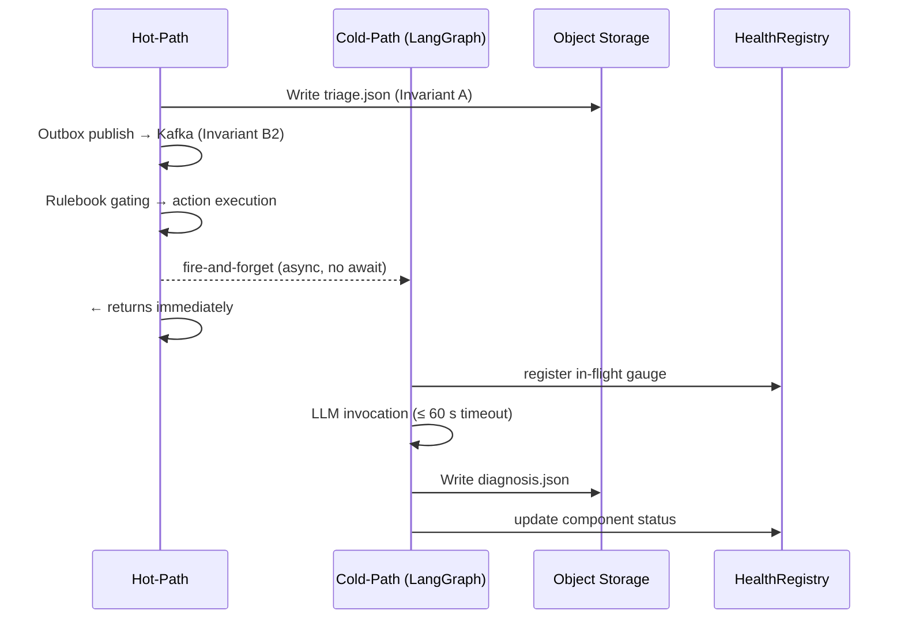

# Architecture Overview

## Purpose

`aiops-triage-pipeline` is an event-driven backend system that ingests infrastructure telemetry, classifies anomalies, enriches context, and drives deterministic triage/action preparation.

## Runtime Topology

Core local/runtime dependencies:

- Prometheus (telemetry source)
- Kafka + ZooKeeper (event transport)
- Postgres (durable outbox state)
- Redis (cache and dedupe)
- S3-compatible object storage (MinIO locally)

Application runtime modes:

- `hot-path`
- `cold-path`
- `outbox-publisher`

## Pipeline Shape

Hot path:

1. Evidence collection
2. Peak/sustained classification
3. Topology resolution and routing context
4. CaseFile triage assembly
5. Outbox staging
6. Gating input/action assembly
7. Dispatch integration handling

Parallel paths:

- Cold path: diagnosis enrichment and fallback behavior
- Outbox publisher: publishes from durable outbox state

## Package Boundaries

| Package | Responsibility |
|---|---|
| `pipeline/` | Scheduler and stage orchestration |
| `registry/` | Topology loader, resolver, ownership routing, legacy compat views |
| `contracts/` | Frozen v1 contracts and policy models |
| `outbox/` | Outbox schema/state machine/publisher |
| `diagnosis/` | Cold-path diagnosis orchestration and deterministic fallback |
| `storage/` | CaseFile I/O and serialization helpers |
| `cache/` | Evidence/peak/dedupe cache operations |
| `integrations/` | External adapter boundaries and mode control |
| `health/` | Component health tracking and telemetry exports |
| `denylist/` | Shared denylist load/enforcement |
| `logging/` | Structured logging setup |

## Design Invariants

- Deterministic behavior is preferred over implicit defaults in safety-critical paths.
- Topology lookups are in-memory and scope-aware.
- Outbox-mediated publishing is the durability path.
- Cross-boundary data shaping uses shared denylist enforcement.
- Contract models are frozen and validated at boundaries.

## Cold-Path / Hot-Path Handoff Contract

The cold-path (LLM diagnosis) and hot-path (triage, gating, action execution) are strictly decoupled. This section defines their integration boundary, the non-blocking guarantee, the handoff artifact schema, and fallback posture.

### Non-Blocking Guarantee

The hot-path pipeline completes entirely without waiting on LLM diagnosis. The sequence is:

1. Hot-path stages complete: evidence collection → classification → topology resolution → CaseFile triage write (Invariant A) → outbox publish (Invariant B2) → Rulebook gating → action execution.
2. After hot-path completion, a fire-and-forget async LangGraph task is spawned for eligible cases.
3. Hot-path latency is never affected by LLM availability, LLM response time, or cold-path failures (FR66).



### Invocation Criteria

LLM diagnosis is conditionally invoked. All three criteria must hold:

| Criterion | Required value |
|---|---|
| Environment | `PROD` |
| Topology tier | `TIER_0` |
| Sustained state | `True` |

Cases not meeting these criteria skip LLM diagnosis entirely. No `diagnosis.json` is written for ineligible cases. Absence of the file signals the case was not eligible — not an error.

### LLM Input Bounds

The cold-path task receives:

- `TriageExcerpt.v1` (already published to Kafka by the outbox publisher)
- A structured evidence summary bounded by a deployment-configured token budget

The cold-path task MUST NOT receive raw logs, the full CaseFile, or any field that violates the exposure denylist. The denylist is applied to all LLM inputs before invocation (NFR-S8). LLM endpoints must be bank-sanctioned (NFR-S8). No retry occurs within the same evaluation cycle (NFR-P4).

The fire-and-forget task registers with `HealthRegistry` with an in-flight gauge metric so LLM concurrency and failure state are observable.

### Handoff Artifact

The cold-path writes its result to object storage as a write-once stage file:

```text
cases/{case_id}/diagnosis.json
```

The file follows the standard [SchemaEnvelope](schema-evolution-strategy.md) pattern:

| Envelope field | Value |
|---|---|
| `schema_name` | `"DiagnosisReport"` |
| `schema_version` | `"v1"` |
| `producer` | `"cold-path-llm-diagnosis"` or `"cold-path-fallback"` |
| `payload` | `DiagnosisReportV1` (see below) |

`DiagnosisReportV1` fields (`contracts/diagnosis_report.py`):

| Field | Type | Description |
|---|---|---|
| `schema_version` | `Literal["v1"]` | Schema discriminator |
| `case_id` | `str \| None` | Matches hot-path `case_id`; `None` in fallback |
| `verdict` | `str` | LLM verdict or `"UNKNOWN"` for fallback |
| `fault_domain` | `str \| None` | Identified fault domain; `None` when verdict is `UNKNOWN` |
| `confidence` | `DiagnosisConfidence` | `LOW`, `MEDIUM`, or `HIGH` |
| `evidence_pack` | `EvidencePack` | `facts`, `missing_evidence`, `matched_rules` |
| `next_checks` | `tuple[str, ...]` | Recommended follow-up checks |
| `gaps` | `tuple[str, ...]` | Evidence gaps identified |
| `reason_codes` | `tuple[str, ...]` | Failure codes; see fallback table below |
| `triage_hash` | `str \| None` | SHA-256 of `triage.json` (hash chain) |

`diagnosis.json` includes the SHA-256 hash of `triage.json`, maintaining the CaseFile hash integrity chain (FR19).

### Fallback Posture

When LLM is absent, slow, or produces invalid output, the cold-path emits a deterministic schema-valid fallback `DiagnosisReportV1` and writes it to `diagnosis.json`. Every qualifying case receives a `diagnosis.json` regardless of LLM outcome.

| Failure scenario | `reason_codes` | `verdict` | `confidence` |
|---|---|---|---|
| LLM unavailable / connection refused | `[LLM_UNAVAILABLE]` | `"UNKNOWN"` | `LOW` |
| LLM timeout (> 60 s) | `[LLM_TIMEOUT]` | `"UNKNOWN"` | `LOW` |
| LLM returned an error response | `[LLM_ERROR]` | `"UNKNOWN"` | `LOW` |
| LLM output failed schema validation | `[LLM_SCHEMA_INVALID]` | `"UNKNOWN"` | `LOW` |
| Stub / test mode active | `[LLM_STUB]` | `"UNKNOWN"` | `LOW` |

`HealthRegistry` is updated with LLM component status on failure and recovery.

### Boundary Rules

**The hot-path MUST NOT:**

- Await cold-path task completion before returning.
- Read `diagnosis.json` or any cold-path artifact during triage, gating, or action execution.
- Gate any action on the presence or absence of a `DiagnosisReport`.

**The cold-path MUST NOT:**

- Modify `triage.json` or any prior hot-path stage file.
- Publish to Kafka or the outbox.
- Block or delay hot-path progression.

## Current Implementation Notes

- Epic 1 through Epic 3 scope is implemented and marked done in sprint tracking.
- Epic 4 is in progress; `pipeline/stages/casefile.py`, `storage/casefile_io.py`, and `models/case_file.py` are currently placeholders and expected to fill in as Epic 4 advances.
- `src/aiops_triage_pipeline/__main__.py` currently parses mode and prints startup mode; full wiring is incremental.

## Related Docs

- [Contracts](contracts.md)
- [Local Development](local-development.md)
- [Schema Evolution Strategy](schema-evolution-strategy.md)
