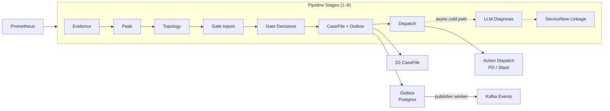

# AIOps Triage Pipeline — Developer Onboarding

> For a new contributor who has just cloned the repo and wants to build an accurate mental model before writing code.

---

## Contents

1. [What Problem Does This Solve?](#1-what-problem-does-this-solve)
2. [How the System Thinks](#2-how-the-system-thinks)
3. [The Pipeline Journey](#3-the-pipeline-journey)
4. [Runtime Modes](#4-runtime-modes)
5. [Data Contracts](#5-data-contracts)
6. [Configuration](#6-configuration)
7. [Code Navigation](#7-code-navigation)

---

## 1. What Problem Does This Solve?

This section establishes *why this system exists* and the vocabulary used throughout. After reading it you'll know what the system produces and the mental vocabulary used in every other section.

Infrastructure at scale generates a continuous stream of Prometheus metrics. Triaging anomalies manually — deciding whether a consumer-lag spike is noise, a soft issue requiring a Slack notification, or an incident requiring an immediate page — is slow, inconsistent, and error-prone when done by humans across hundreds of Kafka topics.

The AIOps Triage Pipeline automates this triage loop. It ingests Prometheus samples, classifies anomaly patterns, assembles a durable case artifact, gates the proposed action through a deterministic rulebook, and dispatches to the appropriate channel (PagerDuty, Slack, or a structured log fallback). Every decision is explainable and replayable from stored artifacts.

**What the system produces:**
- A **CaseFile** — an immutable JSON artifact written to S3, recording the complete triage context.
- **Kafka events** — `CaseHeaderEventV1` and `TriageExcerptV1`, published via a transactional outbox.
- An **ActionDecisionV1** — the rulebook's verdict: what action to take and why.

**Core vocabulary:** *anomaly → triage → case → gate → action*. These five words appear throughout the codebase; keep them in mind as you read.

---

## 2. How the System Thinks

This section covers four mental models that govern every design decision in this codebase. After reading it you'll be able to predict *why* the code is structured the way it is.

### Mental Model 1: The Pipeline Is Sequential and Deterministic

Every anomaly passes through the same numbered stages in order. No stage can skip a previous one or override its output. Given the same inputs and policy versions, the system always produces the same outputs — making decisions auditable and replayable from the stored CaseFile.

### Mental Model 2: Contracts Are Frozen

All data flowing between stages are immutable Pydantic v2 models (`frozen=True`). A stage receives a contract, reads it, and produces a new one — it never mutates what it received. This makes each stage independently testable and prevents subtle bugs from shared mutable state.

### Mental Model 3: Safety Modes Prevent Accidents

Every external call (PagerDuty, Slack, Kafka, ServiceNow, LLM) has an explicit safety mode: `OFF | LOG | MOCK | LIVE`. In `OFF`, the integration is disabled. In `LOG`, it logs the payload but makes no call. In `MOCK`, it returns a canned response. Only `LIVE` makes the real call. Local development defaults to `OFF` or `LOG` — you cannot accidentally page an on-call engineer by running the hot-path locally.

### Mental Model 4: Write-Once Persistence

CaseFiles are immutable artifacts written to object storage. Each enrichment stage writes exactly one file (`triage.json`, `diagnosis.json`, `linkage.json`). A missing file means that stage did not complete — never that it failed silently. The system's state is always observable from S3.

### High-Level Concept

> **Legend:** Solid arrows = hot-path (synchronous). Dashed arrows = cold-path (async, post-dispatch).

---

## 3. The Pipeline Journey

<!-- PLACEHOLDER -->

---

## 4. Runtime Modes

<!-- PLACEHOLDER -->

---

## 5. Data Contracts

<!-- PLACEHOLDER -->

---

## 6. Configuration

<!-- PLACEHOLDER -->

---

## 7. Code Navigation

<!-- PLACEHOLDER -->
