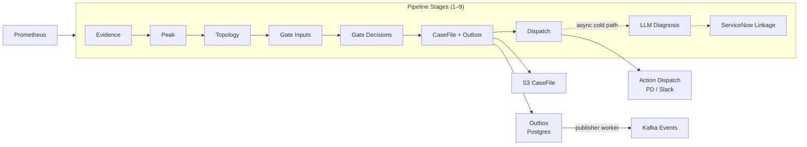
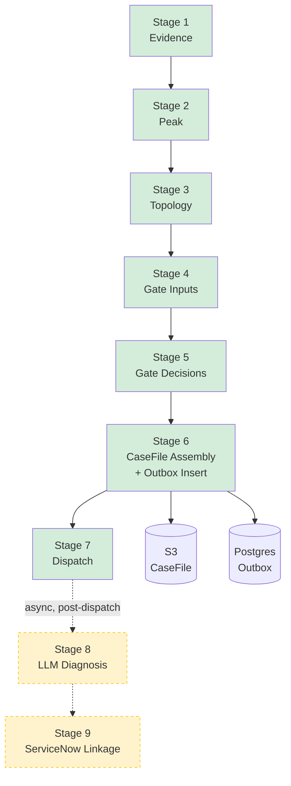
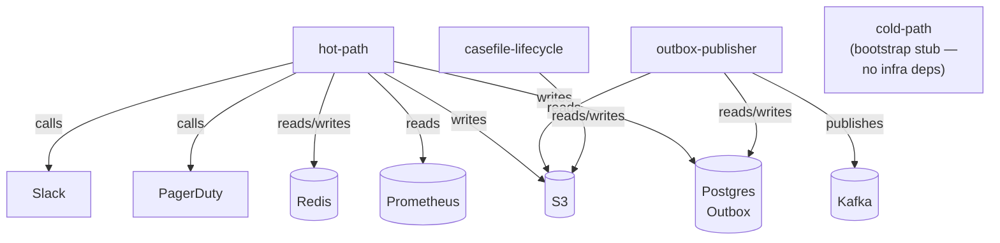

# AIOps Triage Pipeline — Developer Onboarding

> For a new contributor who has just cloned the repo and wants to build an accurate mental model before writing code.

---

## Contents

1. [What Problem Does This Solve?](#1-what-problem-does-this-solve)
2. [How the System Thinks](#2-how-the-system-thinks)
3. [The Pipeline Journey](#3-the-pipeline-journey)
4. [Runtime Modes](#4-runtime-modes)
5. [Data Contracts](#5-data-contracts)
6. [Configuration](#6-configuration)
7. [Code Navigation](#7-code-navigation)

---

## 1. What Problem Does This Solve?

This section establishes *why this system exists* and the vocabulary used throughout. After reading it you'll know what the system produces and the mental vocabulary used in every other section.

Infrastructure at scale generates a continuous stream of Prometheus metrics. Triaging anomalies manually — deciding whether a consumer-lag spike is noise, a soft issue requiring a Slack notification, or an incident requiring an immediate page — is slow, inconsistent, and error-prone when done by humans across hundreds of Kafka topics.

The AIOps Triage Pipeline automates this triage loop. It ingests Prometheus samples, classifies anomaly patterns, assembles a durable case artifact, gates the proposed action through a deterministic rulebook, and dispatches to the appropriate channel (PagerDuty, Slack, or a structured log fallback). Every decision is explainable and replayable from stored artifacts.

**What the system produces:**
- A **CaseFile** — an immutable JSON artifact written to S3, recording the complete triage context.
- **Kafka events** — `CaseHeaderEventV1` and `TriageExcerptV1`, published via a transactional outbox.
- An **ActionDecisionV1** — the rulebook's verdict: what action to take and why.

**Core vocabulary:** *anomaly → triage → case → gate → action*. These five words appear throughout the codebase; keep them in mind as you read.

---

## 2. How the System Thinks

This section covers four mental models that govern every design decision in this codebase. After reading it you'll be able to predict *why* the code is structured the way it is.

### Mental Model 1: The Pipeline Is Sequential and Deterministic

Every anomaly passes through the same numbered stages in order. No stage can skip a previous one or override its output. Given the same inputs and policy versions, the system always produces the same outputs — making decisions auditable and replayable from the stored CaseFile.

### Mental Model 2: Contracts Are Frozen

All data flowing between stages are immutable Pydantic v2 models (`frozen=True`). A stage receives a contract, reads it, and produces a new one — it never mutates what it received. This makes each stage independently testable and prevents subtle bugs from shared mutable state.

### Mental Model 3: Safety Modes Prevent Accidents

Every external call (PagerDuty, Slack, Kafka, ServiceNow, LLM) has an explicit safety mode: `OFF | LOG | MOCK | LIVE`. In `OFF`, the integration is disabled. In `LOG`, it logs the payload but makes no call. In `MOCK`, it returns a canned response. Only `LIVE` makes the real call. Local development defaults to `OFF` or `LOG` — you cannot accidentally page an on-call engineer by running the hot-path locally.

### Mental Model 4: Write-Once Persistence

CaseFiles are immutable artifacts written to object storage. Each enrichment stage writes exactly one file (`triage.json`, `diagnosis.json`, `linkage.json`). A missing file means that stage did not complete — never that it failed silently. The system's state is always observable from S3.

### High-Level Concept



> **Legend:** Solid arrows = hot-path (synchronous). Dashed arrows = cold-path (async, post-dispatch).

---

## 3. The Pipeline Journey

This section covers the full journey of a single anomaly through the pipeline. After reading it you'll be able to trace any triage decision from its Prometheus origin to its dispatched action.

### Stage Flow



> **Green** = hot-path (synchronous, runs every scheduler cycle). **Yellow/dashed** = cold-path (async, post-dispatch, orchestration stub in progress).

---

### Per-Stage Walkthrough

> The domain-layer functions below are what contributors read and modify. The scheduler (`pipeline/scheduler.py`) wraps these in `run_*_stage_cycle()` helpers — those are infrastructure glue, not domain logic.

---

**Stage 1 — Evidence**
Processes collected Prometheus samples into per-scope anomaly findings. Prometheus collection happens upstream in `run_evidence_stage_cycle()` in `scheduler.py`; this function is synchronous and operates on already-collected samples.

← `src/aiops_triage_pipeline/pipeline/stages/evidence.py`

```python
def collect_evidence_stage_output(
    samples_by_metric: Mapping[str, list[Mapping[str, Any]]],
    *,
    findings_cache_client: FindingsCacheClientProtocol | None = None,
    redis_ttl_policy: RedisTtlPolicyV1 | None = None,
    evaluation_time: datetime | None = None,
    telemetry_degraded_active: bool = False,
    telemetry_degraded_events: Sequence[TelemetryDegradedEvent] = (),
    max_safe_action: Action | None = None,
) -> EvidenceStageOutput:
```

---

**Stage 2 — Peak**
Classifies whether each scope is experiencing a peak (anomaly intensity above policy thresholds) and computes sustained-window state.

← `src/aiops_triage_pipeline/pipeline/stages/peak.py`

```python
def collect_peak_stage_output(
    *,
    rows: Sequence[EvidenceRow],
    historical_windows_by_scope: Mapping[PeakScope, Sequence[float]],
    evidence_status_map_by_scope: (
        Mapping[tuple[str, ...], Mapping[str, EvidenceStatus]] | None
    ) = None,
    anomaly_findings: Sequence[AnomalyFinding] = (),
    prior_sustained_window_state_by_key: (
        Mapping[SustainedIdentityKey, SustainedWindowState] | None
    ) = None,
    peak_policy: PeakPolicyV1 | None = None,
    rulebook_policy: RulebookV1 | None = None,
    evaluation_time: datetime | None = None,
) -> PeakStageOutput:
```

---

**Stage 3 — Topology**
Joins evidence findings with the topology registry snapshot to resolve routing context and scope metadata.

← `src/aiops_triage_pipeline/pipeline/stages/topology.py`

```python
def collect_topology_stage_output(
    *,
    snapshot: TopologyRegistrySnapshot,
    evidence_output: EvidenceStageOutput,
) -> TopologyStageOutput:
```

---

**Stage 4 — Gate Inputs**
Assembles all evidence, peak, and context data for each scope into the `GateInputV1` contracts that the rulebook will evaluate.

← `src/aiops_triage_pipeline/pipeline/stages/gating.py`

```python
def collect_gate_inputs_by_scope(
    *,
    evidence_output: EvidenceStageOutput,
    peak_output: PeakStageOutput,
    context_by_scope: Mapping[GateScope, GateInputContext],
    max_safe_action: Action | None = None,
) -> dict[GateScope, tuple[GateInputV1, ...]]:
```

---

**Stage 5 — Gate Decisions**
Runs each scope's `GateInputV1` contracts through the rulebook (AG0–AG6) and produces an `ActionDecisionV1` per scope.

← `src/aiops_triage_pipeline/pipeline/stages/gating.py`

```python
def evaluate_rulebook_gate_inputs_by_scope(
    *,
    gate_inputs_by_scope: Mapping[GateScope, tuple[GateInputV1, ...]],
    rulebook: RulebookV1,
    dedupe_store: GateDedupeStoreProtocol | None = None,
    latency_warning_threshold_ms: int = 500,
) -> dict[GateScope, tuple[ActionDecisionV1, ...]]:
```

---

**Stage 6 — CaseFile Assembly + Outbox Insert**
Assembles the complete triage artifact and persists it to S3, then inserts an outbox row in Postgres to decouple the hot-path from Kafka.

← `src/aiops_triage_pipeline/pipeline/stages/casefile.py`

```python
def assemble_casefile_triage_stage(
    *,
    scope: tuple[str, ...],
    evidence_output: EvidenceStageOutput,
    peak_output: PeakStageOutput,
    topology_output: TopologyStageOutput,
    gate_input: GateInputV1,
    action_decision: ActionDecisionV1,
    rulebook_policy: RulebookV1,
    peak_policy: PeakPolicyV1,
    prometheus_metrics_contract: PrometheusMetricsContractV1,
    denylist: DenylistV1,
    diagnosis_policy_version: str,
    triage_timestamp: datetime | None = None,
    case_id: str | None = None,
) -> CaseFileTriageV1:

def persist_casefile_and_prepare_outbox_ready(
    *,
    casefile: CaseFileTriageV1,
    object_store_client: ObjectStoreClientProtocol,
) -> OutboxReadyCasefileV1:
```

**Outbox insertion:** After `persist_casefile_and_prepare_outbox_ready()`, the hot-path calls `outbox_repository.insert_pending_object()` directly in `_hot_path_scheduler_loop()`. This is the step that decouples the hot-path from Kafka — a transactional outbox row is inserted, not a Kafka publish.

← `src/aiops_triage_pipeline/outbox/repository.py`

```python
def insert_pending_object(
    self,
    *,
    confirmed_casefile: OutboxReadyCasefileV1,
    now: datetime | None = None,
) -> OutboxRecordV1:
```

> `pipeline/stages/outbox.py` provides higher-level state-transition helpers used by the outbox-publisher worker — not by the hot-path loop.

---

**Stage 7 — Dispatch**
Takes the `ActionDecisionV1` and routes it to PagerDuty, Slack, or log-fallback, depending on integration modes and the denylist.

← `src/aiops_triage_pipeline/pipeline/stages/dispatch.py`

```python
def dispatch_action(
    *,
    case_id: str,
    decision: ActionDecisionV1,
    routing_context: TopologyRoutingContext | None,
    pd_client: PagerDutyClient,
    slack_client: SlackClient,
    denylist: DenylistV1,
) -> None:
```

---

### Gate Engine

Gates AG0–AG6 run sequentially on each `GateInputV1`. Each gate may reduce the proposed action (`cap_action_to`); a gate that is already below a gate's activation threshold is skipped automatically.

| Gate | Name | Responsibility |
|------|------|----------------|
| AG0 | Schema & invariants | Never page/ticket on malformed or incomplete decision inputs |
| AG1 | Environment + tier caps | PAGE is only allowed in PROD + TIER_0 |
| AG2 | Evidence sufficiency | If required evidence is UNKNOWN/ABSENT/STALE, downgrade — never assume 0 |
| AG3 | Paging denied for SOURCE_TOPIC | Never PAGE on SOURCE_TOPIC anomalies |
| AG4 | Confidence + sustained gating | Prevent high-urgency actions when confidence/sustained are weak |
| AG5 | Storm control (dedupe) | Prevent repeated paging/ticket storms on the same fingerprint |
| AG6 | Postmortem policy selector | Selectively require postmortems (SOFT today; HARD planned for Phase 1B once SN linkage is wired) |

**AG0 failure effect:** When AG0 validation fails, it sets `state.input_valid = False`. Gates AG1–AG5 still execute, but AG6 checks `input_valid` before evaluating — suppressing postmortem logic on malformed inputs. This is the only inter-gate state propagation in the current implementation.

**Skip-by-priority pattern** — gates AG4 and AG5 require a minimum action level and are skipped when the current action is already below it (AG0–AG3 and AG6 do not use this pattern):

```python
# from pipeline/stages/gating.py
if gate_id == "AG4":
    if _ACTION_PRIORITY[state.current_action] < _ACTION_PRIORITY[Action.TICKET]:
        continue  # AG4 is irrelevant if action is already below TICKET

if gate_id == "AG5":
    if _ACTION_PRIORITY[state.current_action] <= _ACTION_PRIORITY[Action.OBSERVE]:
        continue  # AG5 is irrelevant if action is OBSERVE
```

← `src/aiops_triage_pipeline/pipeline/stages/gating.py`

---

### Cold Path: Stages 8 and 9

Stages 8 (LLM Diagnosis) and 9 (ServiceNow Linkage) run asynchronously after hot-path dispatch. The `--mode cold-path` entrypoint in `__main__.py` is currently a bootstrap stub — it logs a warning and exits.

However, the domain logic is substantially implemented and testable independently:

- **`diagnosis/`** — LangGraph graph, prompt builder, fallback path, `diagnosis.json` write-once persistence
- **`linkage/`** — ServiceNow retry state machine, repository, schema (`linkage/repository.py`, `linkage/state_machine.py`, `pipeline/stages/linkage.py`)

These directories are not empty placeholders. New contributors should not skip them — they contain real logic awaiting orchestration wiring.

---

## 4. Runtime Modes

This section covers the four runtime modes. After reading it you'll know which mode to start for any local development task and what infrastructure each mode requires.

### Mode Overview



### Per-Mode Walkthrough

---

**`hot-path`** — the primary mode

**Purpose:** Loads all policies, initialises all runtime clients, then runs the complete triage loop (`asyncio.run(_hot_path_scheduler_loop(...))`). This is the mode to run locally to exercise the full pipeline.

**Run command:**
```bash
APP_ENV=local python -m aiops_triage_pipeline --mode hot-path
```

**`--once` flag:** Not supported. The hot-path runs as a continuous scheduler loop.

**When you'd use this:** Developing or testing any hot-path stage (evidence → dispatch), integration mode behaviour, or policy changes.

---

**`cold-path`** — orchestration stub

**Purpose:** Intended to run LLM Diagnosis (Stage 8) and ServiceNow Linkage (Stage 9) asynchronously after hot-path dispatch.

**Current state:** The `__main__.py` entrypoint logs a warning and exits immediately. The domain modules (`diagnosis/`, `linkage/`) are implemented but not yet wired through this mode.

**Run command:**
```bash
APP_ENV=local python -m aiops_triage_pipeline --mode cold-path
```

**`--once` flag:** N/A (stub exits immediately).

**When you'd use this:** Not yet useful for end-to-end runs. Develop and test `diagnosis/` and `linkage/` by calling their domain functions directly in tests.

---

**`outbox-publisher`** — Kafka publication worker

**Purpose:** Polls the Postgres outbox for pending rows and publishes `CaseHeaderEventV1` and `TriageExcerptV1` to Kafka.

**Run command:**
```bash
APP_ENV=local python -m aiops_triage_pipeline --mode outbox-publisher
```

**`--once` flag:** Supported. Processes one batch and exits — useful for verifying outbox publication in isolation.

```bash
APP_ENV=local python -m aiops_triage_pipeline --mode outbox-publisher --once
```

**When you'd use this:** Developing Kafka integration, verifying outbox schema, or debugging publication failures.

---

**`casefile-lifecycle`** — retention worker

**Purpose:** Purges expired CaseFiles from S3 according to the retention policy.

**Run command:**
```bash
APP_ENV=local python -m aiops_triage_pipeline --mode casefile-lifecycle
```

**`--once` flag:** Supported. Runs one deletion sweep and exits.

```bash
APP_ENV=local python -m aiops_triage_pipeline --mode casefile-lifecycle --once
```

**When you'd use this:** Developing or testing the retention policy, or verifying S3 lifecycle behaviour.

---

### Dependency Matrix

| Mode | Redis | Postgres | Kafka | S3 | Prometheus |
|------|-------|----------|-------|----|------------|
| `hot-path` | ✓ | ✓ | — | ✓ | ✓ |
| `cold-path` | — | — | — | — | — |
| `outbox-publisher` | — | ✓ | ✓ | ✓ | — |
| `casefile-lifecycle` | — | — | — | ✓ | — |

> See `docs/runtime-modes.md` for full per-mode environment variable reference.

---

## 5. Data Contracts

This section covers how data moves between pipeline stages. After reading it you'll understand the frozen-contract pattern and be able to find any contract field in the codebase.

### Contracts vs Models

**Contracts** are stable frozen interfaces shared across subsystem boundaries — serialized, versioned, never mutated. They carry the `V1` suffix and live in `contracts/`.

**Models** are internal domain types used within a single stage or subsystem. They live in `models/` or alongside their stage in `pipeline/stages/`.

A contributor changes a model freely. Changing a contract requires explicit versioning and test coverage — see `docs/schema-evolution-strategy.md`.

### Key Contracts

---

**`GateInputV1`** — assembles all evidence for a scope into the rulebook input

← `src/aiops_triage_pipeline/contracts/gate_input.py`

```python
class GateInputV1(BaseModel, frozen=True):
    env: Environment
    cluster_id: str
    stream_id: str
    topic: str
    topic_role: Literal["SOURCE_TOPIC", "SHARED_TOPIC", "SINK_TOPIC"]
    anomaly_family: Literal["CONSUMER_LAG", "VOLUME_DROP", "THROUGHPUT_CONSTRAINED_PROXY"]
    criticality_tier: CriticalityTier
    proposed_action: Action
    sustained: bool
    findings: tuple[Finding, ...]
    action_fingerprint: str
    # ... additional fields (diagnosis_confidence, evidence_status_map, consumer_group, partition_count_observed, peak, case_id, decision_basis)
```

---

**`ActionDecisionV1`** — the rulebook's output; what action to take and why

← `src/aiops_triage_pipeline/contracts/action_decision.py`

```python
class ActionDecisionV1(BaseModel, frozen=True):
    final_action: Action
    env_cap_applied: bool
    gate_rule_ids: tuple[str, ...]
    gate_reason_codes: tuple[str, ...]
    action_fingerprint: str
    postmortem_required: bool
    # ... additional fields (postmortem_mode, postmortem_reason_codes)
```

---

**`CaseHeaderEventV1`** — published to Kafka, identifies the case

← `src/aiops_triage_pipeline/contracts/case_header_event.py`

```python
class CaseHeaderEventV1(BaseModel, frozen=True):
    case_id: str
    env: Environment
    cluster_id: str
    stream_id: str
    topic: str
    anomaly_family: Literal["CONSUMER_LAG", "VOLUME_DROP", "THROUGHPUT_CONSTRAINED_PROXY"]
    criticality_tier: CriticalityTier
    final_action: Action
    routing_key: str
    evaluation_ts: AwareDatetime
    # ... additional fields (topic_role)
```

---

**`TriageExcerptV1`** — published to Kafka, carries the triage summary

← `src/aiops_triage_pipeline/contracts/triage_excerpt.py`

```python
class TriageExcerptV1(BaseModel, frozen=True):
    case_id: str
    env: Environment
    cluster_id: str
    stream_id: str
    topic: str
    anomaly_family: Literal["CONSUMER_LAG", "VOLUME_DROP", "THROUGHPUT_CONSTRAINED_PROXY"]
    topic_role: Literal["SOURCE_TOPIC", "SHARED_TOPIC", "SINK_TOPIC"]
    criticality_tier: CriticalityTier
    routing_key: str
    sustained: bool
    findings: tuple[Finding, ...]
    triage_timestamp: AwareDatetime
    # ... additional fields (peak, evidence_status_map)
```

---

### Shared Enums

These appear in nearly every contract and model — knowing them prevents confusion when reading both hot-path and cold-path code.

← `src/aiops_triage_pipeline/contracts/enums.py`

| Enum | Values |
|------|--------|
| `Environment` | `LOCAL`, `HARNESS`, `DEV`, `UAT`, `PROD` |
| `Action` | `OBSERVE`, `NOTIFY`, `TICKET`, `PAGE` (ordered by urgency) |
| `CriticalityTier` | `TIER_0`, `TIER_1`, `TIER_2`, `UNKNOWN` |
| `EvidenceStatus` | `PRESENT`, `UNKNOWN`, `ABSENT`, `STALE` |
| `DiagnosisConfidence` | `LOW`, `MEDIUM`, `HIGH` |

> **Important:** `EvidenceStatus.UNKNOWN` means the Prometheus series is missing — never treat it as zero. AG2 gate enforces this.

> For the procedure when a contract must change: `docs/schema-evolution-strategy.md`

---

## 6. Configuration

<!-- PLACEHOLDER -->

---

## 7. Code Navigation

<!-- PLACEHOLDER -->
