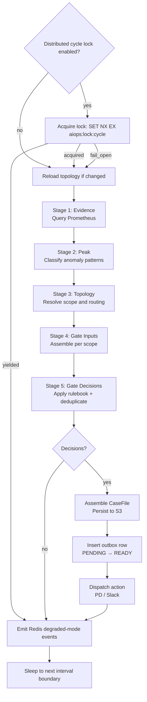

# Runtime Modes

The entry point `src/aiops_triage_pipeline/__main__.py` dispatches to one of four modes via the `--mode` argument. Each mode is a self-contained process designed to run independently.

```bash
uv run python -m aiops_triage_pipeline --mode <mode> [--once]
```

## Common Bootstrap

Every mode runs the same bootstrap sequence before any mode-specific logic:

1. Load settings from `config/.env.<APP_ENV>` via `pydantic-settings`
2. Configure structured logging (`structlog`)
3. Load the operational alert policy (`config/policies/operational-alert-policy-v1.yaml`)
4. Initialise the `OperationalAlertEvaluator` scoped to `APP_ENV`
5. Configure OTLP metrics export

---

## hot-path

The primary triage pipeline. Runs continuously on a fixed scheduler interval (`HOT_PATH_SCHEDULER_INTERVAL_SECONDS`).

### Startup initialisation

Policies loaded once at startup (no per-cycle disk I/O):

- `config/policies/peak-policy-v1.yaml`
- `config/policies/rulebook-v1.yaml`
- `config/policies/redis-ttl-policy-v1.yaml`
- `config/policies/prometheus-metrics-contract-v1.yaml`
- `config/denylist.yaml`

Runtime clients initialised at startup:

- Prometheus HTTP client
- Redis client + `RedisActionDedupeStore`
- Distributed cycle lock client (`RedisCycleLock`) using shared Redis connection
- S3 object store client
- Postgres engine — outbox schema ensured (`outbox` table)
- PagerDuty client (mode: `INTEGRATION_MODE_PD`)
- Slack client (mode: `INTEGRATION_MODE_SLACK`)
- Topology registry loader (requires `TOPOLOGY_REGISTRY_PATH`)

### Per-cycle stage flow

Each scheduler tick executes these stages in sequence:



- Per-case errors are caught and logged without killing the loop.
- Cycle-level errors are caught and logged; the loop continues.
- Redis degraded-mode events are emitted every cycle regardless of case output.
- If lock coordination is enabled:
  - `acquired`: pod runs full interval stages.
  - `yielded`: pod skips stage execution for that interval and sleeps to next boundary.
  - `fail_open`: pod continues stage execution and emits degraded coordination health/metrics.

### Shard coordination (Story 4.2)

When `SHARD_REGISTRY_ENABLED=true`, each hot-path pod additionally participates in
shard-level scope distribution using Redis leases.  The feature is **disabled by default**
to allow incremental rollout.

**How it works per cycle:**

1. For each shard in `[0, SHARD_COORDINATION_SHARD_COUNT)`, the pod attempts
   `SET NX EX aiops:shard:lease:<shard_id>` with `SHARD_LEASE_TTL_SECONDS` as the TTL.
2. Shards acquired by this pod are checkpointed to Redis via
   `aiops:shard:checkpoint:<shard_id>:<interval_bucket>` with `SHARD_CHECKPOINT_TTL_SECONDS` TTL.
3. If a holder pod fails, its leases expire naturally — no manual intervention required.
   Any other pod can then acquire those leases on the next cycle.
4. On any Redis coordination failure, the pod falls back to **full-scope processing**
   (D3 fail-open semantics) and emits a structured warning.

**Relevant settings:**

| Setting | Default | Description |
|---|---|---|
| `SHARD_REGISTRY_ENABLED` | `false` | Enable/disable shard coordination |
| `SHARD_COORDINATION_SHARD_COUNT` | `4` | Number of shards to distribute scopes across |
| `SHARD_LEASE_TTL_SECONDS` | `360` | Shard lease TTL (must be > interval + margin) |
| `SHARD_CHECKPOINT_TTL_SECONDS` | `660` | Checkpoint key TTL (should exceed 2 × interval) |

**Rollback:** Set `SHARD_REGISTRY_ENABLED=false` to revert to single-pod full-scope processing instantly.

### Notes

- Hot-path never publishes to Kafka directly. It writes a `READY` outbox row; the `outbox-publisher` process handles Kafka delivery.
- `TOPOLOGY_REGISTRY_PATH` must be set — hot-path exits at startup if missing.
- Safe rollout default keeps distributed lock disabled (`DISTRIBUTED_CYCLE_LOCK_ENABLED=false`).
- Safe rollout default keeps shard coordination disabled (`SHARD_REGISTRY_ENABLED=false`).
- `--once` is not supported for this mode.

---

## cold-path

Consumes `CaseHeaderEventV1` events from Kafka and runs downstream diagnosis processing
sequentially per event. Designed to be decoupled from the hot path — never blocks or
overrides deterministic gating outcomes.

### Startup initialisation

Configuration loaded at startup (from `Settings`):

- `KAFKA_COLD_PATH_CONSUMER_GROUP` (default: `aiops-cold-path-diagnosis`)
- `KAFKA_CASE_HEADER_TOPIC` (default: `aiops-case-header`)
- `KAFKA_COLD_PATH_POLL_TIMEOUT_SECONDS` (default: `1.0`)

Runtime clients initialised at startup:

- S3 object store client (via `build_s3_object_store_client_from_settings`) — required for triage artifact retrieval

### Consumer lifecycle

```
bootstrap → build S3 client → log cold_path_mode_started → subscribe(aiops-case-header) →
poll loop → [process event] → graceful shutdown → commit offsets → close
```

1. Joins consumer group `aiops-cold-path-diagnosis` and subscribes to `aiops-case-header`.
2. Processes messages sequentially (no batching or concurrency in this mode).
3. Decodes each message as `CaseHeaderEventV1`; malformed payloads are structured-logged and skipped.
4. On shutdown (SIGINT/SIGTERM), commits final offsets synchronously before close.

### Per-event processing (Story 3.3)

For each valid `CaseHeaderEventV1`, the processor boundary executes three steps:

```
1. retrieve_case_context(case_id, object_store_client)
   → reads cases/{case_id}/triage.json from S3
   → validates triage_hash chain integrity (Invariant A)
   → reconstructs TriageExcerptV1 from CaseFileTriageV1 fields

2. build_evidence_summary(triage_excerpt)
   → pure function: TriageExcerptV1 → str
   → byte-stable output (sorted keys, fixed section order)
   → four sections: Case Context, Evidence Status, Anomaly Findings, Temporal Context
   → all four EvidenceStatus values (PRESENT, UNKNOWN, ABSENT, STALE) explicitly labeled

3. run_cold_path_diagnosis(...)
   → invoked for **every** consumed case (no env/tier/sustained eligibility gating)
   → prompt includes full finding fields, routing context (`topic_role`, `routing_key`),
     confidence calibration guidance, fault-domain hints, and deterministic few-shot guidance
   → LLM output is schema-validated through `DiagnosisReportV1.model_validate(...)`
   → schema-invalid outputs map to `LLM_SCHEMA_INVALID` fallback handling
   → for timeout/transport/schema/generic invocation failures, deterministic fallback diagnosis is persisted to `diagnosis.json` with explicit `PRIMARY_DIAGNOSIS_ABSENT` gap and preserved `triage_hash` hash-chain linkage
   → observability events distinguish success vs fallback persistence:
     `cold_path_diagnosis_json_written` (includes `case_id`, `triage_hash`, `diagnosis_hash`) and
     `cold_path_fallback_diagnosis_json_written` (includes `case_id`, `reason_codes`, `triage_hash`, `diagnosis_hash`, `primary_diagnosis_absent=true`)
```

On retrieval or summary failure: logs `cold_path_context_retrieval_failed` /
`cold_path_evidence_summary_failed` warning with `exc_info=True` and skips to the
next message. The consumer loop is never crashed by per-message errors.

**Invariant A:** `triage.json` is guaranteed to exist in S3 before a `CaseHeaderEventV1`
is published by the hot-path. If missing, `retrieve_case_context()` raises
`CaseTriageNotFoundError` (a typed invariant violation), which is caught by the error
handler and logged as a warning.

### Health state transitions

The cold-path consumer publishes health signals to `HealthRegistry` at each lifecycle stage:

| Component | Transitions |
|---|---|
| `kafka_cold_path_connected` | `DEGRADED` (connecting) → `HEALTHY` (joined) / `UNAVAILABLE` (error) |
| `kafka_cold_path_poll` | `HEALTHY` (polled) / `UNAVAILABLE` (error) |
| `kafka_cold_path_commit` | `HEALTHY` (committed) / `UNAVAILABLE` (commit failed or consumer not initialized) |

### Processor boundary

`_cold_path_process_event(event, logger, *, object_store_client, ...)` in `__main__.py` is the
composition point for context retrieval, evidence summary generation, and diagnosis invocation.
Case-level diagnosis failures are logged (`cold_path_diagnosis_invocation_failed`) and skipped
without terminating the consumer loop.

### Notes

- Requires Kafka (bootstrap servers, consumer group, topic) AND S3 — see dependency matrix below.
- `--once` is not supported for this mode.
- Sequential consumption is deliberate (architecture decision D6) — concurrency is not introduced in this story.
- `object_store_client` is constructed once at startup and injected through the call chain: `_run_cold_path()` → `_cold_path_consumer_loop()` → `_process_cold_path_message()` → `_cold_path_process_event()`. It is never built inside the loop.

---

## outbox-publisher

Drains the `outbox` table and publishes case events to Kafka. Runs as a separate, always-on companion process alongside hot-path.

### Startup initialisation

- `config/policies/outbox-policy-v1.yaml`
- `config/denylist.yaml`
- Postgres engine — outbox schema ensured
- S3 object store client (reads casefiles for payload construction)
- Confluent Kafka publisher — topics: `aiops-case-header`, `aiops-triage-excerpt`

### Behaviour

Polls the outbox table for `READY` rows. For each row:

1. Reads the casefile from S3
2. Publishes `CaseHeaderEventV1` and `TriageExcerptV1` to Kafka
3. Transitions the row: `READY → SENT` (or `RETRY` / `DEAD` on failure)

Poll interval and batch size are configured via:

- `OUTBOX_PUBLISHER_POLL_INTERVAL_SECONDS`
- `OUTBOX_PUBLISHER_BATCH_SIZE`

### `--once` flag

Runs a single drain batch and exits. Use for testing or CI validation.

```bash
APP_ENV=local uv run python -m aiops_triage_pipeline --mode outbox-publisher --once
```

### Why it is a separate process

Hot-path writes outbox rows atomically with casefile persistence. If Kafka is unavailable, hot-path continues unaffected — cases accumulate in Postgres. The outbox-publisher retries independently until Kafka recovers, guaranteeing at-least-once delivery (Invariant B2).

---

## casefile-lifecycle

Scans object storage for expired casefiles and purges them according to the retention policy. Runs as an infrequent maintenance process.

### Startup initialisation

- `config/policies/casefile-retention-policy-v1.yaml`
- S3 object store client
- Governance approval ref from `CASEFILE_RETENTION_GOVERNANCE_APPROVAL`

### Behaviour

Scans `cases/` in S3, identifies casefiles eligible for purge based on the retention policy, and deletes them in batches.

Configurable via:

- `CASEFILE_LIFECYCLE_POLL_INTERVAL_SECONDS`
- `CASEFILE_LIFECYCLE_DELETE_BATCH_SIZE`
- `CASEFILE_LIFECYCLE_LIST_PAGE_SIZE`

### `--once` flag

Runs a single scan-and-purge pass, logs a result summary (scanned / eligible / purged / failed counts), and exits.

```bash
APP_ENV=local uv run python -m aiops_triage_pipeline --mode casefile-lifecycle --once
```

---

## Dependency matrix

| Mode | Redis | Postgres | Kafka | S3 | Prometheus | Topology registry |
|---|---|---|---|---|---|---|
| `hot-path` | yes | yes (outbox) | no | yes | yes | yes |
| `cold-path` | no | no | yes (consumer) | yes (triage retrieval) | no | no |
| `outbox-publisher` | no | yes (outbox) | yes | yes | no | no |
| `casefile-lifecycle` | no | no | no | yes | no | no |
