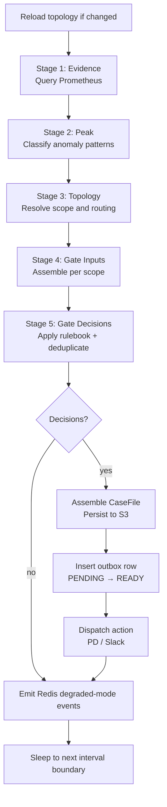

# Runtime Modes

The entry point `src/aiops_triage_pipeline/__main__.py` dispatches to one of four modes via the `--mode` argument. Each mode is a self-contained process designed to run independently.

```bash
uv run python -m aiops_triage_pipeline --mode <mode> [--once]
```

## Common Bootstrap

Every mode runs the same bootstrap sequence before any mode-specific logic:

1. Load settings from `config/.env.<APP_ENV>` via `pydantic-settings`
2. Configure structured logging (`structlog`)
3. Load the operational alert policy (`config/policies/operational-alert-policy-v1.yaml`)
4. Initialise the `OperationalAlertEvaluator` scoped to `APP_ENV`
5. Configure OTLP metrics export

---

## hot-path

The primary triage pipeline. Runs continuously on a fixed scheduler interval (`HOT_PATH_SCHEDULER_INTERVAL_SECONDS`).

### Startup initialisation

Policies loaded once at startup (no per-cycle disk I/O):

- `config/policies/peak-policy-v1.yaml`
- `config/policies/rulebook-v1.yaml`
- `config/policies/redis-ttl-policy-v1.yaml`
- `config/policies/prometheus-metrics-contract-v1.yaml`
- `config/denylist.yaml`

Runtime clients initialised at startup:

- Prometheus HTTP client
- Redis client + `RedisActionDedupeStore`
- S3 object store client
- Postgres engine — outbox schema ensured (`outbox` table)
- PagerDuty client (mode: `INTEGRATION_MODE_PD`)
- Slack client (mode: `INTEGRATION_MODE_SLACK`)
- Topology registry loader (requires `TOPOLOGY_REGISTRY_PATH`)

### Per-cycle stage flow

Each scheduler tick executes these stages in sequence:



- Per-case errors are caught and logged without killing the loop.
- Cycle-level errors are caught and logged; the loop continues.
- Redis degraded-mode events are emitted every cycle regardless of case output.

### Notes

- Hot-path never publishes to Kafka directly. It writes a `READY` outbox row; the `outbox-publisher` process handles Kafka delivery.
- `TOPOLOGY_REGISTRY_PATH` must be set — hot-path exits at startup if missing.
- `--once` is not supported for this mode.

---

## cold-path

**Status: stub — not yet implemented.**

Runs the common bootstrap and exits with a warning log:

```
cold-path diagnosis loop not yet wired in __main__
```

Reserved for the async LLM diagnosis loop (LangGraph, Stage 8) and ServiceNow linkage (Stage 9). Neither blocks the hot path.

---

## outbox-publisher

Drains the `outbox` table and publishes case events to Kafka. Runs as a separate, always-on companion process alongside hot-path.

### Startup initialisation

- `config/policies/outbox-policy-v1.yaml`
- `config/denylist.yaml`
- Postgres engine — outbox schema ensured
- S3 object store client (reads casefiles for payload construction)
- Confluent Kafka publisher — topics: `aiops-case-header`, `aiops-triage-excerpt`

### Behaviour

Polls the outbox table for `READY` rows. For each row:

1. Reads the casefile from S3
2. Publishes `CaseHeaderEventV1` and `TriageExcerptV1` to Kafka
3. Transitions the row: `READY → SENT` (or `RETRY` / `DEAD` on failure)

Poll interval and batch size are configured via:

- `OUTBOX_PUBLISHER_POLL_INTERVAL_SECONDS`
- `OUTBOX_PUBLISHER_BATCH_SIZE`

### `--once` flag

Runs a single drain batch and exits. Use for testing or CI validation.

```bash
APP_ENV=local uv run python -m aiops_triage_pipeline --mode outbox-publisher --once
```

### Why it is a separate process

Hot-path writes outbox rows atomically with casefile persistence. If Kafka is unavailable, hot-path continues unaffected — cases accumulate in Postgres. The outbox-publisher retries independently until Kafka recovers, guaranteeing at-least-once delivery (Invariant B2).

---

## casefile-lifecycle

Scans object storage for expired casefiles and purges them according to the retention policy. Runs as an infrequent maintenance process.

### Startup initialisation

- `config/policies/casefile-retention-policy-v1.yaml`
- S3 object store client
- Governance approval ref from `CASEFILE_RETENTION_GOVERNANCE_APPROVAL`

### Behaviour

Scans `cases/` in S3, identifies casefiles eligible for purge based on the retention policy, and deletes them in batches.

Configurable via:

- `CASEFILE_LIFECYCLE_POLL_INTERVAL_SECONDS`
- `CASEFILE_LIFECYCLE_DELETE_BATCH_SIZE`
- `CASEFILE_LIFECYCLE_LIST_PAGE_SIZE`

### `--once` flag

Runs a single scan-and-purge pass, logs a result summary (scanned / eligible / purged / failed counts), and exits.

```bash
APP_ENV=local uv run python -m aiops_triage_pipeline --mode casefile-lifecycle --once
```

---

## Dependency matrix

| Mode | Redis | Postgres | Kafka | S3 | Prometheus | Topology registry |
|---|---|---|---|---|---|---|
| `hot-path` | yes | yes (outbox) | no | yes | yes | yes |
| `cold-path` | — | — | — | — | — | — |
| `outbox-publisher` | no | yes (outbox) | yes | yes | no | no |
| `casefile-lifecycle` | no | no | no | yes | no | no |
